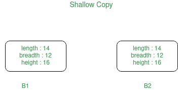
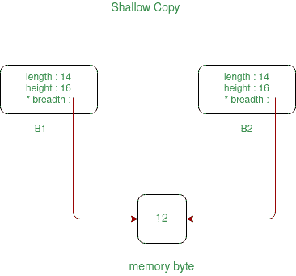
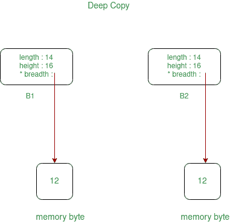

# c++ 中的浅拷贝和深拷贝

> 原文:[https://www . geeksforgeeks . org/浅拷贝和深拷贝-in-c/](https://www.geeksforgeeks.org/shallow-copy-and-deep-copy-in-c/)

通常，创建对象的副本意味着创建具有相同文字值、[数据类型](https://www.geeksforgeeks.org/c-data-types/)和资源的对象的精确副本。

*   [复制构造器](https://www.geeksforgeeks.org/copy-constructor-in-cpp/)
*   [默认分配运算符](https://www.geeksforgeeks.org/default-assignment-operator-and-references/)

> //复制构造器
> 极客 Obj 1(Obj)；
> 或
> 极客 Obj1 = Obj
> 
> //默认赋值运算符
> 极客 Obj2
> Obj2 = Obj1；

根据对象拥有的[动态内存](https://www.geeksforgeeks.org/what-is-dynamic-memory-allocation/)等资源，我们需要执行**浅拷贝**或**深拷贝**来创建对象的副本。一般来说，如果对象的变量已动态分配，则需要执行深度拷贝，以便创建对象的拷贝。

### **<u>浅抄</u> :**

在浅层复制中，通过简单地复制原始对象的所有变量的数据来创建对象。如果在内存的[堆部分没有定义对象的任何变量，这种方法会很有效。如果一些变量是从堆部分动态分配内存的，那么复制的对象变量也将引用相同的内存位置。
这将产生歧义和运行时错误悬空指针。由于两个对象将引用相同的内存位置，因此一个对象所做的更改也将反映另一个对象中的这些更改。因为我们想要创建对象的副本，所以浅拷贝不会满足这个目的。
**注意:**](https://www.geeksforgeeks.org/stack-vs-heap-memory-allocation/) [C++ ](https://www.geeksforgeeks.org/c-plus-plus/) 编译器隐式创建[复制构造函数](https://www.geeksforgeeks.org/copy-constructor-in-cpp/)和[重载赋值运算符](https://www.geeksforgeeks.org/assignment-operator-overloading-in-c/)，以便在编译时执行浅层复制。



**对象的浅拷贝**如果在堆内存中定义了一些变量，那么:



下面是上述方法的实现:

## C++

```cpp
// C++ program for the above approach
#include <iostream>
using namespace std;

// Box Class
class box {
private:
    int length;
    int breadth;
    int height;

public:
    // Function that sets the dimensions
    void set_dimensions(int length1, int breadth1,
                        int height1)
    {
        length = length1;
        breadth = breadth1;
        height = height1;
    }

    // Function to display the dimensions
    // of the Box object
    void show_data()
    {
        cout << " Length = " << length
             << "\n Breadth = " << breadth
             << "\n Height = " << height
             << endl;
    }
};

// Driver Code
int main()
{
    // Object of class Box
    box B1, B3;

    // Set dimensions of Box B1
    B1.set_dimensions(14, 12, 16);
    B1.show_data();

    // When copying the data of object
    // at the time of initialization
    // then copy is made through
    // COPY CONSTRUCTOR
    box B2 = B1;
    B2.show_data();

    // When copying the data of object
    // after initialization then the
    // copy is done through DEFAULT
    // ASSIGNMENT OPERATOR
    B3 = B1;
    B3.show_data();

    return 0;
}
```

**Output:**

```cpp
Length = 14
 Breadth = 12
 Height = 16
 Length = 14
 Breadth = 12
 Height = 16
 Length = 14
 Breadth = 12
 Height = 16

```

### **<u>深度复制</u> :**

在深度复制中，对象是通过复制所有变量的数据来创建的，它还为对象分配具有相同值的相似内存资源。为了执行深度复制，我们需要显式定义复制构造函数，并根据需要分配动态内存。此外，还需要为其他构造函数中的变量动态分配内存。



下面是上述方法的实现:

## C++

```cpp
// C++ program to implement the
// deep copy
#include <iostream>
using namespace std;

// Box Class
class box {
private:
    int length;
    int* breadth;
    int height;

public:
    // Constructor
    box()
    {
        breadth = new int;
    }

    // Function to set the dimensions
    // of the Box
    void set_dimension(int len, int brea,
                       int heig)
    {
        length = len;
        *breadth = brea;
        height = heig;
    }

    // Function to show the dimensions
    // of the Box
    void show_data()
    {
        cout << " Length = " << length
             << "\n Breadth = " << *breadth
             << "\n Height = " << height
             << endl;
    }

    // Parameterized Constructors for
    // for implementing deep copy
    box(box& sample)
    {
        length = sample.length;
        breadth = new int;
        *breadth = *(sample.breadth);
        height = sample.height;
    }

    // Destructors
    ~box()
    {
        delete breadth;
    }
};

// Driver Code
int main()
{
    // Object of class first
    box first;

    // Set the dimensions
    first.set_dimension(12, 14, 16);

    // Display the dimensions
    first.show_data();

    // When the data will be copied then
    // all the resources will also get
    // allocated to the new object
    box second = first;

    // Display the dimensions
    second.show_data();

    return 0;
}
```

**Output:**

```cpp
Length = 12
 Breadth = 14
 Height = 16
 Length = 12
 Breadth = 14
 Height = 16

```