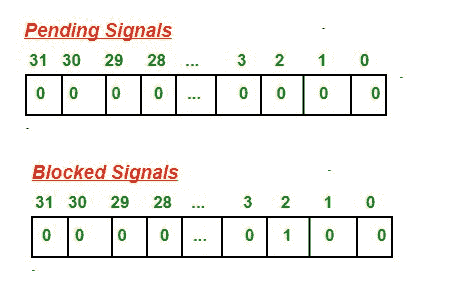

# C 语言信号

> 原文:[https://www.geeksforgeeks.org/signals-c-language/](https://www.geeksforgeeks.org/signals-c-language/)

 `**先决条件:** [Fork 系统调用](https://www.geeksforgeeks.org/fork-system-call/)[Wait 系统调用](https://www.geeksforgeeks.org/wait-system-call-c/)
一个信号是一个软件生成的中断，由 OS 发送给一个进程，因为当用户按 ctrl-c 或另一个进程告诉这个进程一些事情。
有固定一组信号可以发送到进程。信号由整数标识。
信号编号有符号名称。例如 **SIGCHLD** 是子进程终止时发送给父进程的信号数。
**示例:**`

```cpp
#define SIGHUP  1   /* Hangup the process */ 
#define SIGINT  2   /* Interrupt the process */ 
#define SIGQUIT 3   /* Quit the process */ 
#define SIGILL  4   /* Illegal instruction. */ 
#define SIGTRAP 5   /* Trace trap. */ 
#define SIGABRT 6   /* Abort. */ 
```

`**信号的操作系统结构**`

*   `对于每个进程，操作系统维护 2 个整数，其位对应于一个信号号。`
*   `这两个整数跟踪:**未决信号和阻塞信号**`
*   `对于 32 位整数，最多可以表示 32 个不同的信号。`

`**示例:**
在下面的示例中，SIGINT ( = 2)信号被阻塞，没有信号挂起。
`

`一个信号被发送到一个进程，为该进程设置未决信号整数中的相应位。每次操作系统选择要在处理器上运行的进程时，都会检查挂起和阻塞的整数。如果没有信号挂起，进程将正常重启，并继续执行下一条指令。`

`如果有一个或多个信号未决，但每个信号都被阻止，则该过程也会正常重启，但信号仍被标记为未决。如果有一个或多个信号未决且未被阻塞，操作系统将执行进程代码中的例程来处理这些信号。`

`**默认信号处理器**`

`有几个默认的信号处理程序。每个信号都与这些默认处理程序之一相关联。不同的默认处理程序例程通常具有以下操作之一:`

*   `忽略信号；即什么也不做，只是返回`
*   `期限:终止流程`
*   `继续:取消阻止已停止的进程`
*   `停止:阻止进程`

```cpp
// CPP program to illustrate
// default Signal Handler
#include<stdio.h>
#include<signal.h>

int main()
{
    signal(SIGINT, handle_sigint);
    while (1)
    {
        printf(“hello world\n”);
        sleep(1);
    }
    return 0;
}
```

`输出:打印你好世界无限次。如果用户因为发送 **SIGINT** 信号及其默认处理程序终止进程而按 ctrl-c 终止进程。`

```cpp
hello world   
hello world         
hello world         
terminated 
```

`**用户定义的信号处理器**`

`一个进程可以用它自己的处理函数来代替几乎所有信号的默认信号处理程序(但不是 SIGKILL)。
信号处理函数可以有任何名称，但必须有返回类型 void 和一个 int 参数。
**示例:**您可以为**信号(子进程终止)选择信号处理程序的名称 sigchld_handler。那么声明将是:**`

```cpp
**void sigchld_handler(int sig);**
```

`当信号处理程序执行时，传递给它的参数是信号的编号。程序员可以使用同一个信号处理函数来处理几个信号。在这种情况下，处理程序需要检查参数以查看发送了哪个信号。另一方面，如果一个信号处理函数只处理一个信号，就没有必要检查参数，因为它总是那个信号号。`

```cpp
// CPP program to illustrate
// User-defined Signal Handler
#include<stdio.h>
#include<signal.h>

// Handler for SIGINT, caused by
// Ctrl-C at keyboard
void handle_sigint(int sig)
{
    printf("Caught signal %d\n", sig);
}

int main()
{
    signal(SIGINT, handle_sigint);
    while (1) ;
    return 0;
}
```

`输出:`

```cpp
^CCaught signal 2  // when user presses ctrl-c
^CCaught signal 2 
```

`**通过 kill()发送信号**`

`我们可以使用 kill()向进程发送信号。`

```cpp
**int kill(pid_t pid, int signal);**
**pid:** id of destination process
**signal:** the type of signal to send
**Return value:** 0 if signal was sent successfully
```

`示例:`

```cpp
pid_t iPid = getpid(); /* Process gets its id.*/
kill(iPid, SIGINT);  /* Process sends itself a  **SIGINT** signal   
(commits suicide?)(because of **SIGINT** 
signal default handler is terminate the process) */ 
```

`**问题**`

`**1。以下程序的输出是什么？**`

```cpp
#include<stdio.h>
#include<wait.h>
#include<signal.h>
int main()
{
    int stat;
    pid_t pid;
    if ((pid = fork()) == 0)
        while(1) ;
    else
    {
        kill(pid, SIGINT);
        wait(&stat);
        if (WIFSIGNALED(stat))
            psignal(WTERMSIG(stat), "Child term due to");
    }
}
```

`输出:`

```cpp
 Child term due to: Interrupt 
```

`**2。以下程序的输出是什么？**`

```cpp
#include<stdio.h>
#include<signal.h>
#include<wait.h>
int val = 10;
void handler(int sig)
{
    val += 5;
}
int main()
{
    pid_t pid;
    signal(SIGCHLD, handler);
    if ((pid = fork()) == 0)
    {
        val -= 3;
        exit(0);
    }
    waitpid(pid, NULL, 0);
    printf("val = %d\n", val);
    exit(0);
}
```

`输出:`

```cpp
val = 15 
```

`**3。考虑下面的代码。产出是什么？**`

```cpp
#include<stdio.h>
#include<wait.h>
#include<signal.h>
pid_t pid;
int counter = 0;
void handler1(int sig)
{
    counter++ ;
    printf("counter = %d\n", counter);
    /* Flushes the printed string to stdout */
    fflush(stdout);
    kill(pid, SIGUSR1);
}
void handler2(int sig)
{
    counter += 3;
    printf("counter = %d\n", counter);
    exit(0);
}

int main()
{
    pid_t p;
    int status;
    signal(SIGUSR1, handler1);
    if ((pid = fork()) == 0)
    {
        signal(SIGUSR1, handler2);
        kill(getppid(), SIGUSR1);
        while(1) ;
    }
    if ((p = wait(&status)) > 0)
    {
        counter += 4;
        printf("counter = %d\n", counter);
    }
}
```

`输出`

```cpp
counter = 1         //(parent’s handler) 
counter = 3         //(child’s handler) 
counter = 5         //(parent’s main) 
```

`本文由**卡达姆·帕特尔**供稿。如果你喜欢 GeeksforGeeks 并想投稿，你也可以使用[contribute.geeksforgeeks.org](http://www.contribute.geeksforgeeks.org)写一篇文章或者把你的文章邮寄到 contribute@geeksforgeeks.org。看到你的文章出现在极客博客主页上，帮助其他极客。`

`如果你发现任何不正确的地方，或者你想分享更多关于上面讨论的话题的信息，请写评论。`