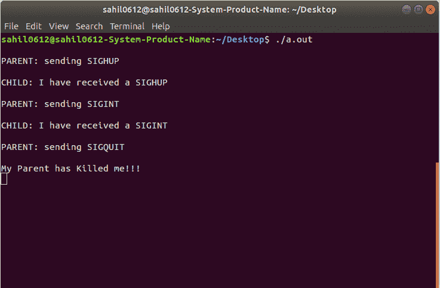

# 两个进程之间使用 C

中的信号进行通信

> 原文:[https://www.geeksforgeeks.org/signals-c-set-2/](https://www.geeksforgeeks.org/signals-c-set-2/)

**先决条件:** [**C 信号处理**](https://www.geeksforgeeks.org/signals-c-language/)

在这篇文章中，子进程和父进程之间的通信是使用 kill()和 signal()，fork()系统调用完成的。

*   **[fork()](https://www.geeksforgeeks.org/fork-system-call/)** 从父进程创建子进程。可以检查 pid 以决定它是子进程(如果 pid == 0)还是父进程(pid =子进程 id)。
*   然后，家长可以使用 pid 和 kill()向孩子发送消息。
*   孩子用 signal()拾取这些信号，并调用适当的函数。

**两个进程如何使用 kill()和 signal()相互对话的示例:**

```cpp
// C program to implement sighup(), sigint()
// and sigquit() signal functions
#include <signal.h>
#include <stdio.h>
#include <stdlib.h>
#include <sys/types.h>
#include <unistd.h>

// function declaration
void sighup();
void sigint();
void sigquit();

// driver code
void main()
{
    int pid;

    /* get child process */
    if ((pid = fork()) < 0) {
        perror("fork");
        exit(1);
    }

    if (pid == 0) { /* child */
        signal(SIGHUP, sighup);
        signal(SIGINT, sigint);
        signal(SIGQUIT, sigquit);
        for (;;)
            ; /* loop for ever */
    }

    else /* parent */
    { /* pid hold id of child */
        printf("\nPARENT: sending SIGHUP\n\n");
        kill(pid, SIGHUP);

        sleep(3); /* pause for 3 secs */
        printf("\nPARENT: sending SIGINT\n\n");
        kill(pid, SIGINT);

        sleep(3); /* pause for 3 secs */
        printf("\nPARENT: sending SIGQUIT\n\n");
        kill(pid, SIGQUIT);
        sleep(3);
    }
}

// sighup() function definition
void sighup()

{
    signal(SIGHUP, sighup); /* reset signal */
    printf("CHILD: I have received a SIGHUP\n");
}

// sigint() function definition
void sigint()

{
    signal(SIGINT, sigint); /* reset signal */
    printf("CHILD: I have received a SIGINT\n");
}

// sigquit() function definition
void sigquit()
{
    printf("My DADDY has Killed me!!!\n");
    exit(0);
}
```

**输出:**
