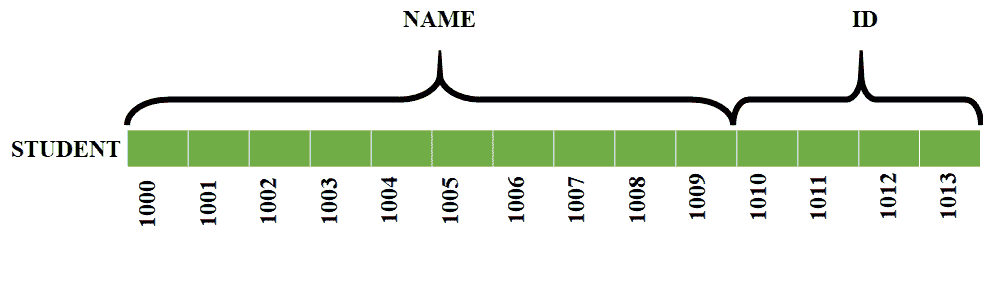
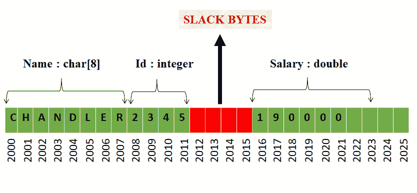

# 结构中的松弛字节:用示例

解释

> 原文:[https://www . geeksforgeeks . org/slack-bytes in-structures-用示例解释/](https://www.geeksforgeeks.org/slack-bytes-in-structures-explained-with-example/)

[**<u>【结构】</u>**](https://www.geeksforgeeks.org/structures-c/)**<u>:</u>**
结构用于存储同一变量名下属于不同数据类型的数据。结构示例如下所示:

```
struct STUDENT
{
    char[10] name;
    int id;
};
```

上述结构的**存储空间分配如下:**



在这里，我们看到在结构的成员之间没有空的空间。但在某些情况下**中的结构成员之间会出现空格**，这些被称为 ***松弛字节*** 。

**<u>是否需要松弛字节？</u>**
在计算机和科技领域 ***速度*** 是一个非常重要的因素。我们总是试图以这样一种方式进行设计和算法，即访问内存要快得多，或者获得解决方案要快得多。微处理器访问偶数地址中的数据比访问奇数地址中的数据更快。因此，我们试图这样分配数据的内存:特定变量的起始地址在偶数地址。

[微处理器](https://www.geeksforgeeks.org/microprocessor-tutorials/)访问存储在偶数地址的数据比访问存储在奇数地址的数据更快。因此，编译器有责任为成员分配内存，使其具有均匀的地址，以便可以非常快速地访问数据。这就产生了松弛字节的概念。

**<u>【SLACK BYTES:</u>**
优化后的编译器总是会给结构的成员分配偶数地址，这样数据就能被非常快速地访问。偶数地址可以是 2、4、8 或 16 的倍数。这在一些成员的边界之间引入了一些未使用的字节或漏洞。这些 ***未使用的字节或结构成员边界之间的孔洞称为松弛字节*** 。

松弛字节不包含任何有用的信息，它们实际上是对内存空间的浪费。但是在松弛字节概念的情况下，数据的访问会快得多。当使用松弛字节时，结构的大小将大于或等于结构的各个成员的大小之和。一些优化的[编译器](https://www.geeksforgeeks.org/introduction-of-compiler-design/)分配地址，使得每个成员的地址将是该结构的最大数据类型的大小的倍数。

**示例:**考虑以下结构声明:

```
struct EMPLOYEE
{
    char name[8];
    int id;
    double salary;
};
```

这里我们看到 double 数据类型占据了最高的内存空间( ***假设 double = 8 字节*** )。因此，每个成员将被分配一个 8 的倍数的存储器地址，如下所示:



请注意，该结构的所有成员都以 8 的倍数作为地址开始。我们可以观察到中间有一个空白(红色阴影区域)，称为松弛字节。