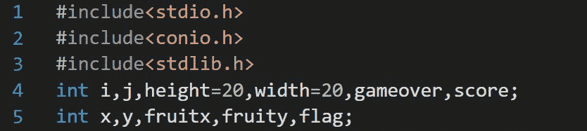
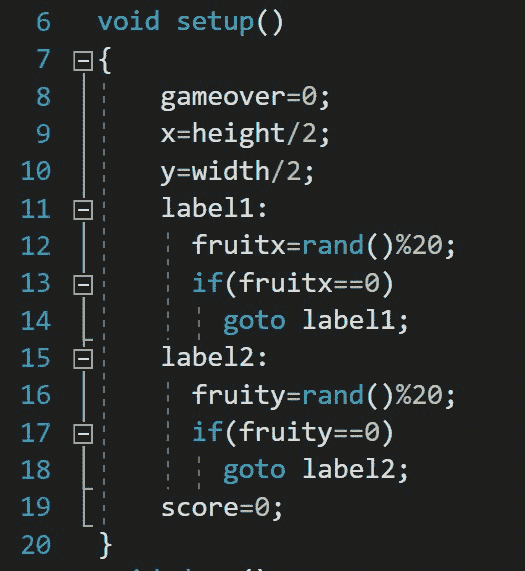
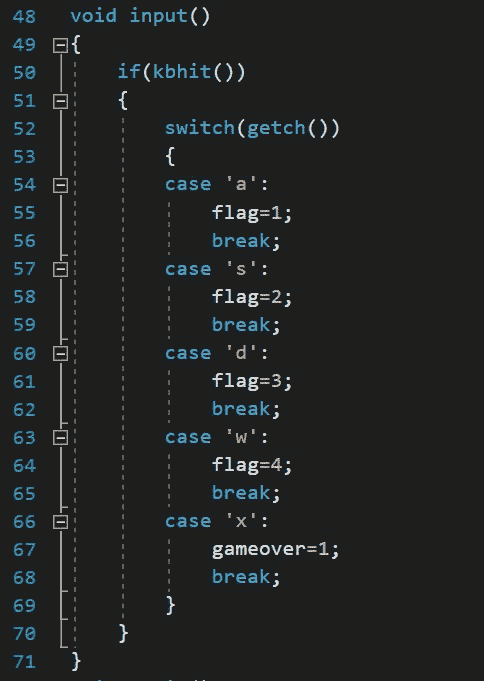
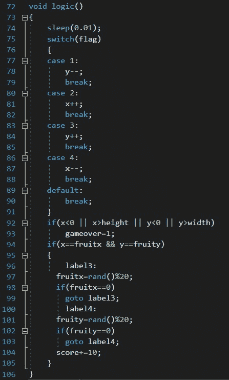
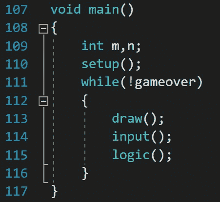
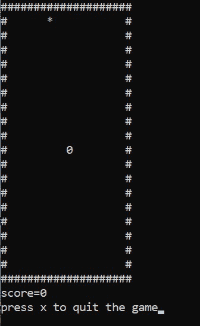

# C 区蛇游戏

> 原文:[https://www.geeksforgeeks.org/snake-game-in-c/](https://www.geeksforgeeks.org/snake-game-in-c/)

在本文中，任务是实现一个基本的 [**蛇游戏**](https://www.geeksforgeeks.org/design-snake-game/) **。**下面给出了这款游戏的一些功能:

*   蛇用 **0** (零)符号表示。
*   水果用 ***** (星号)符号表示。
*   借助键盘( **W** 、 **A** 、 **S** 、 **D** 键)，蛇可以根据用户的需要向任意方向移动。
*   当蛇吃水果时，分数会增加 10 分。
*   果实会在边界内自动生成。
*   每当蛇碰到边界，游戏就结束了。

**<u>创建此游戏的步骤</u> :**

*   将有四个用户定义的[功能](https://www.geeksforgeeks.org/functions-in-c/)。
*   建立一个游戏的边界。
*   水果是随机生成的。
*   然后每当蛇吃水果时增加分数。

本程序中创建的****自定义功能如下:****

*   ******Draw():** 此功能创建游戏将要进行的边界。****
*   ******设置():**该功能将设置水果在边界内的位置。****
*   ******输入():**该功能将从键盘上进行输入。****
*   ******逻辑():**该功能将设置蛇的运动。****

******<u>使用的内置功能</u> :******

*   ******kbhit():** 该功能在 [C](https://www.geeksforgeeks.org/c-programming-language/) 中用于判断一个键是否被按下。在程序中使用该功能包括头文件 [**conio.h**](https://www.geeksforgeeks.org/getch-function-in-c-with-examples/) 。如果一个键被按下，那么它返回一个非零值，否则它返回零。****
*   ******rand():**[rand()](https://www.geeksforgeeks.org/rand-and-srand-in-ccpp/)函数在 [**stdlib.h**](https://www.geeksforgeeks.org/whats-difference-between-and/) 中声明。每次调用它时，它都会返回一个随机整数值。****

******<u>头文件和变量</u> :******

*   ****本程序中使用的[头文件](https://www.geeksforgeeks.org/header-files-in-c-cpp-and-its-uses/)和[变量](https://www.geeksforgeeks.org/variables-and-keywords-in-c/)为:****

****[](https://media.geeksforgeeks.org/wp-content/uploads/20201231150832/variablesandheaderfiles.jpg)****

*   ****这里包括 <unistd.h>[头文件](https://www.geeksforgeeks.org/write-header-file-c/)为 [**睡眠()**](https://www.geeksforgeeks.org/java-concurrency-yield-sleep-and-join-methods/) 功能。</unistd.h>****

******Draw():** 该功能负责构建游戏将要进行的边界。****

****下面是使用 draw()构建轮廓边界的 C 程序:****

## ****C****

```
**// C program to build the outline
// boundary using draw()
#include <stdio.h>
#include <stdlib.h>
int i, j, height = 30;
int width = 30, gameover, score;

// Function to draw a boundary
void draw()
{
    // system("cls");
    for (i = 0; i < height; i++) {
        for (j = 0; j < width; j++) {
            if (i == 0 || i == width - 1 || j == 0
                || j == height - 1) {
                printf("#");
            }
            else {
                printf(" ");
            }
        }
        printf("\n");
    }
}

// Driver Code
int main()
{
    // Function Call
    draw();

    return 0;
}**
```

******Output:**

```
##############################
#                            #
#                            #
#                            #
#                            #
#                            #
#                            #
#                            #
#                            #
#                            #
#                            #
#                            #
#                            #
#                            #
#                            #
#                            #
#                            #
#                            #
#                            #
#                            #
#                            #
#                            #
#                            #
#                            #
#                            #
#                            #
#                            #
#                            #
#                            #
##############################

```**** 

******setup():** 使用**兰德()**函数编写代码生成边界内的果实。****

*   ****使用 **rand()%20** 因为边界的大小是**长= 20** 和**宽= 20** 所以果实会在边界内生成。****

****[](https://media.geeksforgeeks.org/wp-content/uploads/20201231145704/setupfunction.jpg)****

******Input():** 在该功能中，程序员编写代码从键盘(W、A、S、D、X 键)获取输入。****

****[](https://media.geeksforgeeks.org/wp-content/uploads/20201231152836/inputfunction.jpg)****

******逻辑():**在这里，为这个程序写下所有的逻辑就像为蛇的运动，为增加分数，当蛇会触碰到边界游戏就结束了，为退出游戏而随机生成的果实一旦蛇会吃到果实。****

****[](https://media.geeksforgeeks.org/wp-content/uploads/20201231153517/logicfunction.jpg)****

******sleep():**C 中的这个函数是将程序执行延迟给定秒数的函数。在这段代码中，sleep()用于减慢蛇的移动速度，这样用户就可以轻松地玩耍。****

******main():** 从 main()函数开始执行程序。它调用所有的函数。****

****[](https://media.geeksforgeeks.org/wp-content/uploads/20201231154657/mainfunction.jpg)****

****下面是构建完整蛇游戏的 C 程序:****

## ****C****

```
**// C program to build the complete
// snake game
#include <conio.h>
#include <stdio.h>
#include <stdlib.h>
#include <unistd.h>

int i, j, height = 20, width = 20;
int gameover, score;
int x, y, fruitx, fruity, flag;

// Function to generate the fruit
// within the boundary
void setup()
{
    gameover = 0;

    // Stores height and width
    x = height / 2;
    y = width / 2;
label1:
    fruitx = rand() % 20;
    if (fruitx == 0)
        goto label1;
label2:
    fruity = rand() % 20;
    if (fruity == 0)
        goto label2;
    score = 0;
}

// Function to draw the boundaries
void draw()
{
    system("cls");
    for (i = 0; i < height; i++) {
        for (j = 0; j < width; j++) {
            if (i == 0 || i == width - 1
                || j == 0
                || j == height - 1) {
                printf("#");
            }
            else {
                if (i == x && j == y)
                    printf("0");
                else if (i == fruitx
                         && j == fruity)
                    printf("*");
                else
                    printf(" ");
            }
        }
        printf("\n");
    }

    // Print the score after the
    // game ends
    printf("score = %d", score);
    printf("\n");
    printf("press X to quit the game");
}

// Function to take the input
void input()
{
    if (kbhit()) {
        switch (getch()) {
        case 'a':
            flag = 1;
            break;
        case 's':
            flag = 2;
            break;
        case 'd':
            flag = 3;
            break;
        case 'w':
            flag = 4;
            break;
        case 'x':
            gameover = 1;
            break;
        }
    }
}

// Function for the logic behind
// each movement
void logic()
{
    sleep(0.01);
    switch (flag) {
    case 1:
        y--;
        break;
    case 2:
        x++;
        break;
    case 3:
        y++;
        break;
    case 4:
        x--;
        break;
    default:
        break;
    }

    // If the game is over
    if (x < 0 || x > height
        || y < 0 || y > width)
        gameover = 1;

    // If snake reaches the fruit
    // then update the score
    if (x == fruitx && y == fruity) {
    label3:
        fruitx = rand() % 20;
        if (fruitx == 0)
            goto label3;

    // After eating the above fruit
    // generate new fruit
    label4:
        fruity = rand() % 20;
        if (fruity == 0)
            goto label4;
        score += 10;
    }
}

// Driver Code
void main()
{
    int m, n;

    // Generate boundary
    setup();

    // Until the game is over
    while (!gameover) {

        // Function Call
        draw();
        input();
        logic();
    }
}**
```

******输出:******

****[](https://media.geeksforgeeks.org/wp-content/uploads/20201231160840/snakegame.jpg)****

******演示:******

****<video class="wp-video-shortcode" id="video-554135-1" width="640" height="360" preload="metadata" controls=""><source type="video/mp4" src="https://media.geeksforgeeks.org/wp-content/uploads/20201231163050/snake-game.mp4?_=1">[https://media.geeksforgeeks.org/wp-content/uploads/20201231163050/snake-game.mp4](https://media.geeksforgeeks.org/wp-content/uploads/20201231163050/snake-game.mp4)</video>****