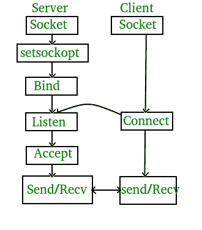

# C/c++ 中的套接字编程

> 原文:[https://www.geeksforgeeks.org/socket-programming-cc/](https://www.geeksforgeeks.org/socket-programming-cc/)

**什么是套接字编程？**
Socket 编程是连接网络上两个节点相互通信的一种方式。一个套接字(节点)监听某个 IP 的特定端口，而另一个套接字则与另一个套接字建立连接。服务器形成侦听器套接字，而客户端则连接到服务器。

**服务器和客户端模型状态图**
[](http://media.geeksforgeeks.org/wp-content/uploads/Socket-Programming-in-C-C-.jpg)

**服务器阶段**

*   **Socket creation:**

    ```cpp
    int sockfd = socket(domain, type, protocol)
    ```

    **sockfd:** 套接字描述符，一个整数(像文件句柄)
    **域:**整数，通信域例如 AF_INET (IPv4 协议)，AF_INET6 (IPv6 协议)
    **类型:**通信类型
    SOCK_STREAM: TCP(可靠，面向连接)
    SOCK_DGRAM: UDP(不可靠，无连接)
    **协议:**互联网协议(IP)的协议值，为 0 这与出现在数据包的 IP 报头的协议字段中的数字相同。(更多详细信息请参见 man 协议)

*   **Setsockopt:**

    ```cpp
    int setsockopt(int sockfd, int level, int optname,  
                       const void *optval, socklen_t optlen);
    ```

    这有助于操作由文件描述符 sockfd 引用的套接字选项。这是完全可选的，但是它有助于地址和端口的重用。防止错误，如:“地址已被使用”。

*   **Bind:**

    ```cpp
    int bind(int sockfd, const struct sockaddr *addr, 
                              socklen_t addrlen);
    ```

    创建套接字后，bind 函数将套接字绑定到 addr(自定义数据结构)中指定的地址和端口号。在示例代码中，我们将服务器绑定到本地主机，因此我们使用 INADDR _ ANY 来指定 IP 地址。

*   **Listen:**

    ```cpp
    int listen(int sockfd, int backlog);
    ```

    它将服务器套接字置于被动模式，等待客户端靠近服务器建立连接。backlog 定义 sockfd 的挂起连接队列可能增长到的最大长度。如果连接请求在队列已满时到达，客户端可能会收到一个错误，并显示为“已恢复”。

*   **Accept:**

    ```cpp
    int new_socket= accept(int sockfd, struct sockaddr *addr, socklen_t *addrlen);
    ```

    它提取侦听套接字 sockfd 的挂起连接队列中的第一个连接请求，创建一个新的已连接套接字，并返回一个引用该套接字的新文件描述符。此时，客户机和服务器之间建立了连接，它们准备好传输数据。

**客户阶段**

*   **套接字连接:**与服务器的套接字创建完全相同
*   **Connect:**

    ```cpp
    int connect(int sockfd, const struct sockaddr *addr,  
                                 socklen_t addrlen);
    ```

    connect()系统调用将文件描述符 sockfd 引用的套接字连接到 addr 指定的地址。服务器的地址和端口在 addr 中指定。

**实现**
这里我们在服务器和客户端之间交换一条 hello 消息来演示客户端/服务器模型。

## server.c

```cpp
// Server side C/C++ program to demonstrate Socket programming
#include <unistd.h>
#include <stdio.h>
#include <sys/socket.h>
#include <stdlib.h>
#include <netinet/in.h>
#include <string.h>
#define PORT 8080
int main(int argc, char const *argv[])
{
    int server_fd, new_socket, valread;
    struct sockaddr_in address;
    int opt = 1;
    int addrlen = sizeof(address);
    char buffer[1024] = {0};
    char *hello = "Hello from server";

    // Creating socket file descriptor
    if ((server_fd = socket(AF_INET, SOCK_STREAM, 0)) == 0)
    {
        perror("socket failed");
        exit(EXIT_FAILURE);
    }

    // Forcefully attaching socket to the port 8080
    if (setsockopt(server_fd, SOL_SOCKET, SO_REUSEADDR | SO_REUSEPORT,
                                                  &opt, sizeof(opt)))
    {
        perror("setsockopt");
        exit(EXIT_FAILURE);
    }
    address.sin_family = AF_INET;
    address.sin_addr.s_addr = INADDR_ANY;
    address.sin_port = htons( PORT );

    // Forcefully attaching socket to the port 8080
    if (bind(server_fd, (struct sockaddr *)&address, 
                                 sizeof(address))<0)
    {
        perror("bind failed");
        exit(EXIT_FAILURE);
    }
    if (listen(server_fd, 3) < 0)
    {
        perror("listen");
        exit(EXIT_FAILURE);
    }
    if ((new_socket = accept(server_fd, (struct sockaddr *)&address, 
                       (socklen_t*)&addrlen))<0)
    {
        perror("accept");
        exit(EXIT_FAILURE);
    }
    valread = read( new_socket , buffer, 1024);
    printf("%s\n",buffer );
    send(new_socket , hello , strlen(hello) , 0 );
    printf("Hello message sent\n");
    return 0;
}
```