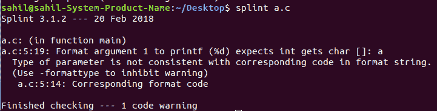

# 夹板——一个 C 程序验证器

> 原文:[https://www.geeksforgeeks.org/splint-c-program-verifier/](https://www.geeksforgeeks.org/splint-c-program-verifier/)

c 编译器在检查程序正确性的许多方面都相当模糊，尤其是在类型检查方面。仔细使用函数原型可以帮助现代 C 编译器完成这项任务。但是，仍然不能保证一旦您成功编译了程序，它就会正确运行。

UNIX Lint 工具**安全编程 Lint** (夹板)，可以帮助检查大量编程错误。查看在线手册页(人工夹板)了解夹板的完整细节。

要运行夹板，只需输入命令:

```cpp
splint myprog.c

```

夹板特别擅长检查变量和函数赋值的类型检查、效率、未使用的变量和函数标识符、无法访问的代码和可能的内存泄漏。有很多有用的选择来帮助控制夹板(见男子夹板)。

```cpp
#include <stdio.h>
int main()
{
    char a[] = "hello";
    printf("%d\n", a);
    return 0;
}
```

**输出:**
