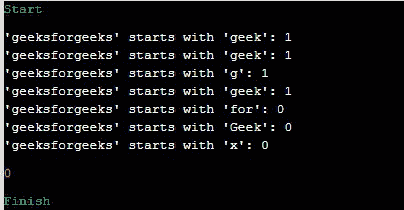
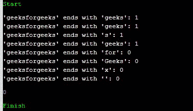

# 在 C++ 20 中以()开头，以()结尾，示例

> 原文:[https://www . geesforgeks . org/starts _ with-and-ends _ with-in-C20-with-examples/](https://www.geeksforgeeks.org/starts_with-and-ends_with-in-c20-with-examples/)

在这篇文章中，我们将讨论**以()**开头，**以()**结尾，并用 C++ 中的例子 <u>20。</u>

### <u>以()</u>开头

这个函数有效地检查一个字符串是否以给定的前缀开始。这个函数是用 std::basic_string 和 std::basic_string_view 编写的。

**语法:**

> 模板 <typename prefixtype="">bool 以 _ 开头(前缀类型前缀)</typename>

在上面的语法中**前缀**可以是:

*   线
*   字符串视图
*   单字符或带有空终止字符的 C 风格字符串

**<u>以()开头，前缀类型不同:</u>**

> bool 以 _ 开头(STD::basic _ string _ view<char t="" traits="">x)const no except；
> bool 以 _ CHart(x)const no except 开头；
> bool 以 _ const(CHart * x)const 开头；</char>

函数的三种重载形式都有效地返回了 STD::basic _ string _ view<char t="">(data()、size())。以(x)开头；</char>

**<u>参数</u> :** 需要单个字符序列或单个字符来与字符串的开头进行比较。

**返回值:**返回如下布尔真或假指示:

*   **True:** 如果字符串以前缀开头。
*   **False:** 如果字符串不以前缀开头。

**程序 1:**

下面的程序演示了在 [C++ ](https://www.geeksforgeeks.org/c-plus-plus/) 中**以()**开头的概念:

## C++

```cpp
// C++ program to illustrate the use
// of starts_with()
#include <iostream>
#include <string>
#include <string_view>
using namespace std;

// Function template to check if the
// given string starts with the given
// prefix or not
template <typename PrefixType>
void if_prefix(const std::string& str,
               PrefixType prefix)
{
    cout << "'" << str << "' starts with '"
         << prefix << "': "
         << str.starts_with(prefix)
         << endl;
}

// Driver Code
int main()
{
    string str = { "geeksforgeeks" };

    if_prefix(str, string("geek"));

    // prefix is string
    if_prefix(str, string_view("geek"));

    // prefix is string view
    if_prefix(str, 'g');

    // prefix is single character
    if_prefix(str, "geek\0");

    // prefix is C-style string
    if_prefix(str, string("for"));

    if_prefix(str, string("Geek"));

    if_prefix(str, 'x');

    return 0;
}
```

**输出:**

[](https://media.geeksforgeeks.org/wp-content/uploads/20201102015227/Screenshot20201102015203.jpg)

这个函数有效地检查一个字符串是否以给定的后缀结束。这个函数是用 std::basic_string 和 std::basic_string_view 编写的。

**语法:**

> **模板<类型名称后缀类型> bool 以(后缀类型后缀)**开头

在上面的语法中，**后缀**可以是:

*   线
*   字符串视图
*   单字符或带有空终止字符的 C 风格字符串。

**<u>以()结尾不同类型的后缀:</u>**

> constexpr bool 以 _ 结尾(STD::basic _ string _ view<char t="" traits="">SV)const noexcept；|
> constexpr boll 以 _ CharT(c)const no except 结尾；
> constexpr bool 以 _ const(CHart * s)const 结尾；</char>

函数的三种重载形式都有效地返回了 STD::basic _ string _ view<char t="">(data()、size())。以(x)结尾；</char>

**<u>参数</u> :** 需要单个字符序列或单个字符与字符串结尾进行比较。

**返回值:**返回布尔值真或假，表示如下:

*   **True:** 如果字符串以后缀结尾。
*   **False:** 如果字符串不以后缀结尾。

**程序 2:**

下面的程序演示了 [C++ ](https://www.geeksforgeeks.org/c-plus-plus/) 中**以()**结尾的概念:

## C++

```cpp
// C++ program to illustrate the use
// of ends_with()
#include <iostream>
#include <string>
#include <string_view>
using namespace std;

// Function template to check if the
// given string ends_with given string
template <typename SuffixType>
void if_suffix(const std::string& str,
               SuffixType suffix)
{
    cout << "'" << str << "' ends with '" << suffix << "': " << str.ends_with(suffix) << std::endl;
}

// Driver Code
int main()
{
    string str = { "geeksforgeeks" };

    if_suffix(str, string("geeks"));

    // suffix is string
    if_suffix(str, string_view("geeks"));

    // suffix is string view
    if_suffix(str, 's');

    // suffix is single character
    if_suffix(str,
              "geeks\0");

    // suffix is C-style string
    if_suffix(str, string("for"));

    if_suffix(str, string("Geeks"));

    if_suffix(str, 'x');

    if_suffix(str, '\0');
}
```

**输出:**

[](https://media.geeksforgeeks.org/wp-content/uploads/20201102020259/Screenshot20201102020241.jpg)