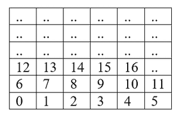
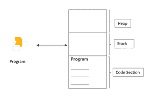
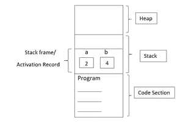
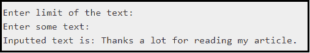
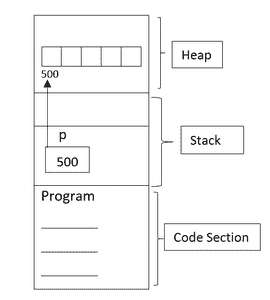
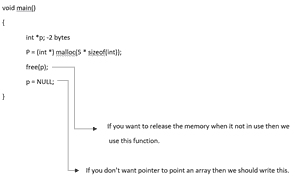
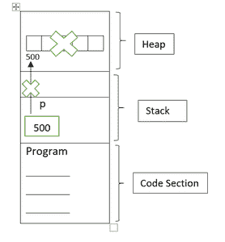
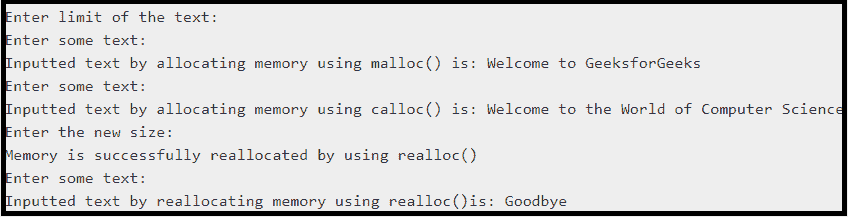

# C 中的静态和动态内存分配

> 原文:[https://www . geesforgeks . org/静态和动态内存分配 in-c/](https://www.geeksforgeeks.org/static-and-dynamic-memory-allocation-in-c/)

[内存](https://www.geeksforgeeks.org/memory-layout-of-c-program/)被分成更小的可寻址单元，称为**字节**。假设这些是作为**字节**的小盒子。根据下表，每个字节都有自己的地址。例如:0、1、2、3、4、5、6 等。



**<u>程序如何使用内存？</u>T3】**

内存分为三个部分。

*   [**堆内存**](https://www.geeksforgeeks.org/stack-vs-heap-memory-allocation/) **:** 它是[主内存](https://www.geeksforgeeks.org/random-access-memory-ram-and-read-only-memory-rom/)的一部分。它是无组织的，当你需要使用它的时候，它被当作一种资源，如果你不发布的话。堆内存不能借助[指针](https://www.geeksforgeeks.org/pointers-in-c-and-c-set-1-introduction-arithmetic-and-array/)直接使用。
*   [**堆栈内存**](https://www.geeksforgeeks.org/stack-vs-heap-memory-allocation/) **:** 它存储由[函数](https://www.geeksforgeeks.org/functions-in-c/)创建的临时变量。在[栈](https://www.geeksforgeeks.org/stack-data-structure/)中，变量在运行时被声明、存储和初始化。它遵循[先进先出的方法](https://www.geeksforgeeks.org/fifo-vs-lifo-approach-in-programming/)，这意味着任何最后存储的元素在不使用时都会先删除。
*   [**【代码段】**](https://www.geeksforgeeks.org/memory-layout-of-c-program/) **:** 程序每次执行都会被带入主存。这个程序将存储在代码部分。根据程序，它将决定是利用堆栈还是堆部分。

下图说明了程序如何使用内存:



[**<u>静态内存分配</u>**](https://www.geeksforgeeks.org/memory-allocation-in-static-data-members-in-c/)

在[静态内存分配](https://www.geeksforgeeks.org/difference-between-static-and-dynamic-memory-allocation-in-c/)中，每当程序执行时，它都会固定程序将要占用的大小，并且不能进一步更改。所以，确切的内存需求必须事先知道。[内存的分配和释放](https://www.geeksforgeeks.org/dynamic-memory-allocation-in-c-using-malloc-calloc-free-and-realloc/)将由编译器自动完成。当一切都在编译时(或)运行时之前完成时，称为静态内存分配。

**主要特征:**

*   分配和解除分配由编译器完成。
*   它使用数据结构堆栈进行静态内存分配。
*   变量被永久分配。
*   没有可重用性。
*   执行比动态内存分配更快。
*   内存在运行前分配。
*   效率较低。

**例如:**

## C++

```cpp
// C++ program to illustrate the
// concept of memory allocation
#include <iostream>
using namespace std;

// Driver Code
void main()
{
    int a; // 2 bytes
    long b; // 4 bytes
}
```

**说明:**

*   上面这段代码声明了 2 个变量。这里的假设是 **int 占用 2 字节**而 **long 占用 4 字节**内存。变量占用了多少内存也取决于编译器。
*   这些变量将存储在堆栈部分。对于程序中的每个函数，它将占用堆栈部分的某个部分，这就是所谓的激活记录(或)堆栈帧，当它不使用时，编译器将删除它。
*   下图说明了同样的情况:



下面是说明静态内存分配的 C 程序:

## C

```cpp
// C program to implement
// static memory allocation
#include <stdio.h>
#include <stdlib.h>

// Driver code
int main()
{
    int size;
    printf("Enter limit of the text: \n");
    scanf("%d", &size);
    char str[size];
    printf("Enter some text: \n");
    scanf(" ");
    gets(str);
    printf("Inputted text is: %s\n", str);
    return 0;
}
```

**输入:**


**输出:**



**优势:**

*   用法简单。
*   分配和解除分配由编译器完成。
*   高效的执行时间。
*   它使用[堆栈数据结构](https://www.geeksforgeeks.org/stack-data-structure/)。

**缺点:**

*   内存浪费问题。
*   必须知道确切的内存需求。
*   初始化后，内存不能调整一次大小。

**<u>动态内存分配</u>**

在[动态内存分配](https://www.geeksforgeeks.org/what-is-dynamic-memory-allocation/)中，大小初始化和分配由程序员完成。它由指针管理和服务，指针指向我们称之为堆的区域中新分配的内存空间。堆内存是无组织的，当您需要使用它时，如果不释放它，它将被视为一种资源。当一切都在运行时或执行时完成，这就是所谓的动态内存分配。

**主要特征:**

*   运行时动态分配
*   如果需要，我们还可以重新分配内存大小。
*   动态分配在运行时完成。
*   没有内存浪费

[stdlib.h 头文件](https://www.geeksforgeeks.org/whats-difference-between-and/)中有一些功能可以使用，这将有助于[动态分配内存](https://www.geeksforgeeks.org/what-is-dynamic-memory-allocation/)。

*   [**malloc()**](https://www.geeksforgeeks.org/dynamic-memory-allocation-in-c-using-malloc-calloc-free-and-realloc/)**:**运行时[分配内存的最简单的函数](https://www.geeksforgeeks.org/dynamic-memory-allocation-in-c-using-malloc-calloc-free-and-realloc/)叫做 malloc()。需要指定需要分配的内存字节数，因为参数返回分配的第一个内存字节的地址，因为您得到一个返回的地址，指针是放置它的唯一位置。

**语法:**

> int *p = (int*)malloc(值的数量*大小(int))；

上面 malloc()的参数清楚地表明，应该有足够的字节来容纳 int 类型的值。还要注意强制转换(int*)，它将函数返回的地址转换为指向 int 的类型指针。 [malloc()函数](https://www.geeksforgeeks.org/malloc-vs-new/)返回一个值为 [**空值**](https://www.geeksforgeeks.org/dangling-void-null-wild-pointers/) 的指针。

*   [**【卡洛克()】**](https://www.geeksforgeeks.org/difference-between-malloc-and-calloc-with-examples/) **:** 卡洛克()函数与 malloc() 相比有几个[优势。它将内存分配为给定大小的多个元素。它初始化分配的内存，使所有字节都为零。calloc()函数需要两个参数值:](https://www.geeksforgeeks.org/dynamic-memory-allocation-in-c-using-malloc-calloc-free-and-realloc/)
    *   需要空间的数据项的数量。
    *   每个数据项的大小。

这与使用 malloc()非常相似，但最大的好处是您知道内存区域将被初始化为零。

**语法:**

> int *p = (int*)calloc(数据项数量，sizeof(int))；

*   [**【realloc()】**](https://www.geeksforgeeks.org/g-fact-66/)**:****realloc()函数**使您能够重用或扩展之前使用 malloc()或 calloc()分配的内存。一个指针，包含一个先前通过调用 malloc()，calloc()返回的地址。需要分配的新内存的字节大小。它分配第二个参数指定的内存，并将作为第一个参数传递的指针所引用的先前分配的内存内容转移到新分配的内存。

**语法:**

> int *np =(类型转换)realloc(以前的指针类型，新的元素数量* sizeof(int))；

*   **。** [**空闲()**](https://www.geeksforgeeks.org/dynamic-memory-allocation-in-c-using-malloc-calloc-free-and-realloc/) **:** 当动态分配内存时，应该总是在不再需要时释放内存。[堆上分配的内存](https://www.geeksforgeeks.org/stack-vs-heap-memory-allocation/)将在程序结束时自动释放，但最好在完成后显式释放内存，即使只是在退出程序之前。出现[内存泄漏内存](https://www.geeksforgeeks.org/what-is-memory-leak-how-can-we-avoid/)是动态分配的，对它的引用不会被保留，因此无法释放内存。

**语法:**

> 自由(指针)；

**例如:**

## C

```cpp
// C program to illustrate the concept
// of memory allocation
#include <iostream>
using namespace std;

// Driver Code
void main()
{
    int* p; // 2 bytes
    P = (int*)malloc(5 * sizeof(int));
}
```

**示例:**

*   在上面这段代码中，声明了一个指针 p。假设指针 p 将占用 2 个字节的内存，这同样取决于编译器。
*   该指针将存储在堆栈部分，并将指向堆中分配的第一个索引的数组地址。堆内存不能直接使用，但是在指针的帮助下，它可以被访问。



*   当程序不使用时，应该释放内存。否则，将导致内存泄漏。



*   释放堆中分配的内存后。下图说明了解除分配后的主内存。



下面是说明动态内存分配的 C 程序:

## C

```cpp
// C program to illustrate the above
// concepts of memory allocation
#include <stdio.h>
#include <stdlib.h>

// Driver Code
int main()
{
    int size, resize;
    char* str = NULL;
    printf("Enter limit of the "
           "text: \n");
    scanf("%d", &size);

    str = (char*)malloc(size * sizeof(char));

    // If str is not NULL
    if (str != NULL) {
        printf("Enter some text: \n");
        scanf(" ");
        gets(str);
        printf("Inputted text by allocating"
               "memory using malloc() is: "
               "%s\n",
               str);
    }

    // Free the memory
    free(str);
    str = (char*)calloc(50, sizeof(char));

    // If str is not NULL
    if (str != NULL) {
        printf("Enter some text: \n");
        scanf(" ");
        gets(str);
        printf("Inputted text by allocating "
               "memory using calloc() is: "
               "%s\n",
               str);
    }

    printf("Enter the new size: \n");
    scanf("%d", &resize);
    str = (char*)realloc(str, resize * sizeof(char));

    printf("Memory is successfully "
           "reallocated by using "
           "realloc() \n");

    // If str is not NULL
    if (str != NULL) {
        printf("Enter some text: \n");
        scanf(" ");
        gets(str);
        printf("Inputted text by reallocating"
               " memory using realloc()is: "
               "%s\n",
               str);
    }

    // Free the memory
    free(str);
    str = NULL;

    return 0;
}
```

**输入:**


**输出:**



**优势:**

*   动态分配在运行时完成。
*   我们可以随时分配(创建)额外的存储空间。
*   每当我们用完动态空间时，就可以释放(释放/删除)它们。
*   因此，一个人总是能够拥有所需的空间——不多也不少。
*   如果需要，可以重新分配内存大小。

**缺点:**

*   由于内存是在运行时分配的，因此需要更多的时间。
*   完成后，用户需要释放内存。这很重要，因为它更有可能变成难以发现的 bug。