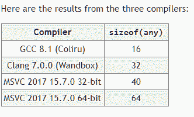

# STD::c++ 中的任意类

> 原文:[https://www.geeksforgeeks.org/stdany-class-in-c/](https://www.geeksforgeeks.org/stdany-class-in-c/)

**any** 是 **C++ 17** 的最新特性之一，它提供了一个类型安全的容器来存储任何类型的单个值。通俗地说，它是一个容器，可以储存任何价值，而不用担心*型安全*。它通过模仿类似于输入的**对象**的行为，作为 C++ 的扩展。NET/Java 或 C 语言中的 **void*** 类型。基于 **boost::any** 设计，在**“any”**头文件中提供。

**语法:**

```cpp
any var= value/object; 

```

其中值类似于“17”或“Hello World”

### 任何的初始化:

任何都可以用三种不同的方法构建:

1.  Copy Initialization

    **语法:**

    ```cpp
    any variable_name = object/value;

    ```

2.  Parameterized constructor / brace initializer.

    **语法:**

    ```cpp
    any variable_name ( object/value);

    ```

3.  Using the assignment operator

    **语法:**

    ```cpp
    any variable_name;
    variable_name= object/value;

    ```

    ### 将 any_var 值转换为其原始类型:

    必须使用 ***any_cast <类型> ( any_var )*** 将 any_var 值转换为其原始类型。如果存储值的类型不同于试图强制转换的类型，编译器将抛出“ **bad_any_cast** ”异常。

    **注意:**施法时的类型必须与原类型完全相同。演职期间没有自动升降。因此，在将值转换为其原始类型时，必须特别小心。

    **一个简单的例子(说明任意的构造/读取值)**

    ```cpp
    #include <any>
    #include <iostream>
    #include <string>
    using namespace std;

    int main()
    {
        try {

            // Integer 42:  Using the copy initialisation
            any value = 42;
            cout << "\n Value: "
                 << any_cast<int>(value);

            // Using the assignment operator
            // to store a string
            value = "Hello World";
            cout << "\n Value: "
                 << any_cast<const char*>(value);

            // Using the parametrized constructor
            any val(19.0);
            cout << " \n Value: "
                 << any_cast<double>(val);

            any val_brace{ string("Brace Initialisation") };
            cout << " \n Value: "
                 << any_cast<string>(val_brace);
        }

        catch (bad_any_cast& e) {
            cout << "\n"
                 << e.what();
        }
        return 0;
    }
    ```

    **输出:**

    ```cpp
     Value: 42 
     Value: Hello World 
     Value: 19 
     Value: Brace Initialisation

    ```

    ### 成员职能:

    1.  **就位**:改变包含的对象，直接构造新的对象
    2.  **重置**:破坏包含的对象(调用对象的析构函数)
    3.  **有 _ 值**:检查“any_variable”是否包含值
    4.  **类型**:返回包含值的类型标识

    让我们一个接一个地详细看看这些方法:

    *   **emplace:** emplace member function is similar to the assignment operator and is used to change the contained object with a new object.

        **程序:**

        ```cpp
        // C++ program to demonstrate
        // emplace() method of any class

        #include <any>
        #include <iostream>
        #include <string>

        int main()
        {
            try {
                any value = 4.2;
                cout << " \n Value:  "
                     << any_cast<double>(value);

                value.emplace<int>(44);
                cout << " \n Value:  "
                     << any_cast<int>(value);
            }
            catch (bad_any_cast& e) {
                cout << "\n"
                     << e.what();
            }
            return 0;
        }
        ```

        **输出:**

        ```cpp
        Value:  4.2 
        Value:  44

        ```

    *   **reset:** It destroys the contained object by calling the destructor of the contained object.

        **程序:**

        ```cpp
        // C++ program to demonstrate
        // reset() method of any class

        #include <any>
        #include <iostream>
        #include <string>

        int main()
        {
            try {
                any var = 4.2;
                cout << " \n Value:  "
                     << any_cast<double>(var);

                var.reset();
                if (!var.has_value())
                    cout << " \n No value found in var variable";
            }
            catch (bad_any_cast& e) {
                cout << "\n"
                     << e.what();
            }
            return 0;
        }
        ```

        **输出:**

        ```cpp
        Value:  4.2 
        No value found in var variable

        ```

    *   **has_value:** This member function is used to check whether the object contains a value or not

        **程序:**

        ```cpp
        // C++ program to demonstrate
        // has_value() method of any class

        #include <any>
        #include <iostream>
        #include <string>

        int main()
        {
            try {
                any var = 9.5;
                cout << " \n Value:  "
                     << any_cast<double>(var);

                if (var.has_value())
                    cout << " \n Value found of type "
                         << var.type().name();
            }

            catch (bad_any_cast& e) {
                cout << "\n"
                     << e.what();
            }
            return 0;
        }
        ```

        **输出:**

        ```cpp
         Value:  9.5 
         Value found of type d

        ```

    *   **type:** This member function returns a type_info structure that can be used to get the properties of the stored object.

        **程序:**

        ```cpp
        // C++ program to demonstrate
        // type() method of any class

        #include <any>
        #include <iostream>
        #include <string>

        int main()
        {
            try {
                any var = 12.0f;
                cout << " \n Type:  "
                     << var.type().name();

                var = "Hello World";
                cout << " \n Type:  "
                     << var.type().name();
            }
            catch (bad_any_cast& e) {
                cout << "\n"
                     << e.what();
            }
            return 0;
        }
        ```

        **输出:**

        ```cpp
        Type:  f 
        Type:  PKc

        ```

### 任何用途

典型用途包括

1.  在库中，当一个库类型在不知道可用类型集的情况下必须保存或传递任何东西时。
2.  信息传递
3.  实现解析器库。JSON 解析器
4.  用户界面:控件可以容纳任何东西
5.  实体组件系统。

任何的一个主要好处是它可以用 void*替代。void*功能有限(仅存储指针类型)，被认为是不安全的模式。

### 错误处理:

关于任何类的错误处理，有两个选项:

1.  **Using Exceptions:** bad_any_cast is the exception thrown by the value-returning forms of any_cast on type-mismatch.

    **示例:**

    ```cpp
    // C++ program to demonstrate
    // using exceptions of any class

    #include <any>
    #include <iostream>
    #include <string>

    int main()
    {
        try {
            any var = 12.0f;

            cout << " \n Value:  "
                 << any_cast<double>(var);
        }

        catch (bad_any_cast& e) {
            cout << "\n"
                 << e.what();
        }
        return 0;
    }
    ```

    **输出**

    ```cpp
    Value:  
    bad any_cast

    ```

2.  **Returning a Pointer:** Returning a pointer is useful when the exception mechanism has been disabled in the compiler. This particular overload of any_cast returns the pointer to the contained object if the cast was successful and returns ***nullptr***.

    **示例:**

    ```cpp
    // C++ program to demonstrate
    // returning pointer of any class

    #include <any>
    #include <iostream>
    #include <string>
    using namespace std;

    int main()
    {
        any var = 12.0f;

        // Special Overload of any_cast
        auto* tval = any_cast<float>(&var);
        if (!tval) {

            // Type-mismatch
            cout << " \n Bad_any_cast ";
        }
        else {

            // Value of the object
            cout << " \n Value:  "
                 << *tval;
        }

        return 0;
    }
    ```

    **输出:**

    ```cpp
    Value:  12

    ```

### 内存考虑事项

尽管 any 给了语言很大的灵活性，但是 any 的主要问题是额外的动态内存分配。由于容器不知道包含对象，因此动态分配成为任何容器的必备条件。

但是根据标准，实现应该避免为小的包含值使用动态分配的内存。示例:其中构造的对象只包含一个 int。这种小对象优化只能应用于类型为真的 T。

这通常意味着编译器必须使用小缓冲区优化(SBO)，其中必须为要包含的类型保留一定量的内存。



从上表可以看出，在某些情况下，为 SBO 保留的内存可能高达 64 字节！(MSVC-64 位)。这意味着任何对象的每个对象都需要保留 64 字节的内存，即使该对象很小，这是相当大的内存开销。

虽然任何一个都是 C++ 中非常强大的特性。它在内存方面有相当大的开销。