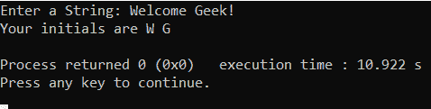

# std::basic_istream::在 C++中忽略，示例

> 原文:[https://www . geesforgeks . org/stdbasic _ is treamignore-in-c-with-examples/](https://www.geeksforgeeks.org/stdbasic_istreamignore-in-c-with-examples/)

**STD::basic _ is tream::ignore**用于从输入字符串中提取字符，并丢弃它们，包括定界字符，即如果到达文件末尾，该函数将停止提取字符。定界字符是新的行字符，即 **'\n'** 。如果使用文件进行输入，当到达文件末尾时，此功能也将停止提取字符。该功能通过首先构建一个[哨兵对象](http://www.cplusplus.com/reference/istream/basic_istream/sentry/)来访问输入序列。它从关联的流缓冲区对象中提取字符，并在返回前销毁 sentry 对象。
**头文件:**

```cpp
#include <iostream>
```

**语法:**

```cpp
istream& ignore(size N,
            int delim = EOF);
```

**参数:**接受以下参数:

*   **N:** 代表最大提取字符数。
*   **delim:** 用于停止提取的地方。

**返回值:**返回 **basic_istream** 对象。
下面是演示**basic _ istream::ignore()**:
**程序 1:**

## 卡片打印处理机（Card Print Processor 的缩写）

```cpp
// C++ program to demonstrate
// basic_istream::ignore

#include <bits/stdc++.h>
using namespace std;

// Driver Code
int main()
{

    // Input String
    istringstream input(
        "12\n"
        "It is a string\n"
        "14\n");

    for (;;) {

        int n;

        // Taking input streamed string
        input >> n;

        // Check for end of file or if
        // any bad  bit occurs
        if (input.eof() || input.bad()) {
            break;
        }

        // If any failbit occurs
        else if (input.fail()) {

            // Clear the input
            input.clear();

            // Use ignore to stream the given
            // input as per delimeter '\n'
            input.ignore(
                numeric_limits<streamsize>::max(),
                '\n');
        }

        // Else print the integer in
        // the string
        else {
            cout << n << '\n';
        }
    }
    return 0;
}
```

**Output:** 

```cpp
12
14
```

**节目 2:**

## 卡片打印处理机（Card Print Processor 的缩写）

```cpp
// C++ program to demonstrate
// basic_istream::ignore

#include <bits/stdc++.h>
using namespace std;

// Driver Code
int main()
{

    char first, last;

    cout << "Enter a String: ";

    // Get one character
    first = cin.get();

    // Ignore string until space occurs
    cin.ignore(256, ' ');

    // Get one character
    last = std::cin.get();

    cout << "Your initials are "
         << first << ' '
         << last << '\n';

    return 0;
}
```

**输出:**



**参考:**T2【http://www . cplusplus . com/Reference/is tream/basic _ is tream/ignore/T4】