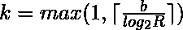

# 在 C++中生成 _ 规范函数模板

> 原文:[https://www . geesforgeks . org/STD generate _ canonical-function-template-in-c/](https://www.geeksforgeeks.org/stdgenerate_canonical-function-template-in-c/)

C++中的这个模板用于将 g 生成的值转换为范围[0，1]内的浮点值，保留用 g 生成的序列的一致性属性为了生成足够的熵 *generate_canonical()* 将精确地调用 g()k 次，其中，



**语法:**

```cpp
template ( class RealType, size_t bits, class URNG )
RealType generate_canonical (URNG& g);
```

**模板参数:**该模板接受三个参数，如上所述，描述如下:

*   **实数类型:**函数返回浮点类型的值。
*   **位:**尾数中的最大位数。
*   **URNG:** 一个统一的随机数生成器类。

**参数:**generate _ canonical()函数接受单参数 *g* ，用作统一随机数生成器对象。它用于获取熵。

**返回值:**该函数返回一个范围为[0，1]的浮点值。

下面的程序说明了上面的 C++模板
**程序:**

```cpp
// C++ program to illustrate generate_canonical()
// function.
#include <bits/stdc++.h>
using namespace std;

int main()
{
    // Obtain a root from the system clock:
    unsigned root = chrono::system_clock::now().time_since_epoch().count();

    // Random number engine class
    // that generates pseudo-random numbers
    default_random_engine generator(root);
    double can_val = generate_canonical<double, 
                              numeric_limits<double>::digits>(generator);

    // Print the random canonical value
    // It will display different value everytime
    cout << "Random canonical value: " << can_val;

    return 0;
}
```

**Output:**

```cpp
Random canonical value: 0.0281975

```

**参考:**T2【http://www . cplusplus . com/Reference/random/generate _ canonical/