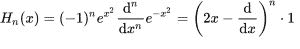

# STD::c++ 中的 Hermite

> 原文:[https://www.geeksforgeeks.org/stdhermite-in-c/](https://www.geeksforgeeks.org/stdhermite-in-c/)

std::hermite 基于以下等式给出的 hermite 多项式函数:



求解埃尔米特多项式后，结果如下表所示:

| n 的值 | Hermite(n，x) |
| --- | --- |
| Zero | one |
| one | 2x |
| Two | 4x <sup>2</sup> -2 |
| three | 8x <sup>3</sup> -12x |
| four | 16x <sup>4</sup> -48x <sup>2</sup> +12 |
| … | … |

示例:

> 输入:n = 2 x = 7
> 输出:194
> n = 2 的公式，
> 4x 7x 7–2 = 196–2 = 194
> 
> 输入:n = 4 x = 12
> 输出:324876
> n = 4 的公式，
> 16x 12x 12x 12–48x 12x 12+12 = 324876

**语法:**

```cpp
std::hermite( unsigned int n, data_type x )
```

**参数:**该功能接受两个强制参数，如下所述:

1.  **n :** 多项式次数
2.  **x :** 要放入函数中的 x 的值。data_tpye 可以是 float、double 或 long double。

**返回值:**这个函数返回的值是埃尔米特多项式的答案。

**注意:**STD::Hermite()函数在 **GCC 7.1 (C++ 17)** 版本上运行。

下面的程序说明了 std::hermite()函数:

**程序 1:**

```cpp
// CPP program to demonstrate the 
// hermite() function
#define __STDCPP_WANT_MATH_SPEC_FUNCS__ 1
#include<bits/stdc++.h>
int main()
{
    // spot-checks
    std::cout << std::hermite(3, 10) << "\n";
    std::cout << std::hermite(4, 10);
}
```

输出:

```cpp
7880
15521

```

**错误处理**

1.  如果参数是 NaN，则返回 NaN，并且不报告域错误。
2.  如果 n 大于或等于 128，则行为由实现定义。

**程序 2:**

```cpp
// CPP program to demonstrate the 
// hermite() function when n>128 
#define __STDCPP_WANT_MATH_SPEC_FUNCS__ 1
#include<bits/stdc++.h>
int main()
{
    std::cout << std::hermite(129, 10) << "\n";
}
```

**输出:**

```cpp
-2.26912e+149

```