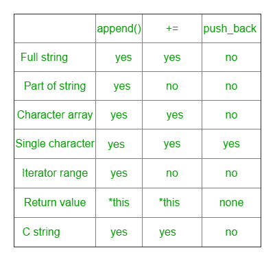

# STD::string::append vs STD::string::push _ back()vs Operator+=在 C++中

> 原文:[https://www . geesforgeks . org/stdstringpend-vs-stdstringpush _ back-vs-operator-c/](https://www.geeksforgeeks.org/stdstringappend-vs-stdstringpush_back-vs-operator-c/)

要追加字符，可以使用运算符+=、追加()和 push_back()。所有这些都有助于添加字符，但在实现和应用上略有不同。

*   运算符 **+= :** 追加单参数值。
*   **append() :** 允许您使用多个参数指定附加值。
*   [**push_back() :**](https://www.geeksforgeeks.org/stdstringpush_back-in-cpp/) 让你一次追加一个字符。



**以下是我们可以用来比较这三者的几个标准:**
1) **全串:**

*   **+= :** 我们可以使用+=。
*   **append() :** 我们也可以使用 append()来追加完整的字符串。
*   **push_back :** 不允许追加全字符串。

## 卡片打印处理机（Card Print Processor 的缩写）

```cpp
// CPP code for comparison on the
// basis of appending Full String
#include <iostream>
#include <string>
using namespace std;

// Function to demonstrate comparison among
// +=, append(), push_back()
void appendDemo(string str1, string str2)
{
    string str = str1;

    // Appending using +=
    str1 += str2;
    cout << "Using += : ";
    cout << str1 << endl;

    // Appending using append()
    str.append(str2);
    cout << "Using append() : ";
    cout << str << endl;
}

// Driver code
int main()
{
    string str1("Hello World! ");
    string str2("GeeksforGeeks");

    cout << "Original String : " << str1 << endl;
    appendDemo(str1, str2);

    return 0;
}
```

**输出:**

```cpp
Original String : Hello World! 
Using += : Hello World! GeeksforGeeks
Using append() : Hello World! GeeksforGeeks
```

2) **追加部分字符串:**

*   **+= :** 不允许追加部分字符串。
*   **追加():**允许追加部分字符串。
*   **push_back :** 我们不能使用 push_back 追加字符串的一部分。

## 卡片打印处理机（Card Print Processor 的缩写）

```cpp
// CPP code for comparison on the basis of
// Appending part of string

#include <iostream>
#include <string>
using namespace std;

// Function to demonstrate comparison among
// +=, append(), push_back()
void appendDemo(string str1, string str2)
{
    // Appends 5 characters from 0th index of
    // str2 to str1
    str1.append(str2, 0, 5);
    cout << "Using append() : ";
    cout << str1;
}

// Driver code
int main()
{
    string str1("GeeksforGeeks ");
    string str2("Hello World! ");

    cout << "Original String : " << str1 << endl;
    appendDemo(str1, str2);

    return 0;
}
```

**输出:**

```cpp
Original String : GeeksforGeeks 
Using append() : GeeksforGeeks Hello
```

3) **追加 C 字符串(字符*):**

*   **+= :** 允许追加 C 字符串
*   **追加():**也允许追加 C-string
*   **push_back :** 我们不能使用 push_back()追加 C-string。

## 卡片打印处理机（Card Print Processor 的缩写）

```cpp
// CPP code for comparison on the basis of
// Appending C-string

#include <iostream>
#include <string>
using namespace std;

// Function to demonstrate comparison among
// +=, append(), push_back()
void appendDemo(string str)
{
    string str1 = str;

    // Appending using +=
    str += "GeeksforGeeks";
    cout << "Using += : ";
    cout << str << endl;

    // Appending using append()
    str1.append("GeeksforGeeks");
    cout << "Using append() : ";
    cout << str1 << endl;
}

// Driver code
int main()
{
    string str("World of ");

    cout << "Original String : " << str << endl;
    appendDemo(str);

    return 0;
}
```

**输出:**

```cpp
Original String : World of 
Using += : World of GeeksforGeeks
Using append() : World of GeeksforGeeks
```

4) **追加字符数组:**

*   **+= :** 允许追加字符数组
*   **追加():**允许追加字符数组。
*   **push_back :** 不允许追加字符数组。

## 卡片打印处理机（Card Print Processor 的缩写）

```cpp
// CPP code for comparison on the basis of
// Appending character array

#include <iostream>
#include <string>
using namespace std;

// Function to demonstrate comparison among
// +=, append(), push_back()
void appendDemo(string str)
{
    char ch[6] = { 'G', 'e', 'e', 'k', 's', '\0' };
    string str1 = str;

    // Appending using +=
    str += ch;
    cout << "Using += : " << str << endl;

    // Appending using append()
    str1.append(ch);
    cout << "Using append() : ";
    cout << str1 << endl;
}

// Driver code
int main()
{
    string str("World of ");

    cout << "Original String : " << str << endl;
    appendDemo(str);

    return 0;
}
```

**输出:**

```cpp
Original String : World of 
Using += : World of Geeks
Using append() : World of Geeks
```

5) **追加单个字符:**

*   **+= :** 我们可以使用+=运算符追加单个字符。
*   **追加():**允许追加单个字符。
*   **push_back :** 允许追加单个字符。

## 卡片打印处理机（Card Print Processor 的缩写）

```cpp
// CPP code for comparison on the basis of
// Appending single character

#include <iostream>
#include <string>
using namespace std;

// Function to demonstrate comparison among
// +=, append(), push_back()
void appendDemo(string str)
{
    string str1 = str;
    string str2 = str;

    // Appending using +=
    str += 'C';
    cout << "Using += : " << str << endl;
    // Appending using append()
    str2.append("C");
    cout << "Using append() : ";
    cout << str2 << endl;

    // Appending using push_back()
    str1.push_back('C');
    cout << "Using push_back : ";
    cout << str1;
}

// Driver code
int main()
{
    string str("AB");

    cout << "Original String : " << str << endl;
    appendDemo(str);

    return 0;
}
```

**输出:**

```cpp
Original String : AB
Using += : ABC
Using append() : ABC
Using push_back : ABC
```

6) **迭代器范围:**

*   **+= :** 不提供迭代器范围。
*   **append() :** 提供迭代器范围。
*   **push_back :** 不提供迭代器范围。

## 卡片打印处理机（Card Print Processor 的缩写）

```cpp
// CPP code for comparison on the basis of
// Appending using iterator range

#include <iostream>
#include <string>
using namespace std;

// Function to demonstrate comparison among
// +=, append(), push_back()
void appendDemo(string str1, string str2)
{

    // Appends all characters from
    // str2.begin()+5, str2.end() to str1
    str1.append(str2.begin() + 5, str2.end());
    cout << "Using append : ";
    cout << str1;
}
// Driver code
int main()
{
    string str1("Hello World! ");
    string str2("GeeksforGeeks");

    cout << "Original String : " << str1 << endl;
    appendDemo(str1, str2);

    return 0;
}
```

**输出:**

```cpp
Original String : Hello World! 
Using append : Hello World! forGeeks
```

7) **返回值:**

*   **+= :** 返回*这个。
*   **追加():**返回*这个
*   **push_back :** 不返回任何东西。

## 卡片打印处理机（Card Print Processor 的缩写）

```cpp
// CPP code for comparison on the basis of
// Return value

#include <iostream>
#include <string>
using namespace std;

// Function to demonstrate comparison among
// +=, append(), push_back()
string appendDemo(string str1, string str2)
{
    // Appends str2 in str1
    str1.append(str2); // Similarly with str1 += str2
    cout << "Using append : ";

    // Returns *this
    return str1;
}

// Driver code
int main()
{
    string str1("Hello World! ");
    string str2("GeeksforGeeks");
    string str;
    cout << "Original String : " << str1 << endl;
    str = appendDemo(str1, str2);
    cout << str;
    return 0;
}
```

**输出:**

```cpp
Original String : Hello World! 
Using append : Hello World! GeeksforGeeks
```

本文由**萨基提瓦里**供稿。如果你喜欢极客(我们知道你喜欢！)并愿意投稿，也可以使用[write.geeksforgeeks.org](https://write.geeksforgeeks.org)写一篇文章或者将文章邮寄到 review-team@geeksforgeeks.org。看到你的文章出现在极客博客主页上，帮助其他极客。
如果你发现任何不正确的地方，或者你想分享更多关于上面讨论的话题的信息，请写评论。