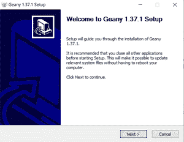

# 安装 Geany IDE 的步骤

> 原文:[https://www.geeksforgeeks.org/steps-to-install-geany-ide/](https://www.geeksforgeeks.org/steps-to-install-geany-ide/)

Geany 是一个轻量级、高性能的[集成开发环境](https://www.geeksforgeeks.org/setting-c-development-environment/)系统，支持使用最多的编程语言，即 [C/C++](https://www.geeksforgeeks.org/difference-between-c-and-c/) 、 [Java](https://www.geeksforgeeks.org/java/) 、 [Python2.x/3/x](https://www.geeksforgeeks.org/important-differences-between-python-2-x-and-python-3-x-with-examples/) 等。它的开发方式使得它对其他包的依赖性最小，因此与[代码块](https://www.geeksforgeeks.org/how-to-change-the-theme-of-code-blocks-20-03-to-dark-mode-in-windows-10/)或 [devc++](https://www.geeksforgeeks.org/basic-graphic-programming-in-c/) 相比，它相当快。特别注意使它尽可能独立于特定的桌面环境，如 KDE、GNOME。本文列出了下载和设置[视窗操作系统](https://www.geeksforgeeks.org/difference-between-unix-and-windows-operating-system/)的通用集成开发环境的分步说明。

**安装齿轮:**

*   Geany 是根据自由软件基金会发布的 GNU 通用公共许可证发行的。本 [GNU 通用公共许可证(GNU GPL 或简称 GPL)](https://www.gnu.org/licenses/gpl-3.0.en.html) 是一系列广泛使用的自由软件许可证，保证最终用户根据自己的需要自由运行、学习、共享和修改软件。点击这里[可以很容易的从官网下载。](https://www.geany.org/download/releases/)


*如上所述下载可执行安装程序。*

*   也可以通过点击 *geany-1.37.1_setup.exe、*只安装设置，根据最新的更新版本可能会有所不同，但是 Windows 操作系统的可执行文件看起来就是这样。默认情况下，Geany 包含几个插件(类构建器、导出、文件浏览器、HTML 字符、保存操作和拆分窗口)。要下载更多插件和可执行文件，向下滚动一点，从 Geany-plugin 版本下载文件。


*   在本文中，让我们继续只使用可执行的安装程序*。*下载后，双击文件打开安装向导。



*   这是安装向导，将有助于将 geany-1.37.1 安装到系统中。单击“下一步”继续。


*   点击*我同意，*同意许可的条款和条件。


*   看看它默认安装的组件。默认情况下，它会安装一些最小的运行时依赖项。一个好的提示是看一看并点击下一步，因为不建议玩这些组件。


*   选择任何需要安装 geany 的位置。


选择是否要为 geany 安装快捷方式。

*   选择是否需要为 Geany 安装开始菜单快捷方式。如果没有，则可以标记写有*的方框，不要创建快捷方式。*点击安装完成安装过程。

**安装 TDM-GCC:**

*   TDM-GCC 是一个适用于 Windows 的[编译器](https://www.geeksforgeeks.org/compiler-construction-tools/)套件。它是最新版本的 GCC 编译器和一些补丁的独特组合，使其能够在 Windows 上流畅运行。它有 32/64 位二进制版本，可以根据需要下载。
*   让我们从[这里](https://jmeubank.github.io/tdm-gcc/download/)下载这个奇妙的轻量级编译器套件。点击蓝色标签，看起来类似于-


*   打开可执行的安装程序，然后点击*创建，*如下图


要创建新安装，请单击“创建”。

*   将出现一个对话框，提示一些必要的下载。


*   接下来，它将继续选择要安装的二进制文件。根据体系结构选择选项。


根据您的系统架构，在两者之间进行选择。

*   接下来，如果需要安装在除了 c 盘以外的任何其他位置，可以选择这里。


选择您想要安装时分复用-全球通信中心的任何位置。

*   下一步是选择或取消选择要与此编译器一起安装的组件。


向下滚动查看组件。

*   它是一个[命令行](https://www.geeksforgeeks.org/command-line-arguments-in-c-cpp/)工具，因此，必须将其配置为在构建/编译时在可视化编辑器中使用。
*   谢天谢地，TDM-GCC 默认做到了。在安装开始前出现的组件菜单中，可以注意到默认选择了*添加到路径*。


*   安装过程现已完成。继续在 Geany IDE 上编写您的第一个程序。

**在 Geany 上构建/编译:**下面是在 IDE 上编写 hello world 或两个数求和程序的代码:

## C++

```
// C++ program to implement
// the above approach
#include <bits/stdc++.h>
using namespace std;

// Driver code
int main()
{
    cout << "Hello world!" << endl;
    cout << "Geany is successfully installed and "
            "integrated with its pal TDM-GCC."
         << endl;
    return 0;
}
```

**Output**

```
Hello world!
Geany is successfully installed and integrated with its pal TDM-GCC.
```

**编译程序的步骤:**

*   用任何有效名称保存，用*。cpp* 分机。
*   在工具栏区域找到一个按钮，上面写着*编译以及构建和执行。*


*   点击*编译*，如果代码写的正确，会产生类似这样的消息。


编译后的消息。

*   如果您的代码中有错误，请修复它，然后再次编译它。
*   编译过程完成后，点击*构建*按钮。同样，会出现一条与此类似的消息。


*   完成后，点击*执行按钮，*将打开一个终端/外壳，输出如上所述。

