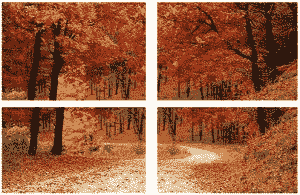

# 用 C++使用 OpenCV 拼接输入图像(全景图)

> 原文:[https://www . geesforgeks . org/sticking-input-images-panorama-using-opencv-c/](https://www.geeksforgeeks.org/stitching-input-images-panorama-using-opencv-c/)

该程序旨在通过使用 OpenCV library stitching.hpp 将一组图像拼接在一起，从而从一组图像中创建全景图，其实现是在 C++中完成的。程序将合成的缝合图像保存在与程序文件相同的目录中。如果这组图像没有被缝合，那么它会以错误退出程序。该错误是由于输入图像没有公共区域或者它们没有共享公共像素块。

**实现代码的步骤:**

1)确保 OpenCV 安装在本地机器上
2)将输入图像放在与程序相同的目录中。
3)照常从命令提示符编译代码。
4)运行代码时，给出所有输入图像作为参数。
5)通过名称“result.jpg”检查结果图像

**拼接流水线:**

这张图片展示了拼接算法的基本架构。它基于 M. Brown 和 D. Lowe 的题为[“利用不变特征的自动全景图像拼接”](http://matthewalunbrown.com/papers/ijcv2007.pdf)的研究论文。请参考参考资料中的第二个链接。
T3】

详见[这张 opencv.org 影像](http://docs.opencv.org/2.4/_images/StitchingPipeline.jpg)。

**实施**

```
// CPP program to Stitch
// input images (panorama) using OpenCV 
#include <iostream>
#include <fstream>

// Include header files from OpenCV directory
// required to stitch images.
#include "opencv2/imgcodecs.hpp"
#include "opencv2/highgui.hpp"
#include "opencv2/stitching.hpp"

using namespace std;
using namespace cv;

// Define mode for stitching as panoroma 
// (One out of many functions of Stitcher)
Stitcher::Mode mode = Stitcher::PANORAMA;

// Array for pictures
vector<Mat> imgs;

int main(int argc, char* argv[])
{
    // Get all the images that need to be 
    // stitched as arguments from command line 
    for (int i = 1; i < argc; ++i)
    {
            // Read the ith argument or image 
            // and push into the image array
            Mat img = imread(argv[i]);
            if (img.empty())
            {
                // Exit if image is not present
                cout << "Can't read image '" << argv[i] << "'\n";
                return -1;
            }
            imgs.push_back(img);
    }

    // Define object to store the stitched image
    Mat pano;

    // Create a Stitcher class object with mode panoroma
    Ptr<Stitcher> stitcher = Stitcher::create(mode, false);

    // Command to stitch all the images present in the image array
    Stitcher::Status status = stitcher->stitch(imgs, pano);

    if (status != Stitcher::OK)
    {
        // Check if images could not be stiched
        // status is OK if images are stiched successfully
        cout << "Can't stitch images\n";
        return -1;
    }

    // Store a new image stiched from the given 
    //set of images as "result.jpg"
    imwrite("result.jpg", pano);

    // Show the result
    imshow("Result", pano);

    waitKey(0);
    return 0;
}
```

**输入图像:**


**输出:**


**参考文献:**

1)[http://docs . opencv . org/2.4/modules/sticking/doc/sticking . html](http://docs.opencv.org/2.4/modules/stitching/doc/stitching.html)
2)[http://docs . opencv . org/2.4/modules/sticking/doc/introduction . html](http://docs.opencv.org/2.4/modules/stitching/doc/introduction.html)

本文由**沙斯沃特·贾恩**供稿。如果你喜欢 GeeksforGeeks 并想投稿，你也可以使用[contribute.geeksforgeeks.org](http://contribute.geeksforgeeks.org)写一篇文章或者把你的文章邮寄到 contribute@geeksforgeeks.org。看到你的文章出现在极客博客主页上，帮助其他极客。

如果你发现任何不正确的地方，或者你想分享更多关于上面讨论的话题的信息，请写评论。