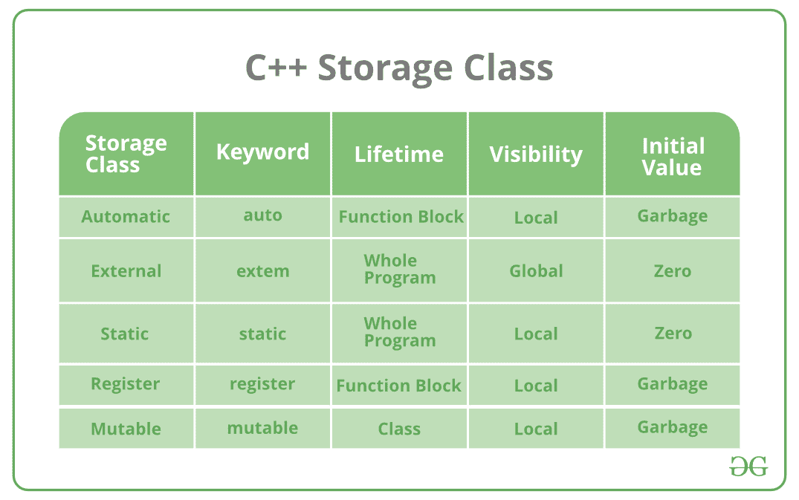

# c++ 中的存储类，示例

> 原文:[https://www . geesforgeks . org/storage-class-in-c-with-examples/](https://www.geeksforgeeks.org/storage-classes-in-c-with-examples/)

**存储类**用于描述变量/函数的特征。这些特性基本上包括范围、可见性和生存期，它们帮助我们在程序运行时跟踪特定变量的存在。要为变量指定存储类，应遵循以下语法:

**语法:**

```cpp
storage_class var_data_type var_name; 
```

C++ 使用 5 个存储类，即:

1.  汽车
2.  注册
3.  走读生
4.  静电
5.  易变的



以下是每个存储类别的详细说明:

*   [**【自动】**](https://www.geeksforgeeks.org/type-inference-in-c-auto-and-decltype/):auto 关键字提供了类型推断功能，使用该功能可以自动推断编程语言中表达式的数据类型。这就减少了编写编译器已经知道的东西的时间。因为所有的类型都是在编译阶段推导出来的，所以编译的时间会稍微增加，但是不会影响程序的运行时间。此功能还扩展到函数和非类型模板参数。由于 C++ 14 适用于函数，返回类型将从其返回语句中推导出来。由于 C++ 17，对于非类型模板参数，类型将从参数中推导出来。

**示例:**

## C++

```cpp
#include <iostream>
using namespace std;

void autoStorageClass()
{

    cout << "Demonstrating auto class\n";

    // Declaring an auto variable
    // No data-type declaration needed
    auto a = 32;
    auto b = 3.2;
    auto c = "GeeksforGeeks";
    auto d = 'G';

    // printing the auto variables
    cout << a << " \n";
    cout << b << " \n";
    cout << c << " \n";
    cout << d << " \n";
}

int main()
{

    // To demonstrate auto Storage Class
    autoStorageClass();

    return 0;
}
```

**Output:** 

```cpp
Demonstrating auto class
32 
3.2 
GeeksforGeeks 
G
```

*   [**【Extern】**](https://www.geeksforgeeks.org/understanding-extern-keyword-in-c/):Extern 存储类只是告诉我们变量是在别处定义的，而不是在使用它的同一个块内。基本上，该值在不同的块中被分配给它，并且这也可以在不同的块中被覆盖/改变。所以外部变量只不过是一个用合法值初始化的全局变量，在这里它被声明以便在其他地方使用。它可以在任何功能/块中访问。此外，通过在任何函数/块中的声明/定义之前放置“extern”关键字，也可以将普通全局变量设置为 extern。这基本上意味着我们没有初始化一个新的变量，而是只使用/访问全局变量。使用外部变量的主要目的是，它们可以在作为大型程序一部分的两个不同文件之间访问。关于外部变量如何工作的更多信息，请看这个[链接](https://www.geeksforgeeks.org/understanding-extern-keyword-in-c/)。

**示例:**

## C++

```cpp
#include <iostream>
using namespace std;

// declaring the variable which is to
// be made extern an initial value can
// also be initialized to x
int x;
void externStorageClass()
{

    cout << "Demonstrating extern class\n";

    // telling the compiler that the variable
    // x is an extern variable and has been
    // defined elsewhere (above the main
    // function)
    extern int x;

    // printing the extern variables 'x'
    cout << "Value of the variable 'x'"
         << "declared, as extern: " << x << "\n";

    // value of extern variable x modified
    x = 2;

    // printing the modified values of
    // extern variables 'x'
    cout
        << "Modified value of the variable 'x'"
        << " declared as extern: \n"
        << x;
}

int main()
{

    // To demonstrate extern Storage Class
    externStorageClass();

    return 0;
}
```

**Output:** 

```cpp
Demonstrating extern class
Value of the variable 'x'declared, as extern: 0
Modified value of the variable 'x' declared as extern: 
2
```

*   [**【静态】**](https://www.geeksforgeeks.org/static-variables-in-c/) :这个存储类用来声明 C++ 语言编写程序时常用的静态变量。静态变量有一个属性，即使超出了它们的范围，也能保持它们的值！因此，静态变量在其作用域中保留了最后一次使用的值。所以我们可以说它们只初始化一次，一直存在到程序终止。因此，没有分配新的内存，因为它们没有被重新声明。它们的范围局限于它们被定义的功能。全局静态变量可以在程序的任何地方访问。默认情况下，编译器会为它们赋值 0。

## C++

```cpp
#include <iostream>
using namespace std;

// Function containing static variables
// memory is retained during execution
int staticFun()
{
    cout << "For static variables: ";
    static int count = 0;
    count++ ;
    return count;
}

// Function containing non-static variables
// memory is destroyed
int nonStaticFun()
{
    cout << "For Non-Static variables: ";

    int count = 0;
    count++ ;
    return count;
}

int main()
{

    // Calling the static parts
    cout << staticFun() << "\n";
    cout << staticFun() << "\n";
    ;

    // Calling the non-static parts

    cout << nonStaticFun() << "\n";
    ;
    cout << nonStaticFun() << "\n";
    ;
    return 0;
}
```

**Output:** 

```cpp
For static variables: 1
For static variables: 2
For Non-Static variables: 1
For Non-Static variables: 1
```

*   [**寄存器**](https://www.geeksforgeeks.org/understanding-register-keyword/) :这个存储类声明了与自动变量功能相同的寄存器变量。唯一的区别是，如果有空闲寄存器，编译器会尝试将这些变量存储在微处理器的寄存器中。这使得寄存器变量的使用比程序运行时存储在内存中的变量快得多。如果空闲寄存器不可用，则这些寄存器仅存储在存储器中。通常，程序中需要频繁访问的几个变量用 register 关键字声明，这样可以提高程序的运行时间。这里需要注意的一个重要而有趣的点是，我们不能使用指针来获取寄存器变量的地址。

**示例:**

## C++

```cpp
#include <iostream>
using namespace std;

void registerStorageClass()
{

    cout << "Demonstrating register class\n";

    // declaring a register variable
    register char b = 'G';

    // printing the register variable 'b'
    cout << "Value of the variable 'b'"
         << " declared as register: " << b;
}
int main()
{

    // To demonstrate register Storage Class
    registerStorageClass();
    return 0;
}
```

**Output:** 

```cpp
Demonstrating register class
Value of the variable 'b' declared as register: G
```

*   [**可变:**](https://www.geeksforgeeks.org/c-mutable-keyword/) 有时需要通过 const 函数修改类/结构的一个或多个数据成员，即使你不想让函数更新类/结构的其他成员。通过使用可变关键字，可以很容易地执行这个任务。关键字 mutable 主要用于允许修改 const 对象的特定数据成员。当我们将一个函数声明为常量时，这个传递给函数的指针就变成了常量。向变量添加可变变量允许常量指针改变成员。

**示例:**

## C++

```cpp
#include <iostream>
using std::cout;

class Test {
public:
    int x;

    // defining mutable variable y
    // now this can be modified
    mutable int y;

    Test()
    {
        x = 4;
        y = 10;
    }
};

int main()
{
    // t1 is set to constant
    const Test t1;

    // trying to change the value
    t1.y = 20;
    cout << t1.y;

    // Uncommenting below lines
    // will throw error
    // t1.x = 8;
    // cout << t1.x;
    return 0;
}
```

**Output:** 

```cpp
20
```