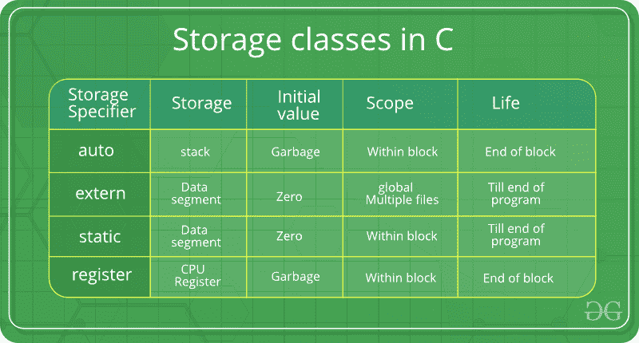

# C 中的存储类

> 原文:[https://www.geeksforgeeks.org/storage-classes-in-c/](https://www.geeksforgeeks.org/storage-classes-in-c/)

存储类用于描述变量/函数的特征。这些特性基本上包括范围、可见性和生存期，它们帮助我们在程序运行时跟踪特定变量的存在。
**C 语言使用 4 个存储类**，即:



1.  **auto** :这是函数或块内部声明的所有变量的默认存储类。因此，在用 C 语言编写程序时，很少使用关键字 auto。自动变量只能在已声明的块/函数内访问，不能在块/函数外访问(块/函数定义了自动变量的作用域)。当然，这些可以在声明 auto 变量的父块/函数的嵌套块中访问。但是，也可以使用这里给出的指针概念，通过指向变量所在的非常精确的内存位置来访问它们。默认情况下，无论何时声明它们，都会为它们分配一个垃圾值。

2.  [**【Extern】**](https://www.geeksforgeeks.org/understanding-extern-keyword-in-c/):Extern 存储类只是告诉我们变量是在别处定义的，而不是在使用它的同一个块内。基本上，该值在不同的块中被分配给它，并且这也可以在不同的块中被覆盖/改变。所以外部变量只不过是一个用合法值初始化的全局变量，在这里它被声明以便在其他地方使用。它可以在任何功能/块中访问。此外，通过在任何函数/块中的声明/定义之前放置“extern”关键字，也可以将普通全局变量设置为 extern。这基本上意味着我们没有初始化一个新的变量，而是只使用/访问全局变量。使用外部变量的主要目的是，它们可以在作为大型程序一部分的两个不同文件之间访问。关于外部变量如何工作的更多信息，请看这个[链接](https://www.geeksforgeeks.org/understanding-extern-keyword-in-c/)。

3.  [**【静态】**](https://www.geeksforgeeks.org/static-variables-in-c/) :这个存储类用来声明 C 语言编写程序时常用的静态变量。静态变量有一个属性，即使超出了它们的范围，也能保持它们的值！因此，静态变量在其作用域中保留了最后一次使用的值。所以我们可以说它们只初始化一次，一直存在到程序终止。因此，没有分配新的内存，因为它们没有被重新声明。它们的范围局限于它们被定义的功能。全局静态变量可以在程序的任何地方访问。默认情况下，编译器会为它们赋值 0。

4.  [**寄存器**](https://www.geeksforgeeks.org/understanding-register-keyword/) :这个存储类声明了与自动变量功能相同的寄存器变量。唯一的区别是，如果有空闲寄存器，编译器会尝试将这些变量存储在微处理器的寄存器中。这使得寄存器变量的使用比程序运行时存储在内存中的变量快得多。如果空闲寄存器不可用，则这些寄存器仅存储在存储器中。通常在程序中很少被频繁访问的变量是用 register 关键字声明的，这提高了程序的运行时间。这里需要注意的一个重要而有趣的点是，我们不能使用指针来获取寄存器变量的地址。

要为变量指定存储类，应遵循以下语法:
语法:

```
storage_class var_data_type var_name; 
```

函数遵循与上面给出的变量相同的语法。请看下面的 C 例子进一步说明:

## C

```
// A C program to demonstrate different storage
// classes
#include <stdio.h>

// declaring the variable which is to be made extern
// an initial value can also be initialized to x
int x;

void autoStorageClass()
{

    printf("\nDemonstrating auto class\n\n");

    // declaring an auto variable (simply
    // writing "int a=32;" works as well)
    auto int a = 32;

    // printing the auto variable 'a'
    printf("Value of the variable 'a'"
           " declared as auto: %d\n",
           a);

    printf("--------------------------------");
}

void registerStorageClass()
{

    printf("\nDemonstrating register class\n\n");

    // declaring a register variable
    register char b = 'G';

    // printing the register variable 'b'
    printf("Value of the variable 'b'"
           " declared as register: %d\n",
           b);

    printf("--------------------------------");
}

void externStorageClass()
{

    printf("\nDemonstrating extern class\n\n");

    // telling the compiler that the variable
    // x is an extern variable and has been
    // defined elsewhere (above the main
    // function)
    extern int x;

    // printing the extern variables 'x'
    printf("Value of the variable 'x'"
           " declared as extern: %d\n",
           x);

    // value of extern variable x modified
    x = 2;

    // printing the modified values of
    // extern variables 'x'
    printf("Modified value of the variable 'x'"
           " declared as extern: %d\n",
           x);

    printf("--------------------------------");
}

void staticStorageClass()
{
    int i = 0;

    printf("\nDemonstrating static class\n\n");

    // using a static variable 'y'
    printf("Declaring 'y' as static inside the loop.\n"
           "But this declaration will occur only"
           " once as 'y' is static.\n"
           "If not, then every time the value of 'y' "
           "will be the declared value 5"
           " as in the case of variable 'p'\n");

    printf("\nLoop started:\n");

    for (i = 1; i < 5; i++) {

        // Declaring the static variable 'y'
        static int y = 5;

        // Declare a non-static variable 'p'
        int p = 10;

        // Incrementing the value of y and p by 1
        y++;
        p++;

        // printing value of y at each iteration
        printf("\nThe value of 'y', "
               "declared as static, in %d "
               "iteration is %d\n",
               i, y);

        // printing value of p at each iteration
        printf("The value of non-static variable 'p', "
               "in %d iteration is %d\n",
               i, p);
    }

    printf("\nLoop ended:\n");

    printf("--------------------------------");
}

int main()
{

    printf("A program to demonstrate"
           " Storage Classes in C\n\n");

    // To demonstrate auto Storage Class
    autoStorageClass();

    // To demonstrate register Storage Class
    registerStorageClass();

    // To demonstrate extern Storage Class
    externStorageClass();

    // To demonstrate static Storage Class
    staticStorageClass();

    // exiting
    printf("\n\nStorage Classes demonstrated");

    return 0;
}

// This code is improved by RishabhPrabhu
```

**Output:** 

一个在 C 中演示存储类的程序
演示自动类
声明为自动的变量“a”的值:32
———————————
演示寄存器类
声明为寄存器的变量“b”的值:71
——————————————————————————————
演示外部类
声明为外部的变量“x”的值:0
声明为外部的变量“x”的修改值:2

但是这个声明只会出现一次，因为‘y’是静态的。
如果不是，那么每次‘y’的值都会是声明值 5 就像变量‘p’的情况一样
循环开始:
声明为静态的‘y’的值，在 1 次迭代中是 6
非静态变量‘p’的值，在 1 次迭代中是 11
声明为静态的‘y’的值，在 2 次迭代中是 7
非静态变量‘p’的值，在 2 次迭代中是 11
的值‘y’， 声明为静态的，在 3 次迭代中为 8
非静态变量‘p’的值，在 3 次迭代中为 11
声明为静态的‘y’的值，在 4 次迭代中为 9
非静态变量‘p’的值，在 4 次迭代中为 11
循环结束:
—————————————
存储类演示

[Quiz on Storage Classes ](https://www.geeksforgeeks.org/c-language-2-gq/storage-classes-gq/)This article is contributed by Ayush Jaggi. Please write comments if you find anything incorrect, or you want to share more information about the topic discussed above