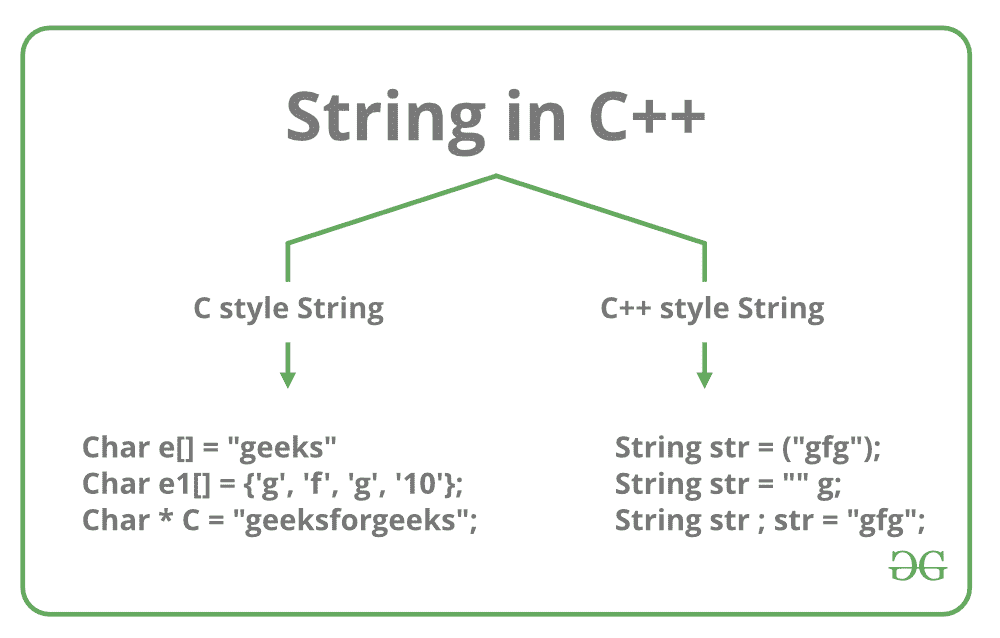
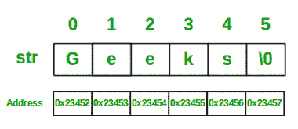

# c++中的字符串以及如何创建它们？

> 原文:[https://www . geeksforgeeks . org/strings-in-c-and-how-create-theme/](https://www.geeksforgeeks.org/strings-in-c-and-how-to-create-them/)

**c++中的字符串**用于存储文本或字符序列。在 C++中，字符串可以通过以下两种方式之一存储:

*   c 风格字符串(使用字符)
*   字符串类

[](https://media.geeksforgeeks.org/wp-content/cdn-uploads/20191113124516/StringInC.png) 
以上每种方法讨论如下:

1.  **[C style string:](https://www.geeksforgeeks.org/strings-in-c-2/)** In C, strings are defined as an array of characters. The difference between a character array and a string is the string is terminated with a special character ‘\0’. In C, the string is actually represented as an array of characters terminated by a null string. Therefore the size of the character array is always one more than that of the number of characters in the actual string. This thing continues to be supported in C++ too. The C++ compiler automatically sets “\0” at the end of the string, during initialization of the array.

    **在 C++中初始化字符串:**

    ```
    1\. char str[] = "Geeks";
    2\. char str[6] = "Geeks";
    3\. char str[] = {'G', 'e', 'e', 'k', 's', '\0'};
    4\. char str[6] = {'G', 'e', 'e', 'k', 's', '\0'};

    ```

    下面是 C++中字符串“极客”的内存表示。
    

    让我们看一些例子来更好地理解 C++中使用 C 风格的字符串表示:

    ```
    // C++ program to demonstrate
    // Strings using C style

    #include <iostream>
    using namespace std;

    int main()
    {

        // Declare and initialize string
        char str[] = "Geeks";

        // Print string
        cout << str;

        return 0;
    }
    ```

    **Output:**

    ```
    Geeks

    ```

2.  **Standard String representation and String Class:** In C++, one can directly store the collection of characters or text in a string variable, surrounded by double-quotes. C++ provides [**string class**](https://www.geeksforgeeks.org/c-string-class-and-its-applications/), which supports various operations like copying strings, concatenating strings etc.

    **在 C++中初始化字符串:**

    ```
    1\. string str1 = "Geeks";
    2\. string str2 = "Welcome to GeeksforGeeks!";

    ```

    **示例:**

    ```
    // C++ program to demonstrate String
    // using Standard String representation

    #include <iostream>
    #include <string>
    using namespace std;

    int main()
    {

        // Declare and initialize the string
        string str1 = "Welcome to GeeksforGeeks!";

        // Initialization by raw string
        string str2("A Computer Science Portal");

        // Print string
        cout << str1 << endl << str2;

        return 0;
    }
    ```

    **Output:**

    ```
    Welcome to GeeksforGeeks!
    A Computer Science Portal

    ```

**相关文章:**

*   [**C++字符串类及其应用|第 1 集**](https://www.geeksforgeeks.org/c-string-class-and-its-applications/)
*   **[C++字符串类及其应用|第 2 集](https://www.geeksforgeeks.org/c-string-class-applications-set-2/)**