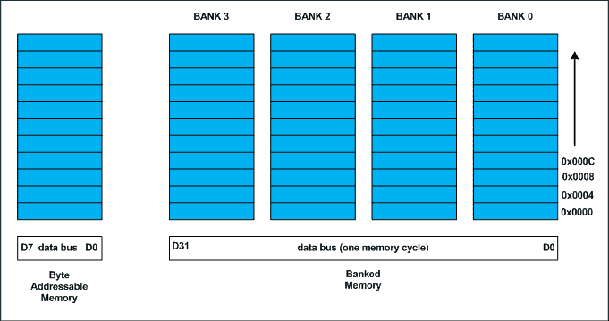
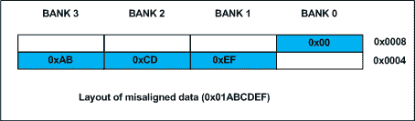

# 结构构件对齐、填充和数据打包

> 原文:[https://www . geesforgeks . org/structure-member-alignment-padding-and-data-packing/](https://www.geeksforgeeks.org/structure-member-alignment-padding-and-data-packing/)

我们所说的数据对齐、结构打包和填充是什么意思？
预测后续程序的输出。

## c

```cpp
#include <stdio.h>

// Alignment requirements
// (typical 32 bit machine)

// char         1 byte
// short int    2 bytes
// int          4 bytes
// double       8 bytes

// structure A
typedef struct structa_tag
{
   char        c;
   short int   s;
} structa_t;

// structure B
typedef struct structb_tag
{
   short int   s;
   char        c;
   int         i;
} structb_t;

// structure C
typedef struct structc_tag
{
   char        c;
   double      d;
   int         s;
} structc_t;

// structure D
typedef struct structd_tag
{
   double      d;
   int         s;
   char        c;
} structd_t;

int main()
{
   printf("sizeof(structa_t) = %lu\n", sizeof(structa_t));
   printf("sizeof(structb_t) = %lu\n", sizeof(structb_t));
   printf("sizeof(structc_t) = %lu\n", sizeof(structc_t));
   printf("sizeof(structd_t) = %lu\n", sizeof(structd_t));

   return 0;
}
```

在继续之前，把你的答案写在纸上，然后继续读下去。如果你急于看到解释，你可能会错过理解你的类比中的任何漏洞。**数据对齐:**
C/c++中的每种数据类型都会有对齐要求(事实上是处理器架构规定的，而不是语言规定的)。处理器的处理字长与数据总线的长度相同。在 32 位机器上，处理字长为 4 字节。



历史上，内存是字节可寻址的，并按顺序排列。如果存储器被安排为一个字节宽度的单个存储体，处理器需要发出 4 个存储器读取周期来获取一个整数。在一个内存周期内读取全部 4 个字节的整数更经济。为了利用这种优势，存储器将被布置为 4 个存储体的组，如上图所示。
存储器寻址仍然是顺序的。如果银行 0 占用地址 X，则银行 1、银行 2 和银行 3 将位于(X + 1)、(X + 2)和(X + 3)地址。如果在 X 地址上分配了一个 4 字节的整数(X 是 4 的倍数)，处理器只需要一个内存周期就可以读取整个整数。
其中，如果整数被分配在 4 的倍数之外的地址，它跨越两行存储体，如下图所示。这样的整数需要两个内存读取周期来获取数据。



一个变量的 ***数据对齐*** 处理存储在这些库中的数据的方式。例如 32 位机器上 ***int*** 的自然对齐是 4 字节。当数据类型自然对齐时，中央处理器在最少的读取周期内获取它。
同样， ***短 int*** 的自然对齐是 2 字节。意思是一个 ***短 int*** 可以存储在银行 0-银行 1 对或银行 2-银行 3 对。一个 ***双*** 需要 8 个字节，占用存储体中的两行。 ***双*** 的任何未对准将迫使两个以上的读取周期获取 ***双*** 数据。
注意，一个**双**变量将在 32 位机器的 8 字节边界上分配，需要两个内存读取周期。在 64 位机器上，基于存储体的数量，**双**变量将在 8 字节边界上分配，并且只需要一个内存读取周期。
**结构填充:**
在 C/C++中，一个结构被用作数据包。它不提供任何数据封装或数据隐藏功能(C++案例是一个例外，因为它与类具有语义相似性)。
由于各种数据类型的对齐要求，结构的每个成员都要自然对齐。结构的成员按递增的顺序分配。让我们分析一下上面程序中声明的每个结构。
**上述程序的输出:**
**为了方便起见，假设每个结构类型变量都分配在 4 字节边界上(比如说 0x0000)，即结构的基址是 4 的倍数(不必总是这样，见 structc _ t 的解释)。**
**结构 A**
*struct _ t*第一个元素是 *char* ，它是一个字节对齐的，后面是*短 int* 。short int 是 2 字节对齐的。如果短 int 元素紧接在 char 元素之后分配，它将从奇数地址边界开始。编译器将在字符后插入一个填充字节，以确保 short int 的地址倍数为 2(即 2 字节对齐)。structa_t 的总大小将是 sizeof(char)+1(padding)+sizeof(short)，1 + 1 + 2 = 4 个字节。
**结构 B**
*结构 b_t* 的第一个成员是短 int 后跟 char。因为 char 可以在任何字节边界上，所以在短 int 和 char 之间不需要填充，它们总共占用 3 个字节。下一个成员是 int。如果立即分配 int，它将从奇数字节边界开始。我们需要在 char 成员后填充 1 个字节，以使下一个 int 成员的地址是 4 字节对齐的。总的来说，*结构 b_t* 需要 2 + 1 + 1(填充)+ 4 = 8 字节。
**结构 C–每个结构也会有对齐要求**
应用同样的分析，*struct _ t*需要 sizeof(char) + 7 字节填充+sizeof(double)+sizeof(int)= 1+7+8+4 = 20 字节。但是，sizeof(struct _ t)将是 24 个字节。这是因为，随着结构成员，结构类型变量也将有自然对齐。让我们通过一个例子来理解它。比方说，我们声明了一个 structc _ t 数组，如下所示

```cpp
structc_t structc_array[3];
```

为便于计算，假设*struct _ array*的基址为 0x0000。如果我们计算时 structc_t 占用 20 (0x14)字节，则第二个 structc_t 数组元素(索引为 1)将位于 0x0000 + 0x0014 = 0x0014。它是数组索引 1 元素的起始地址。此 structc _ t 的 double 成员将在 0x0014 + 0x1 + 0x7 = 0x001C(十进制 28)上分配，该值不是 8 的倍数，并且与 double 的对齐要求相冲突。正如我们在上面提到的，double 的对齐要求是 8 字节。
为了避免这种不对齐，编译器会对每个结构引入对齐要求。它将作为结构中最大的成员。在我们的例子中，structa_t 的对齐是 2，structb_t 是 4，structc_t 是 8。如果我们需要嵌套结构，最大内部结构的大小将是直接更大结构的对齐。
在上述程序的 structc _ t 中，int 成员后会有 4 字节的填充，使结构大小为其对齐的倍数。因此，sizeof (structc_t)是 24 个字节。即使在阵列中，它也能保证正确对齐。你可以交叉检查。
**结构 D–如何减少填充？**
到现在，可能已经很清楚，填充是不可避免的。有一种方法可以最小化填充。程序员应该按照大小的递增/递减顺序来声明结构成员。我们的代码中给出了一个例子 structd _ t，它的大小是 16 字节，而不是 structd _ t 的 24 字节。
**什么是结构打包？**
有时必须避免在结构成员之间填充字节。比如读取 ELF 文件头或者 BMP 或者 JPEG 文件头的内容。我们需要定义一个类似于标题布局的结构并映射它。然而，在接触这些成员时应小心谨慎。典型地，逐字节读取是避免未对齐异常的一种选择。表演会受到影响。
大多数编译器提供非标准扩展来关闭默认填充，如 pragmas 或命令行开关。有关更多详细信息，请参考相应编译器的文档。
**指针误操作:**
处理指针运算时存在潜在错误的可能性。例如，如下所示取消对通用指针(void *)的引用可能会导致未对齐的异常，

```cpp
// Dereferencing a generic pointer (not safe)
// There is no guarantee that pGeneric is integer aligned
*(int *)pGeneric;
```

在编程中，上述类型的代码都是可能的。如果指针*一般*没有按照铸造数据类型的要求对齐，就有可能出现错位异常。
事实上，很少有处理器不会对最后两位地址进行解码，也没有办法访问*未对齐的*地址。如果程序员试图访问这样的地址，处理器会产生未对齐的异常。
**malloc()上的一个注释返回了指针**
malloc()返回的指针是 *void ** 。它可以根据程序员的需要转换成任何数据类型。malloc()的实现者应该返回一个指针，该指针与基本数据类型(由编译器定义的)的最大大小对齐。在 32 位机器上，它通常与 8 字节边界对齐。
**对象文件对齐、节对齐、页对齐**
这些都是操作系统实现者、编译器编写者特有的，不在本文讨论范围之内。事实上，我没有多少信息。
**一般问题:**
1。是否对堆栈应用对齐？
是的。堆栈也是内存。系统程序员应该用正确对齐的内存地址加载堆栈指针。一般来说，处理器不会检查堆栈对齐，程序员的责任是确保堆栈内存的正确对齐。任何未对准都会导致运行时意外。
例如，如果处理器字长为 32 位，堆栈指针也应对齐为 4 字节的倍数。
2。如果 *char* 数据被放置在存储体 0 之外的存储体中，则在存储器读取期间，它将被放置在错误的数据线上。处理器如何处理 *char* 类型？
通常，处理器会根据指令识别数据类型(例如 ARM 处理器上的 LDRB)。根据存储的存储体，处理器将字节转移到最低有效的数据线上。
3。当参数在堆栈上传递时，它们是否要进行对齐？
是的。编译器帮助程序员进行正确的对齐。例如，如果一个 16 位的值被推送到一个 32 位宽的堆栈上，该值会自动用 0 填充到 32 位。考虑以下程序。

## c

```cpp
void argument_alignment_check( char c1, char c2 )
{
   // Considering downward stack
   // (on upward stack the output will be negative)
   printf("Displacement %d\n", (int)&c2 - (int)&c1);
}
```

在 32 位机器上，输出将是 4。这是因为由于对齐要求，每个字符占用 4 个字节。
4。如果我们试图访问未对齐的数据，会发生什么？
这取决于处理器架构。如果访问未对齐，处理器会自动发出足够的内存读取周期，并将数据正确打包到数据总线上。惩罚在于表现。很少的处理器没有最后两条地址线，这意味着没有办法访问奇数字节边界。每次数据访问都必须正确对齐(4 字节)。在这种处理器上，未对齐的访问是一个严重的异常。如果异常被忽略，读取的数据将是不正确的，从而导致结果。
5。有什么方法可以查询数据类型的对齐要求？
是的。编译器为这种需求提供了非标准扩展。例如，Visual Studio 中的 _ _ alignof()有助于获取数据类型的对齐要求。详情请阅读 MSDN。
6。当内存读取在 32 位机器上一次读取 4 个字节有效时，为什么一个**双**类型要在 8 个字节的边界上对齐？
需要注意的是，大多数处理器都将有数学协处理器，称为浮点单元(FPU)。代码中的任何浮点操作都会被翻译成 FPU 指令。主处理器与浮点执行无关。这一切都将在幕后完成。
按照标准，双字会占用 8 个字节。并且，在 FPU 中执行的每个浮点操作都将是 64 位长度。甚至浮点类型也将在执行前提升到 64 位。
FPU 寄存器的 64 位长度强制在 8 字节边界上分配双类型。我假设(我没有具体的信息)在 FPU 操作的情况下，数据获取可能不同，我指的是数据总线，因为它去往 FPU。因此，对于双类型(预计在 8 字节边界上)，地址解码会有所不同。这意味着，*浮点单元的地址解码电路不会有最后 3 个引脚*。
**答案:**

```cpp
sizeof(structa_t) = 4
sizeof(structb_t) = 8
sizeof(structc_t) = 24
sizeof(structd_t) = 16
```

**更新:2013 年 5 月 1 日**
据观察，在最新的处理器上，我们得到的 struct_c 的大小为 16 字节。我尚未阅读相关文件。一旦我得到适当的信息，我会更新(写给少数硬件专家)。
在使用相同工具集(GCC 4.7)的旧处理器(AMD Athlon X2)上，我得到的 struct_c 大小为 24 字节。大小取决于内存库在硬件级别的组织方式。
––作者: [**【文基】**](http://www.linkedin.com/in/ramanawithu) 。如果你发现任何不正确的地方，或者你想分享更多关于上面讨论的话题的信息，请写评论。