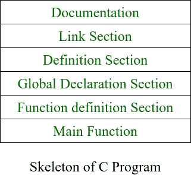

# c++程序的结构

> 原文:[https://www.geeksforgeeks.org/structure-of-c-program/](https://www.geeksforgeeks.org/structure-of-c-program/)

[C++程序](https://www.geeksforgeeks.org/c-plus-plus/)是使用特定的[模板结构](https://www.geeksforgeeks.org/templates-cpp/)编写的。用 C++语言编写的程序结构如下:

[](https://media.geeksforgeeks.org/wp-content/uploads/20201028224032/BasicStructureOfCProgram.png)

### **<u>文件科</u> :**

*   这一部分排在第一位，用于记录程序员将要编写的程序的逻辑。
*   它也可以用来写程序。
*   文档部分写的都是注释，不是编译器编译的。
*   文档部分是可选的，因为程序可以在没有它们的情况下执行。下面是同样的片段:

## C++

```
/*     This is a C++ program to find the
        factorial of a number

    The basic requirement for writing this
    program is to have knowledge of loops

    To find the factorial of number
    iterate over range from number to one
*/
```

### **<u>联络段</u> :**

链接部分包含两个部分:

**<u>头文件</u> :**

*   一般来说，程序包括各种编程元素，如[内置函数](https://www.geeksforgeeks.org/builtin-functions-gcc-compiler/)、类、关键字、[常量](https://www.geeksforgeeks.org/constants-in-c-cpp/)、[运算符](https://www.geeksforgeeks.org/interesting-facts-bitwise-operators-c/)等。已经在标准的 [C++库](https://www.geeksforgeeks.org/the-c-standard-template-library-stl/)中定义了。
*   为了在程序中使用这样的预定义元素，程序中必须包含一个适当的头。
*   通过[预处理器指令<u>#包括</u>](https://www.geeksforgeeks.org/cc-preprocessors/) 在程序中指定标准头。在图中，使用了 iostream 头。当编译器处理指令 <u>#include < iostream ></u> 时，它将该流的内容包含在程序中。这使得程序员能够使用仅通过< iostream >中定义的标准流提供的标准输入、输出和错误工具。这些标准流将数据作为字符流进行处理，也就是说，数据以连续的流进行读取和显示。这里列出了< iostream >中定义的标准流。

> #包括<iostream></iostream>

**<u>命名空间</u> :**

*   命名空间允许对各种实体进行分组，如类、[对象、](https://www.geeksforgeeks.org/c-classes-and-objects/)[函数和各种](https://www.geeksforgeeks.org/functions-in-c/) [C++标记等。用一个名字。](https://www.geeksforgeeks.org/cc-tokens/)
*   任何用户都可以创建自己独立的名称空间，并且可以在任何其他程序中使用它们。
*   在下面的片段中， [**命名空间标准**](https://www.geeksforgeeks.org/using-namespace-std-considered-bad-practice/) 包含对 [cout](https://www.geeksforgeeks.org/difference-between-cout-and-stdcout-in-c/) 、cin、 [endl](https://www.geeksforgeeks.org/endl-vs-n-in-cpp/) 等的声明。陈述。

```
using namespace std;
```

*   可以通过多种方式访问命名空间:
    *   使用命名空间标准；
    *   使用 STD::cout；

### **<u>定义部分</u> :**

*   它用于声明一些常量并给它们赋值。
*   在本节中，任何人都可以使用[原始数据类型](https://www.geeksforgeeks.org/data-types-in-c/)定义自己的[数据类型](https://www.geeksforgeeks.org/c-data-types/)。
*   在 **#define** 中是一个编译器指令，它告诉编译器无论何时发现消息，用“阶乘\n”替换它。
*   **<u>typedef</u>T3】intK<u>；</u>** 这个语句告诉编译器，当你遇到 K 时，用 int 替换它，因为你已经将 K 声明为数据类型，所以你不能将它用作[标识符](https://www.geeksforgeeks.org/difference-between-keyword-and-identifier/)。

### **<u>全球申报区</u> :**

*   这里，将要在程序中使用的变量和类定义被声明为全局变量。
*   本节中声明的变量的作用域持续到整个程序终止。
*   这些变量也可以在[用户定义函数](https://www.geeksforgeeks.org/difference-between-user-defined-function-and-library-function-in-c-c/)中访问。

### **<u>功能申报区</u> :**

*   它包含了我们主要功能所需要的所有功能。
*   通常，该部分包含用户定义的函数。
*   程序的这一部分可以写在主函数之后，但是为此，在这一部分中为您将要在[主函数](https://www.geeksforgeeks.org/executing-main-in-c-behind-the-scene/)之后编写代码的函数编写函数原型。

## C++

```
// Function to implement the
// factorial of number num
int factorial(k& num)
{
    // Iterate over the loop from
    // num to one
    for (k i = 1; i <= num; i++) {
        fact *= i;
    }

    // Return the factorial calculated
    return fact;
}
```

### [**<u>主功能</u>**](https://www.geeksforgeeks.org/write-running-c-code-without-main/) **:**

*   主函数告诉编译器从哪里开始执行程序。程序的执行从主函数开始。
*   所有要执行的语句都写在主函数中。
*   编译器执行所有写在花括号 **{}** 中的指令，花括号包含了主函数的主体。
*   一旦来自[主功能的所有指令被执行](https://www.geeksforgeeks.org/functions-that-are-executed-before-and-after-main-in-c/)控制从主功能中出来，程序终止并且不再执行。

下面是说明这一点的程序:

## C++

```
// Documentation Section
/*  This is a C++ program to find the
    factorial of a number
    The basic requirement for writing this
    program is to have knowledge of loops
    To find the factorial of a number
    iterate over the range from number to 1
*/

// Linking Section
#include <iostream>
using namespace std;

// Defination Section
#define msg "FACTORIAL\n"
typedef int k;

// Global Declaration Section
k num = 0, fact = 1, storeFactorial = 0;

// Function Section
k factorial(k& num)
{
    // Iterate over the loop from
    // num to one
    for (k i = 1; i <= num; i++) {
        fact *= i;
    }

    // Return the factorial
    return fact;
}

// Main Function
int main()
{
    // Given number Num
    k Num = 5;

    // Function Call
    storeFactorial = factorial(Num);
    cout << msg;

    // Print the factorial
    cout << Num << "! = "
         << storeFactorial << endl;

    return 0;
}
```

**Output**

```
FACTORIAL
5! = 120

```