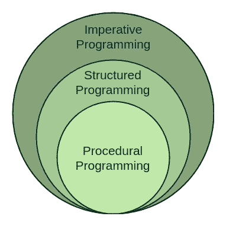

# 结构化编程方法的优缺点

> 原文:[https://www . geeksforgeeks . org/结构化程序设计-有利有弊的方法/](https://www.geeksforgeeks.org/structured-programming-approach-with-advantages-and-disadvantages/)

**结构化编程方法**顾名思义，可以定义为一种编程方法，其中程序被制作为单一结构。这意味着代码将一条接一条地执行指令。它不支持借助 GOTO 等语句从一个指令跳到另一个指令的可能性。因此，这种方法中的指令将以串行和结构化的方式执行。支持结构化编程方法的语言有:

*   C
*   C++
*   Java 语言(一种计算机语言，尤用于创建网站)
*   C#

    ..等等

相反，在像微处理器 8085 等汇编语言中，语句不是以结构化的方式执行的。它允许像 GOTO 这样的跳转语句。所以程序流可能是随机的。

结构化程序主要由三种元素组成:

*   选择语句
*   顺序语句
*   迭代语句

结构化程序由结构良好且独立的模块组成。但是结构化程序的进入和退出是一次性事件。这意味着程序使用单入口和单出口元素。因此一个结构化的程序是维护良好、整洁干净的程序。这就是结构化编程方法在编程界被广泛接受的原因。

**结构化编程方法的优势:**

1.  更容易阅读和理解
2.  方便用户的
3.  更容易维护
4.  主要基于问题，而不是基于机器
5.  开发更容易，因为它需要更少的努力和时间
6.  更容易调试
7.  主要是独立于机器的。

**结构化编程方法的缺点:**

1.  因为它是独立于机器的，所以转换成机器代码需要时间。
2.  转换后的机器代码与汇编语言不同。
3.  该程序依赖于数据类型等可变因素。因此，它需要随时更新。
4.  通常这种方法的开发需要更长的时间，因为它依赖于语言。而在汇编语言的情况下，开发花费的时间更少，因为它对于机器来说是固定的。