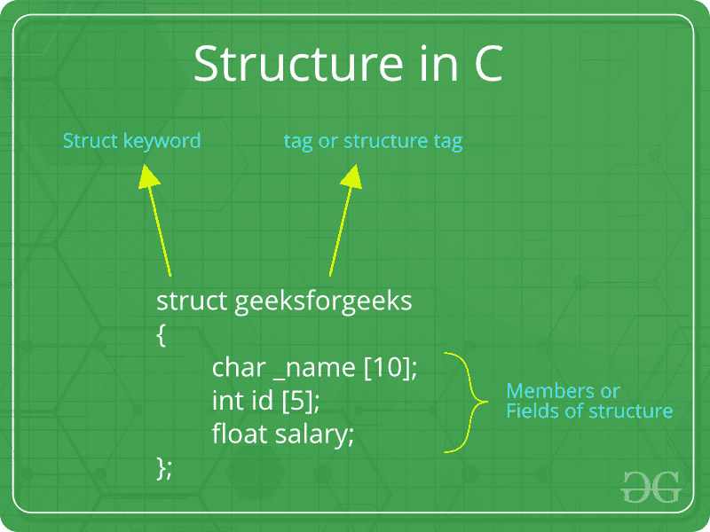

# C 中的结构

> 原文:[https://www.geeksforgeeks.org/structures-c/](https://www.geeksforgeeks.org/structures-c/)

***什么是结构？***
结构是用户在 C/C++ 中定义的数据类型。结构创建的数据类型可用于将可能不同类型的项组合成单一类型。



***如何创建结构？***
“struct”关键字用于创建结构。下面是一个例子。

```cpp
struct address
{
   char name[50];
   char street[100];
   char city[50];
   char state[20];
   int pin;
};
```

***如何声明结构变量？***
结构变量既可以用结构声明来声明，也可以像基本类型一样单独声明。

```cpp
// A variable declaration with structure declaration.
struct Point
{
   int x, y;
} p1;  // The variable p1 is declared with 'Point'

// A variable declaration like basic data types
struct Point
{
   int x, y;
}; 

int main()
{
   struct Point p1;  // The variable p1 is declared like a normal variable
}
```

注意:在 C++ 中，在变量声明中，struct 关键字是可选的。在 C 语言中，它是强制性的。

***如何初始化结构成员？***
结构成员**不能用声明初始化**。例如，下面的 C 程序编译失败。

```cpp
struct Point
{
   int x = 0;  // COMPILER ERROR:  cannot initialize members here
   int y = 0;  // COMPILER ERROR:  cannot initialize members here
}; 
```

上述错误的原因很简单，当声明一个数据类型时，没有为它分配内存。只有在创建变量时才分配内存。

结构成员**可以用花括号“{}”初始化**。例如，以下是有效的初始化。

```cpp
struct Point
{
   int x, y;
}; 

int main()
{
   // A valid initialization. member x gets value 0 and y
   // gets value 1.  The order of declaration is followed.
   struct Point p1 = {0, 1}; 
}
```

***如何访问结构元素？***
结构成员使用点(。)运算符。

```cpp
#include<stdio.h>

struct Point
{
   int x, y;
};

int main()
{
   struct Point p1 = {0, 1};

   // Accessing members of point p1
   p1.x = 20;
   printf ("x = %d, y = %d", p1.x, p1.y);

   return 0;
}
```

**Output:**

```cpp
x = 20, y = 1

```

**什么是指定初始化？**
指定初始化允许以任何顺序初始化结构成员。该功能已添加到 [C99 标准](https://www.geeksforgeeks.org/c-programming-language-standard/)中。

```cpp
#include<stdio.h>

struct Point
{
   int x, y, z;
};

int main()
{
   // Examples of initialization using designated initialization
   struct Point p1 = {.y = 0, .z = 1, .x = 2};
   struct Point p2 = {.x = 20};

   printf ("x = %d, y = %d, z = %d\n", p1.x, p1.y, p1.z);
   printf ("x = %d", p2.x);
   return 0;
}
```

**Output:**

```cpp
x = 2, y = 0, z = 1
x = 20

```

此功能在 C++ 中不可用，仅在 C 中有效。

***什么是阵列结构？***
像其他原始数据类型一样，我们可以创建一个结构数组。

```cpp
#include<stdio.h>

struct Point
{
   int x, y;
};

int main()
{
   // Create an array of structures
   struct Point arr[10];

   // Access array members
   arr[0].x = 10;
   arr[0].y = 20;

   printf("%d %d", arr[0].x, arr[0].y);
   return 0;
}
```

**Output:**

```cpp
10 20

```

***什么是结构指针？***
像原始类型一样，我们可以有指向结构的指针。如果我们有一个指向结构的指针，则使用箭头(- >)操作符来访问成员。

```cpp
#include<stdio.h>

struct Point
{
   int x, y;
};

int main()
{
   struct Point p1 = {1, 2};

   // p2 is a pointer to structure p1
   struct Point *p2 = &p1;

   // Accessing structure members using structure pointer
   printf("%d %d", p2->x, p2->y);
   return 0;
}
```

**Output:**

```cpp
1 2

```

**什么是结构构件对齐？**
见[https://www . geeksforgeeks . org/structure-member-alignment-padding-and-data-packing/](https://www.geeksforgeeks.org/structure-member-alignment-padding-and-data-packing/)

**C 结构的局限性**

在 C 语言中，结构提供了一种将不同类型的数据打包在一起的方法。结构是处理一组逻辑相关数据项的有用工具。然而，C 结构有一些局限性。

*   C 结构不允许将结构数据类型视为内置数据类型:*   我们不能使用+等运算符。关于结构变量。例如，考虑以下代码:

    ```cpp
    struct number
    {
        float x;
    };
    int main()
    {
        struct number n1,n2,n3;
        n1.x=4;
        n2.x=3;
        n3=n1+n2;
        return 0;
    }

    /*Output:

    prog.c: In function 'main':
    prog.c:10:7: error: 
    invalid operands to binary + (have 'struct number' and 'struct number')
      n3=n1+n2;

    */
    ```

    *   **无数据隐藏:** C 结构不允许数据隐藏。结构成员可以由结构范围内任何地方的任何函数访问。*   **结构内部的功能:** C 结构不允许结构内部的功能*   **静态成员:** C 结构的体内不能有静态成员*   **访问修饰符:** C 编程语言不支持访问修饰符。所以它们不能用在 C 结构中。*   **Construction creation in Structure:** Structures in C cannot have constructor inside Structures.

    **相关文章: [C 结构 vs C++ 结构](https://www.geeksforgeeks.org/difference-c-structures-c-structures/)T3】**

    We will soon be discussing union and other struct related topics in C. Please write comments if you find anything incorrect, or you want to share more information about the topic discussed above.