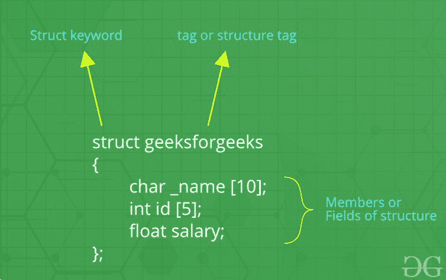

# c++中的结构

> 原文:[https://www.geeksforgeeks.org/structures-in-cpp/](https://www.geeksforgeeks.org/structures-in-cpp/)

我们经常遇到需要存储一组数据的情况，无论是相似数据类型还是不相似数据类型。我们已经看到了 C++中的[数组](https://www.geeksforgeeks.org/arrays-in-c-cpp/)，它用于在连续的内存位置存储一组相似数据类型的数据。
与数组不同，C++中的**结构是用户定义的数据类型，用于存储不相似数据类型的项目组。**

**什么是结构？**

结构是 C/C++中用户定义的数据类型。结构创建的数据类型可用于将可能不同类型的项组合成单一类型。



C++中的结构

**如何创建结构？**

“struct”关键字用于创建结构。创建结构的一般语法如下所示:

```
struct structureName{
    member1;
    member2;
    member3;
    .
    .
    .
    memberN;
};
```

C++中的结构可以包含两种类型的成员:

*   **数据成员**:这些成员都是正常的 C++变量。我们可以在 C++中用不同数据类型的变量创建一个结构。
*   **成员函数**:这些成员都是普通的 C++函数。除了变量，我们还可以在结构声明中包含函数。

**例**:

## C++

```
// Data Members
int roll;
int age;
int marks;

// Member Functions
void printDetails()
{
    cout<<"Roll = "<<roll<<"\n";
    cout<<"Age = "<<age<<"\n";
    cout<<"Marks = "<<marks;
}
```

在上述结构中，数据成员是三个整数变量来存储任何学生的*卷号、年龄和分数*，成员函数是 *printDetails()* ，它打印任何学生的所有上述详细信息。

**如何声明结构变量？**

结构变量既可以用结构声明来声明，也可以像基本类型一样作为单独的声明来声明。

## C++

```
// A variable declaration with structure declaration.
struct Point
{
   int x, y;
} p1;  // The variable p1 is declared with 'Point'

// A variable declaration like basic data types
struct Point
{
   int x, y;
};

int main()
{
   struct Point p1;  // The variable p1 is declared like a normal variable
}
```