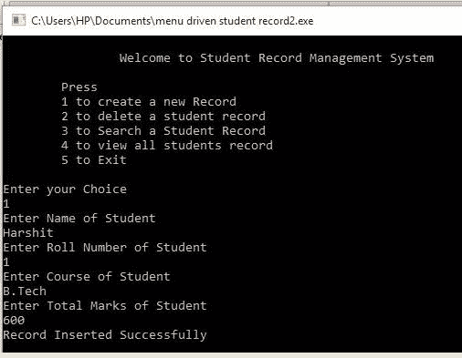
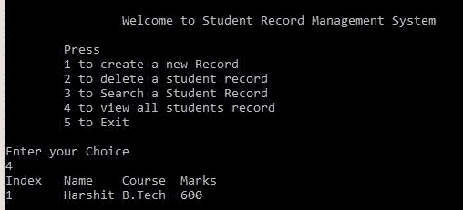
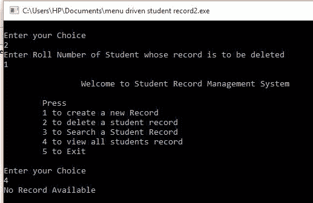
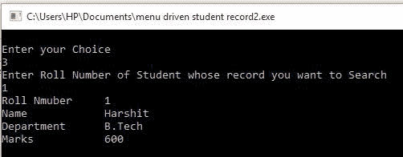
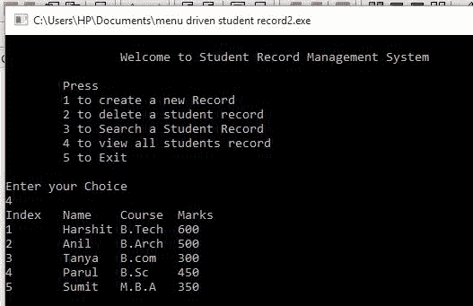

# 学生档案管理系统使用链表

> 原文:[https://www . geesforgeks . org/学生-记录-管理-系统-使用-链表/](https://www.geeksforgeeks.org/student-record-management-system-using-linked-list/)

**先决条件:** [链表](https://www.geeksforgeeks.org/data-structures/linked-list/)

**问题:**创建一个学生记录管理系统，可以执行以下操作:

*   插入学生记录
*   删除学生记录
*   显示学生记录
*   搜索学生记录

学生记录应包含以下项目

*   学生姓名
*   学生人数
*   学生注册的课程
*   学生总成绩

**方法:**有了链表上[操作的基础知识，像插入、](https://www.geeksforgeeks.org/data-structures/linked-list/)[删除链表](https://www.geeksforgeeks.org/linked-list-set-3-deleting-node/)中的元素，就可以创建学生档案管理系统。以下是将要实现的功能说明:

*   **检查记录:**这是一个创建记录的实用功能，它在插入之前检查记录是否已经存在。它使用[的概念来检查链表](https://www.geeksforgeeks.org/search-an-element-in-a-linked-list-iterative-and-recursive/)中给定数据的节点。
*   **创建记录:**简单到[在空链表](https://www.geeksforgeeks.org/linked-list-set-2-inserting-a-node/)中创建新节点或者在非空链表中插入新节点。
*   **搜索记录:**搜索记录类似于[在链表](https://www.geeksforgeeks.org/search-an-element-in-a-linked-list-iterative-and-recursive/)中搜索关键字。在学生记录中，关键是卷号，因为卷号对每个学生都是唯一的。
*   **删除记录:**删除记录类似于[从链表](https://www.geeksforgeeks.org/delete-occurrences-given-key-linked-list/)中删除一个键。这里的关键是卷号。删除记录是一个整数返回函数，如果没有找到给定辊号的记录，它返回 **-1** ，否则它删除给定键的节点，并返回 **0** 。
*   **显示记录:**显示记录类似于[打印链表](https://www.geeksforgeeks.org/print-nodes-of-linked-list-at-given-indexes/)的所有元素。

**<u>异常处理</u>**

<u>虽然异常处理的实现非常简单，但在设计这样的系统之前，必须考虑的事情很少:</u>

*   <u>滚动号必须用作**键**来区分两个不同的记录，因此在插入记录时，检查该记录是否已经存在于我们的数据库中，如果已经存在，则立即向用户报告该记录已经存在，并将该记录插入数据库中。</u>
*   <u>记录应按排序顺序插入，以使滚动号成为一个关键字，并使用排序链表中的[插入节点。](https://www.geeksforgeeks.org/given-a-linked-list-which-is-sorted-how-will-you-insert-in-sorted-way/)</u>

<u>下面是上述方法的实现:</u>

## <u>C++</u>

```
// C++ program for the above approach
#include <bits/stdc++.h>
using namespace std;

// Node Class
class Node {
public:
    int roll;
    string Name;
    string Dept;
    int Marks;
    Node* next;
};

// Stores the head of the Linked List
Node* head = new Node();

// Check Function to check that if
// Record Already Exist or Not
bool check(int x)
{
    // Base Case
    if (head == NULL)
        return false;

    Node* t = new Node;
    t = head;

    // Traverse the Linked List
    while (t != NULL) {
        if (t->roll == x)
            return true;
        t = t->next;
    }

    return false;
}

// Function to insert the record
void Insert_Record(int roll, string Name,
                   string Dept, int Marks)
{
    // if Record Already Exist
    if (check(roll)) {
        cout << "Student with this "
             << "record Already Exists\n";
        return;
    }

    // Create new Node to Insert Record
    Node* t = new Node();
    t->roll = roll;
    t->Name = Name;
    t->Dept = Dept;
    t->Marks = Marks;
    t->next = NULL;

    // Insert at Begin
    if (head == NULL
        || (head->roll >= t->roll)) {
        t->next = head;
        head = t;
    }

    // Insert at middle or End
    else {
        Node* c = head;
        while (c->next != NULL
               && c->next->roll < t->roll) {
            c = c->next;
        }
        t->next = c->next;
        c->next = t;
    }

    cout << "Record Inserted "
         << "Successfully\n";
}

// Function to search record for any
// students Record with roll number
void Search_Record(int roll)
{
    // if head is NULL
    if (!head) {
        cout << "No such Record "
             << "Available\n";
        return;
    }

    // Otherwise
    else {
        Node* p = head;
        while (p) {
            if (p->roll == roll) {
                cout << "Roll Number\t"
                     << p->roll << endl;
                cout << "Name\t\t"
                     << p->Name << endl;
                cout << "Department\t"
                     << p->Dept << endl;
                cout << "Marks\t\t"
                     << p->Marks << endl;
                return;
            }
            p = p->next;
        }

        if (p == NULL)
            cout << "No such Record "
                 << "Available\n";
    }
}

// Function to delete record students
// record with given roll number
// if it exist
int Delete_Record(int roll)
{
    Node* t = head;
    Node* p = NULL;

    // Deletion at Begin
    if (t != NULL
        && t->roll == roll) {
        head = t->next;
        delete t;

        cout << "Record Deleted "
             << "Successfully\n";
        return 0;
    }

    // Deletion Other than Begin
    while (t != NULL && t->roll != roll) {
        p = t;
        t = t->next;
    }
    if (t == NULL) {
        cout << "Record does not Exist\n";
        return -1;
        p->next = t->next;

        delete t;
        cout << "Record Deleted "
             << "Successfully\n";

        return 0;
    }
}

// Function to display the Student's
// Record
void Show_Record()
{
    Node* p = head;
    if (p == NULL) {
        cout << "No Record "
             << "Available\n";
    }
    else {
        cout << "Index\tName\tCourse"
             << "\tMarks\n";

        // Until p is not NULL
        while (p != NULL) {
            cout << p->roll << "    \t"
                 << p->Name << "\t"
                 << p->Dept << "\t"
                 << p->Marks << endl;
            p = p->next;
        }
    }
}

// Driver code
int main()
{
    head = NULL;
    string Name, Course;
    int Roll, Marks;

    // Menu-driven program
    while (true) {
        cout << "\n\t\tWelcome to Student Record "
                "Management System\n\n\tPress\n\t1 to "
                "create a new Record\n\t2 to delete a "
                "student record\n\t3 to Search a Student "
                "Record\n\t4 to view all students "
                "record\n\t5 to Exit\n";
        cout << "\nEnter your Choice\n";
        int Choice;

        // Enter Choice
        cin >> Choice;
        if (Choice == 1) {
            cout << "Enter Name of Student\n";
            cin >> Name;
            cout << "Enter Roll Number of Student\n";
            cin >> Roll;
            cout << "Enter Course of Student \n";
            cin >> Course;
            cout << "Enter Total Marks of Student\n";
            cin >> Marks;
            Insert_Record(Roll, Name, Course, Marks);
        }
        else if (Choice == 2) {
            cout << "Enter Roll Number of Student whose "
                    "record is to be deleted\n";
            cin >> Roll;
            Delete_Record(Roll);
        }
        else if (Choice == 3) {
            cout << "Enter Roll Number of Student whose "
                    "record you want to Search\n";
            cin >> Roll;
            Search_Record(Roll);
        }
        else if (Choice == 4) {
            Show_Record();
        }
        else if (Choice == 5) {
            exit(0);
        }
        else {
            cout << "Invalid Choice "
                 << "Try Again\n";
        }
    }
    return 0;
}
```

<u>**输出:**下面是学生档案管理系统提供的各种功能的输出截图:</u>

*   <u>**创建记录:**</u> 

<u></u>

*   <u>**显示记录:**</u> 

<u></u>

*   <u>**删除记录:**</u> 

<u></u>

*   <u>**搜索记录:**</u> 

<u></u>

*   <u>**学生成绩:**</u> 

<u></u>