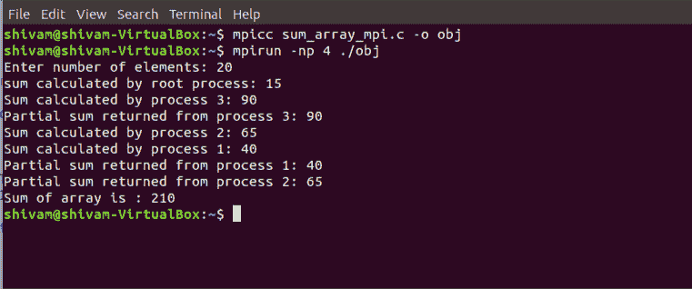

# 使用 MPI 对数组求和

> 原文:[https://www.geeksforgeeks.org/sum-of-an-array-using-mpi/](https://www.geeksforgeeks.org/sum-of-an-array-using-mpi/)

**先决条件:**[MPI–分布式计算变得简单](https://www.geeksforgeeks.org/mpi-distributed-computing-made-easy/)

[消息传递接口(MPI)](https://www.geeksforgeeks.org/mpi-distributed-computing-made-easy/) 是一个例程库，可以用 C 或 Fortran77 创建并行程序。它允许用户通过创建并行进程来构建并行应用程序，并在这些进程之间交换信息。
MPI 使用两种基本的通信例程:

*   **MPI_Send** ，向另一个进程发送消息。
*   **MPI_Recv** ，接收来自另一个进程的消息。

MPI_Send 和 MPI_Recv 的语法是:

```cpp
int MPI_Send(void *data_to_send, 
             int send_count, 
             MPI_Datatype send_type, 
             int destination_ID, 
             int tag, 
             MPI_Comm comm); 

int MPI_Recv(void *received_data, 
             int receive_count, 
             MPI_Datatype receive_type,
             int sender_ID, 
             int tag, 
             MPI_Comm comm, 
             MPI_Status *status);

```

为了降低程序的时间复杂度，子数组的并行执行是通过并行进程运行来计算它们的部分和，然后主进程(根进程)计算这些部分和的和，以返回数组的总和。

**示例:**

```cpp
Input : {1, 2, 3, 4, 5, 6, 7, 8, 9, 10}
Output : Sum of array is 55

Input : {1, 3, 5, 10, 12, 20, 4, 50, 100, 1000}
Output : Sum of array is 1205

```

**注意–**您必须在基于 Linux 的系统上安装 MPI，才能执行以下程序。详情请参考[MPI-分布式计算变得简单](https://www.geeksforgeeks.org/mpi-distributed-computing-made-easy/)

使用以下代码编译并运行程序:

```cpp
mpicc program_name.c -o object_file
mpirun -np [number of processes] ./object_file

```

以下是上述主题的实现:

```cpp
#include <mpi.h>
#include <stdio.h>
#include <stdlib.h>
#include <unistd.h>

// size of array
#define n 10

int a[] = { 1, 2, 3, 4, 5, 6, 7, 8, 9, 10 };

// Temporary array for slave process
int a2[1000];

int main(int argc, char* argv[])
{

    int pid, np,
        elements_per_process,
        n_elements_recieved;
    // np -> no. of processes
    // pid -> process id

    MPI_Status status;

    // Creation of parallel processes
    MPI_Init(&argc, &argv);

    // find out process ID,
    // and how many processes were started
    MPI_Comm_rank(MPI_COMM_WORLD, &pid);
    MPI_Comm_size(MPI_COMM_WORLD, &np);

    // master process
    if (pid == 0) {
        int index, i;
        elements_per_process = n / np;

        // check if more than 1 processes are run
        if (np > 1) {
            // distributes the portion of array
            // to child processes to calculate
            // their partial sums
            for (i = 1; i < np - 1; i++) {
                index = i * elements_per_process;

                MPI_Send(&elements_per_process,
                         1, MPI_INT, i, 0,
                         MPI_COMM_WORLD);
                MPI_Send(&a[index],
                         elements_per_process,
                         MPI_INT, i, 0,
                         MPI_COMM_WORLD);
            }

            // last process adds remaining elements
            index = i * elements_per_process;
            int elements_left = n - index;

            MPI_Send(&elements_left,
                     1, MPI_INT,
                     i, 0,
                     MPI_COMM_WORLD);
            MPI_Send(&a[index],
                     elements_left,
                     MPI_INT, i, 0,
                     MPI_COMM_WORLD);
        }

        // master process add its own sub array
        int sum = 0;
        for (i = 0; i < elements_per_process; i++)
            sum += a[i];

        // collects partial sums from other processes
        int tmp;
        for (i = 1; i < np; i++) {
            MPI_Recv(&tmp, 1, MPI_INT,
                     MPI_ANY_SOURCE, 0,
                     MPI_COMM_WORLD,
                     &status);
            int sender = status.MPI_SOURCE;

            sum += tmp;
        }

        // prints the final sum of array
        printf("Sum of array is : %d\n", sum);
    }
    // slave processes
    else {
        MPI_Recv(&n_elements_recieved,
                 1, MPI_INT, 0, 0,
                 MPI_COMM_WORLD,
                 &status);

        // stores the received array segment
        // in local array a2
        MPI_Recv(&a2, n_elements_recieved,
                 MPI_INT, 0, 0,
                 MPI_COMM_WORLD,
                 &status);

        // calculates its partial sum
        int partial_sum = 0;
        for (int i = 0; i < n_elements_recieved; i++)
            partial_sum += a2[i];

        // sends the partial sum to the root process
        MPI_Send(&partial_sum, 1, MPI_INT,
                 0, 0, MPI_COMM_WORLD);
    }

    // cleans up all MPI state before exit of process
    MPI_Finalize();

    return 0;
}
```

**输出:**

```cpp
Sum of array is 55

```

下面是计算其部分和的进程的快照:
