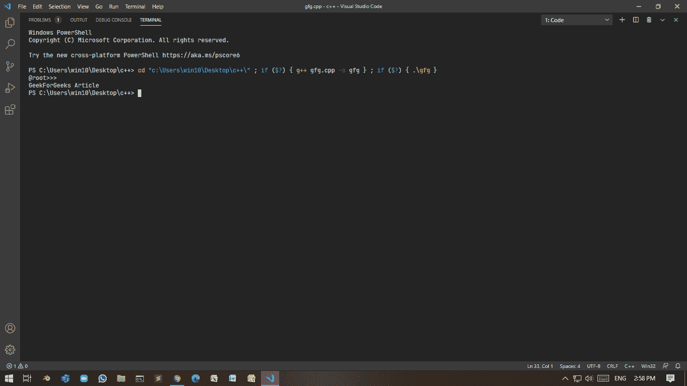
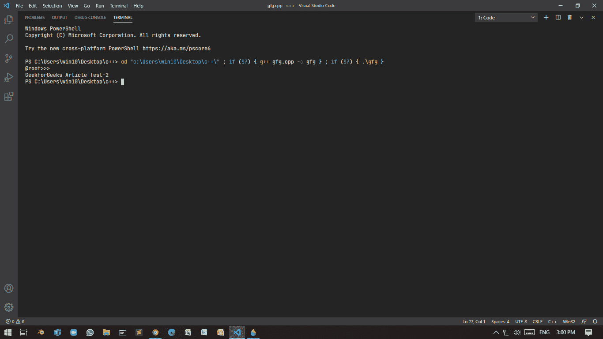
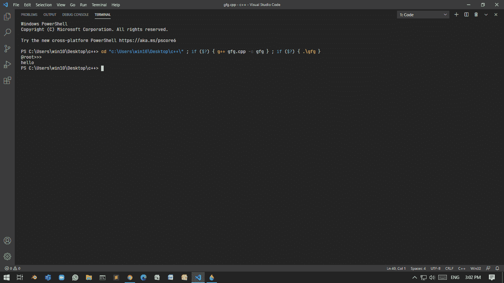
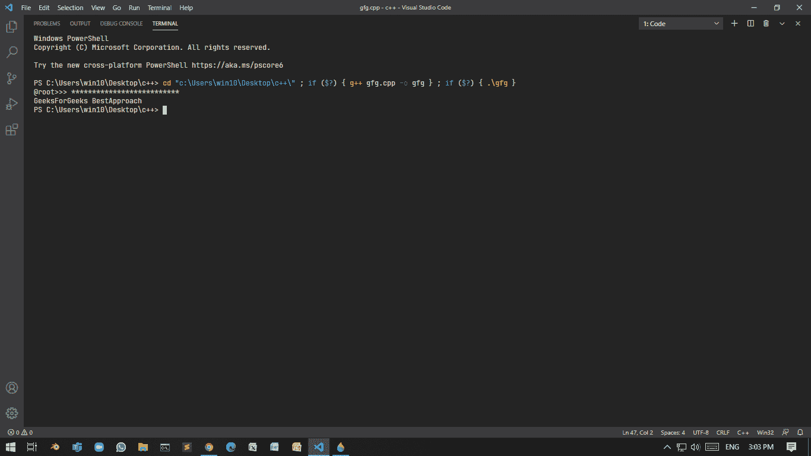

# 在 C++中以密码作为输入

> 原文:[https://www . geesforgeks . org/taking-password-as-input-in-c/](https://www.geeksforgeeks.org/taking-password-as-input-in-c/)

有两种方法可以更安全地进行输入:

*   不显示任何内容。
*   显示特殊字符，如**星号**，而不是实际内容。

在这种方法中，输入的内容将是不可见的。这可以通过两种方式实现:

### **<u>使用<>T2:</u>**

**程序 1:**

以下是将[控制台](https://www.geeksforgeeks.org/basic-input-output-c/)模式设置为启用、回声输入和重置控制台模式的程序:

## C++

```
// C++ program to take the input
// invisibly
#include <iostream>
#include <windows.h>
using namespace std;

// Function take password and
// reset to console mode
std::string takePasswdFromUser()
{
    HANDLE hStdInput
        = GetStdHandle(STD_INPUT_HANDLE);
    DWORD mode = 0;

    // Create a restore point Mode
    // is know 503
    GetConsoleMode(hStdInput, &mode);

    // Enable echo input
    // set to 499
    SetConsoleMode(
        hStdInput,
        mode & (~ENABLE_ECHO_INPUT));

    // Take input
    string ipt;
    getline(cin, ipt);

    // Otherwise next cout will print
    // into the same line
    cout << endl;

    // Restore the mode
    SetConsoleMode(hStdInput, mode);

    return ipt;
}

// Driver Code
int main()
{
    string input;
    cout << "@root>>> ";

    // Function Call
    input = takePasswdFromUser();

    // Print the input
    cout << input << endl;
}
```

**输出:**



### **<u>使用<</u>**[**<u>conio . h</u>**](https://practice.geeksforgeeks.org/problems/full-form-of-conioheader-file)**<u>></u>**:

**为此使用 [getch()](https://www.geeksforgeeks.org/getch-function-in-c-with-examples/) 。该功能接受用户输入的字符，不需要缓冲，不需要等待用户按下“返回”键。**

****程序 2:****

**下面是 C++程序，演示了在 conio.h 中使用 **getch()** :**

## **C++**

```
// C++ program to demonstrate the
// use of getch()
#include <conio.h>
#include <iostream>
using namespace std;

// Function using getch()
std::string takePasswdFromUser()
{
    string ipt = "";
    char ipt_ch;
    while (true) {
        ipt_ch = getch();

        // Check whether user enters
        // a special non-printable
        // character
        if (ipt_ch < 32) {
            cout << endl;
            return ipt;
        }
        ipt.push_back(ipt_ch);
    }
}

// Driver Code
int main()
{
    string input;
    cout << "@root>>> ";

    // Function call
    input = takePasswdFromUser();
    cout << input << endl;
}
```

****输出:****

****

****缺点:**用户无法清除之前做出的响应。按下**退格键**时，返回输入。**

****程序 3:****

**下面是 C++程序来演示上述缺点的解决方案:**

## **C++**

```
// C++ program to demonstrate the
// solution of above drawback
#include <conio.h>
#include <iostream>
using namespace std;

// Enumerator
enum TT_Input {

    // ASCII code of backspace is 8
    BACKSPACE = 8,
    RETURN = 32
};

// Function accepting password
std::string takePasswdFromUser()
{
    string ipt = "";
    char ipt_ch;
    while (true) {
        ipt_ch = getch();

        if (ipt_ch < TT_Input::RETURN
            && ipt_ch != TT_Input::BACKSPACE) {
            cout << endl;
            return ipt;
        }

        // Check whether the user
        // pressed backspace
        if (ipt_ch == TT_Input::BACKSPACE) {

            // Check if ipt is empty or not
            if (ipt.length() == 0)
                continue;
            else {

                // Removes last character
                ipt.pop_back();

                continue;
            }
        }
        ipt.push_back(ipt_ch);
    }
}

// Driver Code
int main()
{
    string input;
    cout << "@root>>> ";

    // Function call
    input = takePasswdFromUser();
    cout << input << endl;
}
```

****

### ****<u>通过特殊字符(*)</u> :** 隐藏密码**

**想法是在这里使用库 **< conio.h >** 隐藏带有[星号(*)](https://www.geeksforgeeks.org/print-in-place-of-characters-for-reading-passwords-in-c/) 的密码。下面是 C++程序使用 **conio.h** 到[隐藏密码](https://www.geeksforgeeks.org/print-in-place-of-characters-for-reading-passwords-in-c/)使用*:**

****程序 4:****

## **C++**

```
// C++ program to hide the password
// using *(asterik)
#include <conio.h>
#include <iostream>
using namespace std;

// Enumerator
enum IN {

    // 13 is ASCII for carriage
    // return
    IN_BACK = 8,
    IN_RET = 13

};

// Function that accepts the password
std::string takePasswdFromUser(
    char sp = '*')
{
    // Stores the password
    string passwd = "";
    char ch_ipt;

    // Until condition is true
    while (true) {

        ch_ipt = getch();

        // if the ch_ipt
        if (ch_ipt == IN::IN_RET) {
            cout << endl;
            return passwd;
        }
        else if (ch_ipt == IN::IN_BACK
                 && passwd.length() != 0) {
            passwd.pop_back();

            // Cout statement is very
            // important as it will erase
            // previously printed character
            cout << "\b \b";

            continue;
        }

        // Without using this, program
        // will crash as \b can't be
        // print in beginning of line
        else if (ch_ipt == IN::IN_BACK
                 && passwd.length() == 0) {
            continue;
        }

        passwd.push_back(ch_ipt);
        cout << sp;
    }
}

// Driver Code
int main()
{
    string input;
    cout << "@root>>> ";

    // Function call
    input = takePasswdFromUser();
    cout << input << endl;
}
```

****