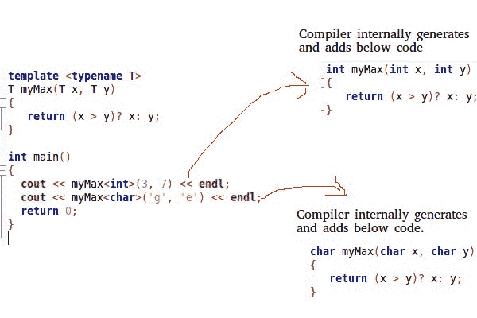

# c++ 中的模板

> 原文:[https://www.geeksforgeeks.org/templates-cpp/](https://www.geeksforgeeks.org/templates-cpp/)

在 C++ 中，模板是一个简单而又非常强大的工具。简单的想法是将数据类型作为参数传递，这样我们就不需要为不同的数据类型编写相同的代码。例如，软件公司可能需要对不同的数据类型进行 sort()。我们可以编写一个 sort()并将数据类型作为参数传递，而不是编写和维护多个代码。
C++ 新增两个关键词支持模板:*【模板】*和*【typename】*。第二个关键字总是可以被关键字“class”替换。
**模板如何工作？**
模板在编译时展开。这就像宏一样。不同的是，编译器在模板扩展之前进行类型检查。想法很简单，源代码只包含函数/类，但是编译后的代码可能包含同一个函数/类的多个副本。



**函数模板**我们编写了一个通用函数，可以用于不同的数据类型。函数模板的示例有 sort()、max()、min()、printArray()。
了解更多关于 C++
中[泛型的信息](https://www.geeksforgeeks.org/generics-in-c/)

## 卡片打印处理机（Card Print Processor 的缩写）

```cpp
#include <iostream>
using namespace std;

// One function works for all data types.  This would work
// even for user defined types if operator '>' is overloaded
template <typename T>
T myMax(T x, T y)
{
   return (x > y)? x: y;
}

int main()
{
  cout << myMax<int>(3, 7) << endl;  // Call myMax for int
  cout << myMax<double>(3.0, 7.0) << endl; // call myMax for double
  cout << myMax<char>('g', 'e') << endl;   // call myMax for char

  return 0;
}
```

输出:

```cpp
7
7
g
```

下面是用 C++ 模板实现[冒泡排序](https://www.geeksforgeeks.org/bubble-sort/)的程序:

## 卡片打印处理机（Card Print Processor 的缩写）

```cpp
// CPP code for bubble sort
// using template function
#include <iostream>
using namespace std;

// A template function to implement bubble sort.
// We can use this for any data type that supports
// comparison operator < and swap works for it.
template <class T>
void bubbleSort(T a[], int n) {
    for (int i = 0; i < n - 1; i++)
        for (int j = n - 1; i < j; j--)
            if (a[j] < a[j - 1])
              swap(a[j], a[j - 1]);
}

// Driver Code
int main() {
    int a[5] = {10, 50, 30, 40, 20};
    int n = sizeof(a) / sizeof(a[0]);

    // calls template function
    bubbleSort<int>(a, n);

    cout << " Sorted array : ";
    for (int i = 0; i < n; i++)
        cout << a[i] << " ";
    cout << endl;

  return 0;
}
```

**输出** :

```cpp
Sorted array : 10 20 30 40 50
```

**类模板**和函数模板一样，类模板在类定义独立于数据类型的东西时很有用。对于链接列表、二进制树、堆栈、队列、数组等类非常有用。
下面是一个简单的模板数组类的例子。

## 卡片打印处理机（Card Print Processor 的缩写）

```cpp
#include <iostream>
using namespace std;

template <typename T>
class Array {
private:
    T *ptr;
    int size;
public:
    Array(T arr[], int s);
    void print();
};

template <typename T>
Array<T>::Array(T arr[], int s) {
    ptr = new T[s];
    size = s;
    for(int i = 0; i < size; i++)
        ptr[i] = arr[i];
}

template <typename T>
void Array<T>::print() {
    for (int i = 0; i < size; i++)
        cout<<" "<<*(ptr + i);
    cout<<endl;
}

int main() {
    int arr[5] = {1, 2, 3, 4, 5};
    Array<int> a(arr, 5);
    a.print();
    return 0;
}
```

输出:

```cpp
 1 2 3 4 5
```

**模板可以有多个参数吗？**
是的，和普通参数一样，我们可以将不止一种数据类型作为参数传递给模板。下面的示例演示了相同的内容。

## 卡片打印处理机（Card Print Processor 的缩写）

```cpp
#include<iostream>
using namespace std;

template<class T, class U>
class A  {
    T x;
    U y;
public:
    A() {    cout<<"Constructor Called"<<endl;   }
};

int main()  {
   A<char, char> a;
   A<int, double> b;
   return 0;
}
```

输出:

```cpp
Constructor Called
Constructor Called
```

**我们可以为模板参数指定默认值吗？**
是的，和普通参数一样，我们可以给模板指定默认参数。下面的示例演示了相同的内容。

## 卡片打印处理机（Card Print Processor 的缩写）

```cpp
#include<iostream>
using namespace std;

template<class T, class U = char>
class A  {
public:
    T x;
    U y;
    A() {   cout<<"Constructor Called"<<endl;   }
};

int main()  {
   A<char> a;  // This will call A<char, char>  
   return 0;
}
```

输出:

```cpp
Constructor Called
```

**函数重载和模板有什么区别？**
函数重载和模板都是面向对象程序的多态性特征的例子。当多个函数执行相似的操作时使用函数重载，当多个函数执行相同的操作时使用模板。
**当模板类/函数中有静态成员时会发生什么？**
模板的每个实例都包含自己的静态变量。详见[模板和静态变量](https://www.geeksforgeeks.org/templates-and-static-variables-in-c/)。
**什么是模板专精？**
模板专门化允许我们为特定的数据类型拥有不同的代码。详见[模板专门化](https://www.geeksforgeeks.org/template-specialization-c/)。
**我们可以将非类型参数传递给模板吗？**
我们可以将非类型参数传递给模板。非类型参数主要用于为模板的特定实例指定最大值或最小值或任何其他常数值。关于非类型参数，需要注意的重要一点是，它们必须是常量。编译器必须在编译时知道非类型参数的值。因为编译器需要在编译时为指定的非类型值创建函数/类。在下面的程序中，如果我们用一个变量替换 10000 或 25，我们会得到一个编译器错误。请看[这个](https://ide.geeksforgeeks.org/mgvysu)。
下面是一个 C++ 程序。

## 卡片打印处理机（Card Print Processor 的缩写）

```cpp
// A C++ program to demonstrate working of non-type
// parameters to templates in C++.
#include <iostream>
using namespace std;

template <class T, int max>
int arrMin(T arr[], int n)
{
   int m = max;
   for (int i = 0; i < n; i++)
      if (arr[i] < m)
         m = arr[i];

   return m;
}

int main()
{
   int arr1[]  = {10, 20, 15, 12};
   int n1 = sizeof(arr1)/sizeof(arr1[0]);

   char arr2[] = {1, 2, 3};
   int n2 = sizeof(arr2)/sizeof(arr2[0]);

   // Second template parameter to arrMin must be a constant
   cout << arrMin<int, 10000>(arr1, n1) << endl;
   cout << arrMin<char, 256>(arr2, n2);
   return 0;
}
```

输出:

```cpp
10
1
```

**什么是模板元编程？**
见[模板元编程](https://www.geeksforgeeks.org/template-metaprogramming-in-c/)
你可能还想参加一个关于模板的[测验。
Java 也支持这些功能。Java 称之为](https://www.geeksforgeeks.org/c-plus-plus-gq/templates-gq/)[泛型](https://www.geeksforgeeks.org/generics-in-java/)。
如果发现有不正确的地方，或者想分享更多关于上述话题的信息，请写评论。