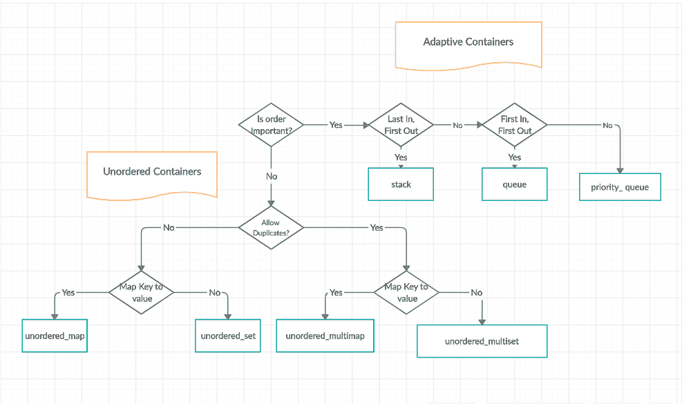
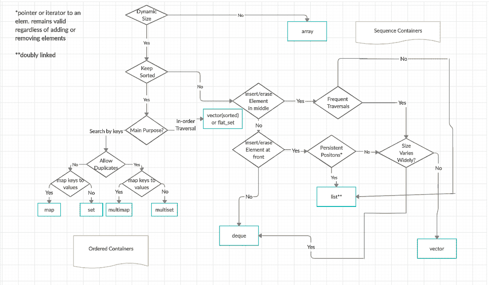

# c++ 标准模板库(STL)

> 原文:[https://www . geesforgeks . org/the-c-standard-template-library-STL/](https://www.geeksforgeeks.org/the-c-standard-template-library-stl/)

标准模板库(STL)是一组 C++ 模板类，用于提供常见的编程数据结构和功能，如列表、堆栈、数组等。它是容器类、算法和迭代器的库。它是一个通用库，因此，它的组件是参数化的。对[模板类](https://www.geeksforgeeks.org/templates-cpp/)的工作知识是使用 STL 的先决条件。

**STL 有四个组件**

*   算法
*   容器
*   功能
*   迭代程序

**算法**

标头算法定义了一组函数，这些函数是专门设计用于元素范围的。它们作用于容器，并为容器内容物的各种操作提供手段。

*   算法
    *   [排序](https://www.geeksforgeeks.org/sort-algorithms-the-c-standard-template-library-stl/)
    *   [搜索](https://www.geeksforgeeks.org/binary-search-algorithms-the-c-standard-template-library-stl/)
    *   [重要的 STL 算法](https://www.geeksforgeeks.org/c-magicians-stl-algorithms/)
    *   [有用的阵列算法](https://www.geeksforgeeks.org/useful-array-algorithms-in-c-stl/)
    *   [分区操作](https://www.geeksforgeeks.org/stdpartition-in-c-stl/)
*   数字的
    *   [valarray 类](https://www.geeksforgeeks.org/std-valarray-class-c/)

**容器**

容器或容器类存储对象和数据。总共有七个标准的“一级”容器类和三个容器适配器类，只有七个头文件提供对这些容器或容器适配器的访问。

*   序列容器:实现可以以顺序方式访问的数据结构。
    *   [矢量](https://www.geeksforgeeks.org/vector-in-cpp-stl/)
    *   [列表](https://www.geeksforgeeks.org/list-cpp-stl/)
    *   从开始
    *   [阵列](https://www.geeksforgeeks.org/array-class-c/)
    *   [forward _ list](https://www.geeksforgeeks.org/forward-list-c-set-1-introduction-important-functions/)(c++ 11 引入)
*   容器适配器:为顺序容器提供不同的接口。
    *   队列
    *   [优先级 _ 队列](https://www.geeksforgeeks.org/priority-queue-in-cpp-stl/)
    *   [堆叠](https://www.geeksforgeeks.org/stack-in-cpp-stl/)
*   关联容器:实现可快速搜索的排序数据结构( O(log n) 复杂度)。
    *   [设置](https://www.geeksforgeeks.org/set-in-cpp-stl/)
    *   [多组](https://www.geeksforgeeks.org/multiset-in-cpp-stl/)
    *   [地图](https://www.geeksforgeeks.org/map-associative-containers-the-c-standard-template-library-stl/)
    *   [多工位](https://www.geeksforgeeks.org/multimap-associative-containers-the-c-standard-template-library-stl/)
*   Unordered Associative Containers : implement unordered data structures that can be quickly searched
    *   [无序 _ 集合](https://www.geeksforgeeks.org/unordered_set-in-cpp-stl/)(c++ 11 中引入)
    *   [无序 _ 多集](https://www.geeksforgeeks.org/unordered_multiset-and-its-uses/)(c++ 11 引入)
    *   [无序 _ 映射](https://www.geeksforgeeks.org/unordered_map-in-cpp-stl/)(c++ 11 引入)
    *   [无序 _ 多映射](https://www.geeksforgeeks.org/unordered_multimap-and-its-application/)(c++ 11 中引入)

    **自适应容器和无序容器流程图**

    

    **序列控制器和订购容器的流程图**

**功能**

STL 包含重载函数调用运算符的类。这种类的实例称为函数对象或函子。函子允许在要传递的参数的帮助下定制相关函数的工作。

*   [函子](https://www.geeksforgeeks.org/functors-in-cpp/)

**迭代器**

顾名思义，迭代器用于处理一系列值。它们是 STL 中允许通用性的主要特性。

*   [迭代器](https://www.geeksforgeeks.org/iterators-c-stl/)

**实用程序库**

在标题<utility>中定义。</utility>

*   [配对](https://www.geeksforgeeks.org/pair-in-cpp-stl/)

> 要以最高效最有效的方式掌握 **C++ 标准模板库(STL)** ，请务必通过 GeeksforGeeks 查看本 [**C++ STL 在线课程**](https://practice.geeksforgeeks.org/courses/cpp-stl) 。本课程涵盖了 C++ 的基础知识和对所有 C++ STL 容器、迭代器等的深入解释，以及一些问题的视频解释。此外，您将学习使用 STL 内置的类和函数来实现一些复杂的数据结构，并方便地对它们执行操作。

**参考文献:**

*   [http://en . cppreference . com/w/CPP](http://en.cppreference.com/w/cpp/)
*   [http://cs . stmarys . ca/~ porter/CSC/ref/STL/headers . html](http://cs.stmarys.ca/~porter/csc/ref/stl/headers.html)
*   [http://www.cplusplus.com/reference/stl/](http://www.cplusplus.com/reference/stl/)

[最近关于 STL 的文章！](https://www.geeksforgeeks.org/tag/stl/)

如果您发现任何不正确的地方，或者您想分享更多关于上面讨论的主题的信息，请写评论