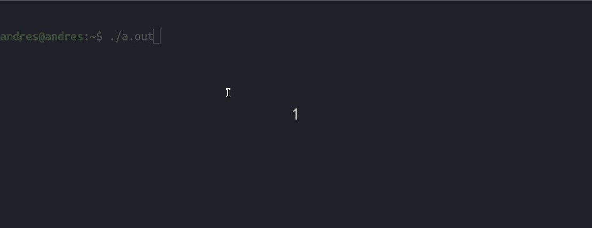

# 定时器在 C++中使用系统调用

> 原文:[https://www.geeksforgeeks.org/timer-c-using-system-calls/](https://www.geeksforgeeks.org/timer-c-using-system-calls/)

任务是在不使用任何图形或动画的情况下创建计时器。必要时将使用 [**系统调用**](https://www.geeksforgeeks.org/operating-system-introduction-system-call/) 进行计时。这里的计时器指的是计时的秒表。
计时器是在 Linux 中创建的。使用 Linux 的以下系统调用:
**sleep()** :它将使程序休眠作为函数参数提供的秒数。
[**system()**](https://www.geeksforgeeks.org/system-call-in-c/)**:用于通过将命令作为参数传递给该函数来执行系统命令。** 

**下面是使用系统调用创建定时器的实现:** 

## **卡片打印处理机（Card Print Processor 的缩写）**

```cpp
// CPP program to create a timer
#include <iomanip>
#include <iostream>
#include <stdlib.h>
#include <unistd.h>
using namespace std;

// hours, minutes, seconds of timer
int hours = 0;
int minutes = 0;
int seconds = 0;

// function to display the timer
void displayClock()
{
    // system call to clear the screen
    system("clear");

    cout << setfill(' ') << setw(55) << "         TIMER         \n";
    cout << setfill(' ') << setw(55) << " --------------------------\n";
    cout << setfill(' ') << setw(29);
    cout << "| " << setfill('0') << setw(2) << hours << " hrs | ";
    cout << setfill('0') << setw(2) << minutes << " min | ";
    cout << setfill('0') << setw(2) << seconds << " sec |" << endl;
    cout << setfill(' ') << setw(55) << " --------------------------\n";
}

void timer()
{
    // infinite loop because timer will keep
    // counting. To kill the process press
    // Ctrl+D. If it does not work ask
    // ubuntu for other ways.
    while (true) {

        // display the timer
        displayClock();

        // sleep system call to sleep
        // for 1 second
        sleep(1);

        // increment seconds
        seconds++;

        // if seconds reaches 60
        if (seconds == 60) {

            // increment minutes
            minutes++;

            // if minutes reaches 60
            if (minutes == 60) {

                // increment hours
                hours++;
                minutes = 0;
            }
            seconds = 0;
        }
    }
}

// Driver Code
int main()
{
    // start timer from 00:00:00
    timer();
    return 0;
}
```

****输出:**** 

****

****注意:**稍加修改即可在 Windows 上运行。
所需修改:
1。在系统()调用中，使用**“cls”**代替**“clear”**。
2。使用**的**睡眠()功能代替小写**的**睡眠()功能。
3。包括 **windows.h** 头文件。
进行这些更改的代码应该可以在 Windows 上完美运行。**