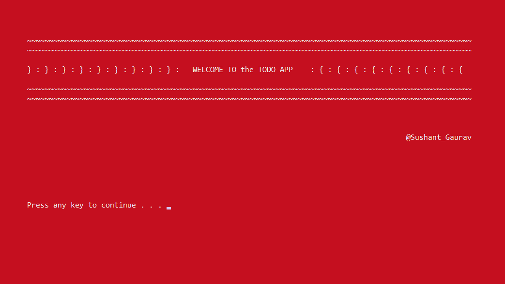
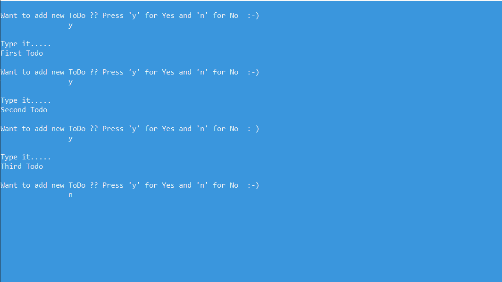
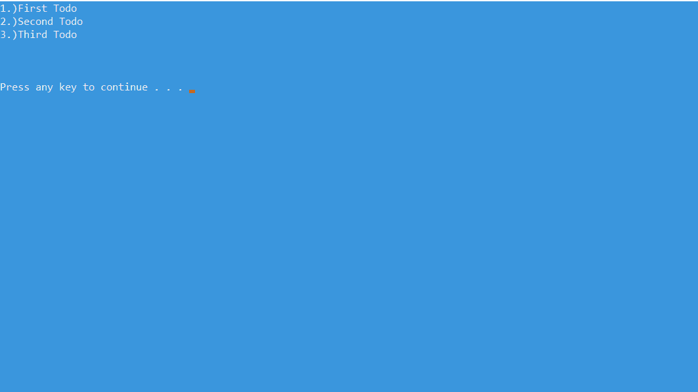
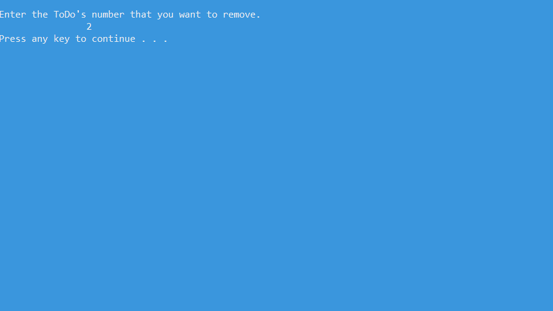
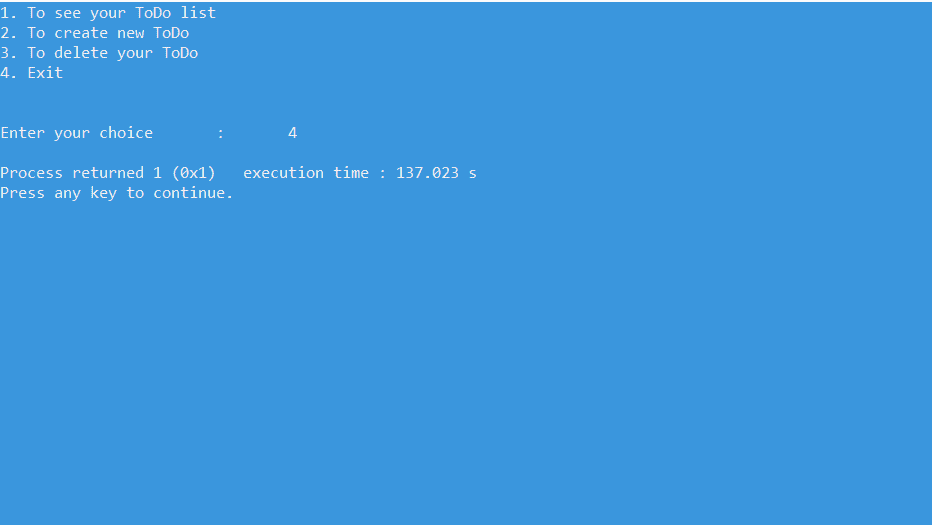

# C 语言 ToDo App

> 原文:[https://www.geeksforgeeks.org/todo-app-in-c-language/](https://www.geeksforgeeks.org/todo-app-in-c-language/)

**ToDo List App** 是一种 App，一般用来维护我们的日常任务或者列出我们必须要做的所有事情，最重要的任务排在最上面，最不重要的任务排在最下面。这有助于计划我们的日常日程。我们可以随时添加更多的任务，删除已经完成的任务。

**<u>特色</u> :**

在这个版本的待办事项列表中，用户将获得四个选项:

*   在待办事项列表应用程序中创建新任务或添加新待办事项。
*   查看所有任务或查看添加到应用程序的所有待办事项。
*   从待办事项列表中删除任何待办事项。
*   退出应用程序。

**<u>进场</u> :**

本程序涉及的基本概念有[变量](https://www.geeksforgeeks.org/variables-in-c/)、[数据类型](https://www.geeksforgeeks.org/data-types-in-c/)、[结构](https://www.geeksforgeeks.org/structures-c/)、[字符串](https://www.geeksforgeeks.org/category/data-structures/c-strings/)、[循环](https://www.geeksforgeeks.org/range-based-loop-c/)、[在链表中任意位置插入一个节点](https://www.geeksforgeeks.org/insert-a-node-at-a-specific-position-in-a-linked-list/)、[在链表中任意位置删除一个节点](https://www.geeksforgeeks.org/delete-a-linked-list-node-at-a-given-position/)、[链表遍历器](https://www.geeksforgeeks.org/recursive-insertion-and-traversal-linked-list/) l 等。构建 ToDo 应用程序的方法如下:

*   初始屏幕将显示应用程序和开发人员的名称:这是使用 **printf()** 函数(用于打印(“字符、字符串、浮点、整数、八进制和十六进制值”)和一些预定义函数中的一些语句来完成的。
*   第二个屏幕将向用户显示四个选项的列表，即**添加、删除、查看和退出:**这是使用**开关盒**实现的。
*   根据用户的选择，将显示相应的功能屏幕:为每个任务创建功能。由于 C 语言是一种基于函数或过程的语言，所以我们应该为特定的工作制作函数。
*   所有 ToDos 将被写入链表节点的数据部分。链表应该是全局声明的，这样如果函数的执行结束了，数据(我们的 ToDos)就不会丢失。通过全局声明，所有函数都可以使用链表中的相同数据。

以下是上述程序的功能:

*   **<u>闪屏</u> :** 这包括应用程序的名称和开发人员。代码写在名为**接口()**的函数中:
    *   **接口()函数**包含一些 [printf 语句](https://www.geeksforgeeks.org/how-to-print-using-printf/)和一个名为 **system()** 的预定义函数。
    *   **系统()函数**是 C/C++ 标准库的一部分。它用于传递可以在命令处理器或操作系统终端执行的命令，并在完成后最终返回命令。
        *   **系统(“Color 4F”)**将改变控制台的颜色即背景(4)和控制台上的文字即前景(F)。
        *   **系统(“暂停”)**将暂停屏幕，因此用户将获得一条消息:按任意键继续。。。



*   [**<u>main()函数</u>**](https://www.geeksforgeeks.org/executing-main-in-c-behind-the-scene/) **:** 使用一个简单的[**开关盒**](https://www.geeksforgeeks.org/switch-statement-cc/) 在一个无限的 [while-loop](https://www.geeksforgeeks.org/java-while-loop-with-examples/) 里面，这样用户每次都可以做出选择，并在 **printf()函数**的帮助下提供选择，并使用 [**scanf()函数**](https://www.geeksforgeeks.org/scanf-and-fscanf-in-c-simple-yet-poweful/) 接受用户的输入。根据输入，将执行特定的案例，并调用所需的函数。
*   [**<u>链表</u>**](https://www.geeksforgeeks.org/data-structures/linked-list/) **:名为 Todo 的**链表是利用 C 的[结构](https://www.geeksforgeeks.org/structures-c/)概念，使用 [typedef](https://www.geeksforgeeks.org/typedef-versus-define-c/) 制作的，我们将其重命名为 Todo。该链接列表由三部分组成–
    *   数据部分被制成字符数组，即字符**缓冲区【101】**。ToDos 可以很大，所以声明数组的大小为 101。
    *   节点部分包含下一个节点的地址，即*next。
    *   一个整数类型变量(int count)，它将考虑节点的数量，并有助于在进一步定义的函数中对 ToDos 进行编号。
*   就像在单链表中一样，一个开始指针(在这种情况下是- todo *start)被用来获取第一个节点的地址，它被声明并保持为空(最初指向空)。
*   **<u>seetodo()函数</u> :** 这个函数中编码了四个概念。这些措施如下:
    *   **系统(“cls”):**清除屏幕或控制台。如果有人想要查看用户之前完成的所有操作或输入，可以避免这种情况。
    *   创建一个结构变量的对象，即 ***temp** 来访问链表结构。这个临时变量将指向开始。如果开始值等于空，我们可以输出空 ToDo。这意味着我们的列表是空的。
    *   使用简单的链表遍历概念，即逐节点打印数据部分，直到最后一个节点我们可以打印所有的**到**。while 循环将执行到最后一个节点，其中的 **printf()** 将打印**到**的编号， [**puts()** 函数](https://www.geeksforgeeks.org/puts-vs-printf-for-printing-a-string/)将打印字符串形式的数据。 [**fflush()** 是预定义的功能](https://www.geeksforgeeks.org/use-fflushstdin-c/)，其目的是清除(或刷新)输出缓冲区，并将缓冲的数据移动到控制台。
    *   最后使用**系统(“暂停”)**暂停屏幕，直到用户按下任意键。
*   **createtodo()函数:**它包含一个开关盒，询问用户是否要添加 todo 或者不使用字符变量(char c；).使用 printf()询问用户另一个输入，使用 scanf()输入用户的选择。
    现在使用在链表末尾添加一个节点的概念来添加节点。这里可能有两种情况–
    *   如果不存在节点，在这种情况下，开始将指向空。
    *   如果存在一些节点，在这种情况下，起点将指向第一个节点，并使用指向节点的指针(*add)遍历直到最后一个节点(指针部分包含空值)。这里使用[动态内存分配](https://www.geeksforgeeks.org/what-is-dynamic-memory-allocation/)(使用 [**calloc()**](https://www.geeksforgeeks.org/difference-between-malloc-and-calloc-with-examples/) ，这是一个预定义的动态分配内存的函数)在运行时分配内存。

在插入过程中，创建一个新节点，使用**get()**(一个用于输入字符的预定义函数)从用户处获取数据，当我们在末尾添加时，指针部分被设为空，并且通过使用上面解释的遍历概念，新创建的节点被链表中的前一个节点指向。

*   **adjustcount()函数:**该函数将考虑链表节点的编号。使用遍历概念和开始指针的帮助，它将在每次调用时更新每个节点的计数值。
*   **deletetodo()函数:**使用删除节点的概念，我们在删除 todo。我们询问用户他/她想要删除的节点(通过询问节点的编号)。如果开始是空的，那么我们不能删除任何东西，所以我们可以打印:今天没有待办事项。

以下是上述方法的程序:

## C

```cpp
// C program for the above approach
#include <stdio.h>
#include <stdlib.h>

// Renaming structure to avoid the
// repetitive use of struct keyword
typedef struct ToDo todo;

// Declaration of structure
struct ToDo {
    // char array as data part
    char buffer[101];

    // Pointer part to access addresses
    todo* next;

    // Count variable for counting
    // the number of nodes
    int count;
};

// Declare start pointer as null in
// the beginning
todo* start = NULL;

// Driver Code
int main()
{
    int choice;
    interface();

    while (1) {

        // Change console color and
        // text color
        system("Color 3F");

        // Clear the console
        system("cls");

        printf("1\. To see your ToDo list\n");
        printf("2\. To create new ToDo\n");
        printf("3\. To delete your ToDo\n");
        printf("4\. Exit");
        printf("\n\n\nEnter your choice\t:\t");

        // Choice from the user
        scanf("%d", &choice);

        switch (choice) {

        // Calling functions defined
        // below as per the user input
        case 1:
            seetodo();
            break;
        case 2:
            createtodo();
            break;
        case 3:
            deletetodo();
            break;
        case 4:
            exit(1);
            break;
        default:
            printf("\nInvalid Choice :-(\n");
            system("pause");
        }
    }
    return 0;
}

// Code for Splash screen
void interface()
{
    system("color 4F");
    printf("\n\n\n\n");
    printf("\t~~~~~~~~~~~~~~~~~~~~~"
           "~~~~~~~~~~~~~~~~~~~~~~~~"
           "~~~~~~~~~~~~~~~~~~~~~~~~"
           "~~~~~~~~~~~~~~~~~~~~~~~"
           "~~~~~~~~~~\n");
    printf("\t~~~~~~~~~~~~~~~~~~~~~~"
           "~~~~~~~~~~~~~~~~~~~~~~~"
           "~~~~~~~~~~~~~~~~~~~~~~~"
           "~~~~~~~~~~~~~~~~~~~~~~~~"
           "~~~~~~~~~~\n\n");
    printf("\t} : } : } : } : } : } "
           ": } : } : } :   "
           "WELCOME TO the TODO APP "
           "     : { : { : { : { : { "
           ": { : { : { : {\n\n");
    printf("\t~~~~~~~~~~~~~~~~~~~~~"
           "~~~~~~~~~~~~~~~~~~~~~~~~"
           "~~~~~~~~~~~~~~~~~~~~~~~~~"
           "~~~~~~~~~~~~~~~~~~~~~~"
           "~~~~~~~~~~\n");
    printf("\t~~~~~~~~~~~~~~~~~~~~~~"
           "~~~~~~~~~~~~~~~~~~~~~~~"
           "~~~~~~~~~~~~~~~~~~~~~~~"
           "~~~~~~~~~~~~~~~~~~~~~~~~"
           "~~~~~~~~~~\n");
    printf("\n\n\n\t\t\t\t\t\t\t\"
           "t\t\t\t       "
           "@Sushant_Gaurav\n\n\n\n"
           "\n\n\n\t");

    // Pausing screen until user
    // presses any key
    system("pause");
}

// To view all the todos
void seetodo()
{
    // Clearing the console
    system("cls");

    // Pointer to the node for traversal
    todo* temp;

    // temp is made to point the
    // start of linked list
    temp = start;

    // Condition for empty linked list
    if (start == NULL)
        printf("\n\nEmpty ToDo \n\n");

    // Traverse until last node
    while (temp != NULL) {

        // Print number of the node
        printf("%d.)", temp->count);

        // Print data of the node
        puts(temp->buffer);

        // Clear output console
        fflush(stdin);

        // Going to next node
        temp = temp->next;
    }

    printf("\n\n\n");
    system("pause");
}

// Function to insert a node todo
void createtodo()
{
    // Choose choice from user
    char c;

    // Pointers to node
    todo *add, *temp;
    system("cls");

    // Infinite loop which will
    // break if "n" is pressed
    while (1) {

        printf("\nWant to add new ToDo ??"
               + " Press 'y' for Yes and 'n' "
               + " for No  :-)\n\t\t");
        fflush(stdin);

        // Input from user
        scanf("%c", &c);

        if (c == 'n')
            break;
        else {

            // If start node is NULL
            if (start == NULL) {

                // Dynamically allocating
                // memory to the newly
                // created node
                add = (todo*)calloc(1, sizeof(todo));

                // Using add pointer to
                // create linked list
                start = add;
                printf("\nType it.....\n");

                // Input from user
                fflush(stdin);
                gets(add->buffer);

                // As first input so
                // count is 1
                add->count = 1;

                // As first node so
                // start's next is NULL
                start->next = NULL;
            }
            else {
                temp = (todo*)calloc(1, sizeof(todo));
                printf("\nType it.....\n");
                fflush(stdin);
                gets(temp->buffer);

                // Insertion is at last
                // so pointer part is NULL
                temp->next = NULL;

                // add is now pointing
                // newly created node
                add->next = temp;
                add = add->next;
            }

            // Using the concept of
            // insertion at the end,
            // adding a todo

            // Calling function to adjust
            // the count variable
            adjustcount();
        }
    }
}

// Function to delete the todo
void deletetodo()
{
    system("cls");

    // To get the numbering of the
    // todo to be deleted
    int x;

    todo *del, *temp;
    printf("\nEnter the ToDo's number"
           + " that you want to remove.\n\t\t");

    // Checking empty condition
    if (start == NULL)
        printf("\n\nThere is no ToDo"
               + " for today :-)\n\n\n");
    else {
        scanf("%d", &x);

        // del will point to start
        del = start;

        // temp will point to start's
        // next so that traversal and
        // deletion is achieved easily
        temp = start->next;

        // Running infinite loop so
        // that user can delete and
        // asked again for choice
        while (1) {

            // When the values matches,
            // delete the node
            if (del->count == x) {

                // When the node to be
                // deleted is first node
                start = start->next;

                // Deallocating the memory
                // of the deleted node
                free(del);

                // Adjusting the count when
                // node is deleted
                adjustcount();
                break;
            }

            if (temp->count == x) {
                del->next = temp->next;
                free(temp);
                adjustcount();
                break;
            }
            else {
                del = temp;
                temp = temp->next;
            }
        }
    }
    system("pause");
}

// Function to adjust the numbering
// of the nodes
void adjustcount()
{
    // For traversal, using
    // a node pointer
    todo* temp;
    int i = 1;
    temp = start;

    // Running loop until last node
    // and numbering it one by one
    while (temp != NULL) {
        temp->count = i;
        i++ ;
        temp = temp->next;
    }
}
```

**输出:**

*   **闪屏:**


*   **可用功能列表**


*   **用户按下 2**



*   **用户按下 1**


*   **显示 ToDos**



*   **删除待办事项**



*   **删除待办事项后显示待办事项**


*   **用户按下 4**

