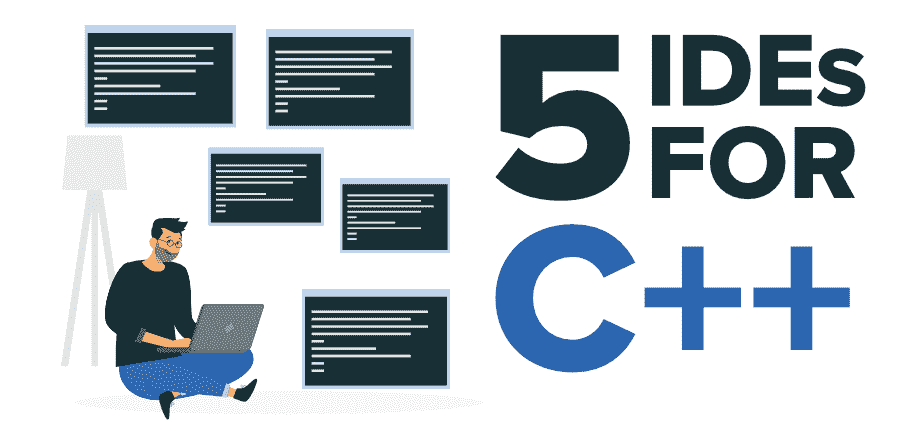

# 你应该尝试一次的 C++前 5 个 IDEs】

> 原文:[https://www . geesforgeks . org/top-5-ides-for-c-you-the-try-once/](https://www.geeksforgeeks.org/top-5-ides-for-c-that-you-should-try-once/)

在过去的几年里，要从头开始创建一个应用程序，开发人员必须付出很多努力。因为创建一个软件应用程序需要很多步骤，从编码、编译、测试、调试、构建和部署开始。所有这些不同的阶段都需要安装不同的软件包，并且很难由开发人员维护。

因此，为了提高生产率和加快软件开发过程，所有这些对开发至关重要的包都被集成或组合到一个称为 IDE(集成开发环境)的环境中，这使得现代软件开发更加容易和快速。一个典型的 IDE 必须具备很少的特性，例如**语法高亮**、**自动代码完成**、**自动保存代码**、**代码搜索**、**编译器**、**重构**、**调试**、**版本控制**、**构建和部署**等。如果你是一个 C++程序员，那么下面是一些免费的软件开发软件:

### [1。Visual Studio 代码](https://visualstudio.microsoft.com/)

Visual Studio Code 是微软开发的最受欢迎的免费开源代码编辑器，支持 Windows、Linux、Mac 等平台。微软为名为“微软 C/C++”的 [**C++**](https://www.geeksforgeeks.org/c-plus-plus/) 提供了扩展，在扩展部分搜索就可以很容易找到。还有另一个名为“代码运行器”的扩展，允许运行代码片段作为输出。

**特征:**

*   免费使用
*   重量轻
*   自动代码完成
*   语法突出显示
*   命令行区域
*   调试器
*   主题和扩展
*   部署工具
*   Git 支持

### [2。代码::区块](http://www.codeblocks.org/)

Code::blocks 是一个面向 C 和 C++的开源免费 IDE，可以在多个平台上使用，使用名为“wxWidget”的 GUI widget 工具内置 [C++](https://www.geeksforgeeks.org/c-plus-plus/) 。这个 IDE 是专门用来用 C++编程的，性能和特性都很流畅。

**特征:**

*   免费使用
*   跨平台
*   可扩展插件
*   多编译器支持
*   非常快的性能
*   调试器
*   可定制的
*   良好的界面

### [3 .clion〔t1〕](https://www.jetbrains.com/clion/)

Clion 是一个由 JetBrains 开发的现代 IDE，旨在运行各种平台上的 C 和 C++，如 windows、Linux 和 MacOS。它提供了智能代码辅助支持，因此主要的焦点必须放在重要的事情上。

**特征:**

*   易于启动新项目
*   智能代码完成
*   易于调试
*   重构
*   智能代码分析
*   用户化
*   内置工具

### [4。日食](https://www.eclipse.org/downloads/packages/release/luna/r/eclipse-ide-cc-developers)

Eclipse 是 C++开发人员最流行和最强大的集成开发环境之一。它也是开源的，在优秀的社区支持下可以免费使用。它支持 Windows、Linux、MacOS 等多平台，很多用户觉得很好用。

**特征:**

*   使用方便
*   代码自动完成
*   开源的
*   源导航
*   语法突出显示
*   可视化调试工具
*   排除故障
*   代码重构

### [5。code lite〔t1〕](https://codelite.org/)

CodeLite 是最好使用的 C++ IDE 之一，它是免费的，开源的，用 C++编写，专门运行在各种平台上，如 Windows、MacOS、Linux。它还像任何 C++ IDE 一样提供了许多功能。

**特征:**

*   项目管理
*   代码完成
*   语法突出显示
*   交互式调试器
*   代码重构
*   单元测试