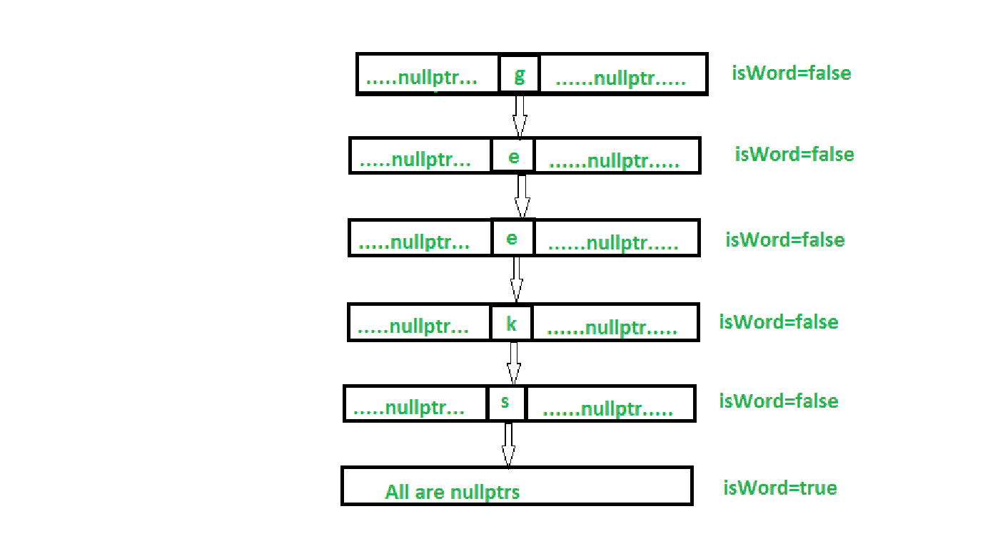
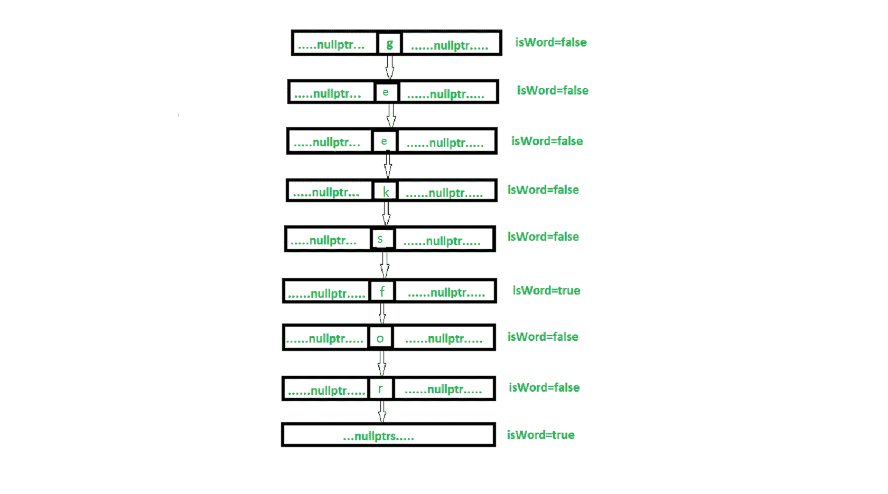
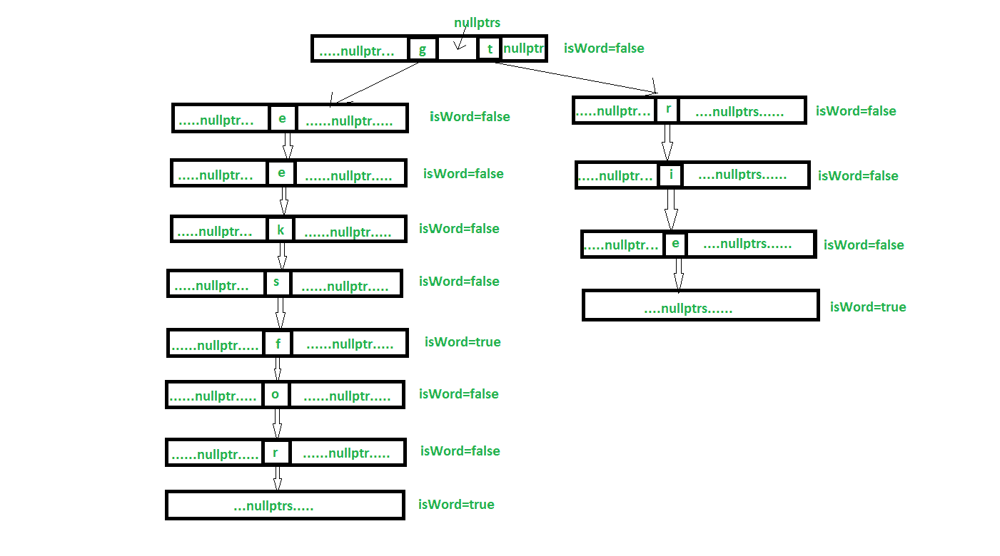

# 在 C++ 中使用智能指针和面向对象技术构建数据结构

> 原文:[https://www . geesforgeks . org/trie-data-structure-use-smart-pointer-and-OOP-in-c/](https://www.geeksforgeeks.org/trie-data-structure-using-smart-pointer-and-oop-in-c/)

我们将在 C++ 和 OOP 中使用智能指针实现 trie。[在这里](https://www.geeksforgeeks.org/search-in-a-trie-recursively/)，我们已经讨论了使用递归实现 trie 数据
在我们的一个 trie 的实现节点看起来像:

## 卡片打印处理机（Card Print Processor 的缩写）

```cpp
class TrieNode{

    public:
    // Use of shared_ptr for storing Children
    // Pointers of TrieNode

    shared_ptr children[ALPHABET_SIZE];

    // Tracks whether If this Node is the end of
    // any word stored in Trie

    bool isWord;

    // Constructor for TrieNode
    TrieNode()
    {
        for(int i=0; i<ALPHABET_SIZE; i++)
        {
            children[i] = shared_ptr();
        }
        isWord = false;
    }
};
```

接口是显示我们的对象类的功能的类，它只有纯虚函数。[这里](https://www.geeksforgeeks.org/interfaces-in-java/)，概念界面讨论的比较详细。

## 卡片打印处理机（Card Print Processor 的缩写）

```cpp
// Interface representing functionalities
// of Trie Data Structure
class interface {
public:
    interface() {}
    virtual ~interface() {}
    // Pure virtual functions showing all
    // the functions of my Trie class

    // To convert character to integer like hashing
    virtual int i2c(char) = 0;

    // Inserts word to Trie
    virtual void insertWord(string&) = 0;

    // Deletes word if present
    virtual bool deleteWord(string&) = 0;

    // To search a word in Trie
    virtual bool searchWord(string&) = 0;

    // Checks whether there is any children present
    // for any node
    virtual bool isEmptyNode(shared_ptr<TrieNode>)
                                          const = 0;
};
```

**空值**存储空值，这表明该位置没有任何其他字符串的路径
下图显示了将“极客”插入空字符串。



下图显示了“极客”在 trie 中的插入。极客 p 已经退出了 trie。所以，它重叠了。



下图显示了将“trie”插入 trie



为什么**共享 _ptr** 而不是所有其他智能指针(auto_ptr，unique_ptr，weak_ptr)？
我们使用 **shared_ptr** 是因为在构建 Trie 时，我们可能会遇到这样一种情况，即我们可能不得不共享指向另一个临时 shared_ptr 的特定指针的资源来遍历 Trie。因为 shared_ptr 比上面提到的任何其他指针都好。
以下是上述方法的实施:

## 卡片打印处理机（Card Print Processor 的缩写）

```cpp
#include <iostream>

// For shared_ptr class
#include <memory>

using namespace std;
#define ALPHABET_SIZE 26

// Trie Node class
class TrieNode {

public:
    // Use of shared_ptr for storing Children
    // Pointers of TrieNode

    shared_ptr<TrieNode> children[ALPHABET_SIZE];

    // Tracks whether If this Node is the end of
    // any word stored in Trie

    bool isWord;

    // Constructor for TrieNode
    TrieNode()
    {
        for (int i = 0; i < ALPHABET_SIZE; i++) {
            children[i] = shared_ptr<TrieNode>();
        }
        isWord = false;
    }
};

// Interface representing functionalities
// of Trie Data Structure
class interface {
public:
    interface() {}
    virtual ~interface() {}
    // Pure virtual functions showing all
    // the functions of my Trie class

    // To convert character to integer like hashing
    virtual int i2c(char) = 0;

    // Inserts word to Trie
    virtual void insertWord(string&) = 0;

    // Deletes word if present
    virtual bool deleteWord(string&) = 0;

    // To search a word in Trie
    virtual bool searchWord(string&) = 0;

    // Checks whether there is any children present
    // for any node
    virtual bool isEmptyNode(shared_ptr<TrieNode>)
                                          const = 0;
};

class Trie : public interface {

    // Storing root of the Trie
    shared_ptr<TrieNode> root;
    int Total_words;

public:
    Trie()
    {
        root = shared_ptr<TrieNode>
                              (new TrieNode());
        Total_words = 0;
    }

    ~Trie()
    {
        // Need not delete anything
                // as shared_ptr deallocates
                // all memory automatically
    }

    // To convert characters of string into
    // integer like hashing of character
    int i2c(char c)
    {
        return static_cast<int>(c - 'a');
    }

    // Insert word function
    void insertWord(string& trieString)
    {
        shared_ptr<TrieNode> current = root;
        for (int i = 0; i < trieString.size(); i++)
                {

            // If word after some prefix is not
                        // present then creates new node
            if (current->children[i2c(trieString[i])] ==
                          shared_ptr<TrieNode>(nullptr))
            {
                current->children[i2c(trieString[i])] =
                     shared_ptr<TrieNode>(new TrieNode());
            }
            current = (current->children[i2c(trieString[i])]);
        }

        // Now word is added in Trie so at leaf node
        // for that word isWord=true
        current->isWord = true;
    }

    // Searching for word whether it is
    // present in Trie
    bool searchWord(string& trieString)
    {
        shared_ptr<TrieNode> current = root;

        for (int i = 0; i < trieString.size(); i++)
        {
            // If at any point in Trie Node for particular
            // character is not present means nullptr then
            // return false
            if (current->children[i2c(trieString[i])] ==
                            shared_ptr<TrieNode>(nullptr))
                return false;
            current = current->children[i2c(trieString[i])];
        }

        // At the end of the word checking whether this
        // word is really present or not
        if (current->isWord == true)
            return true;

        return false;
    }

    bool Partdelete(string& trieString, shared_ptr<TrieNode>&     
                                                     checkout)
    {
        // Word is not present in the Trie then returns
        // false and stops further recursion
        if (checkout == nullptr)
            return false;

        // At the end of the word if the word is
        // present in trie then setting isWord to
        // false either returning false
        if (trieString.size() == 0) {
            if (checkout->isWord == true) {
                checkout->isWord = false;
                return true;
            }
            return false;
        }

        // String excluding first character
        string part = trieString.substr(1);

        // Recursive call to Partdelete for
        // rest of the string(part)
        if (Partdelete(part, checkout->
                      children[i2c(trieString[0])])) {

            // Checks whether it is empty node
            // then delete this node
            if (isEmptyNode(checkout->
                      children[i2c(trieString[0])])) {

                // Resetting memory and making it nullptr
                checkout->children[i2c(trieString[0])].
                                                 reset();

                checkout->children[i2c(trieString[0])] =
                                                  nullptr;

                return true;
            }
            else
                return true;
        }
        else
            return false;

        return false;
    }

    // For ease of recursion; passing
    // root to Partdelete
    bool deleteWord(string& trieString)
    {
        if (Partdelete(trieString, root))
            return true;
        return false;
    }

    // Checks whether there is no children present
    bool isEmptyNode(shared_ptr<TrieNode> check) const
    {
        for (int i = 0; i < ALPHABET_SIZE; i++) {
            if (check->children[i] != nullptr ||
                              check->isWord == true)
                return false;
        }
        return true;
    }
};

// Driver code
int main()
{
    // Again using shared_ptr to store Trie
    // you can use auto_ptr here
    shared_ptr<Trie> myTrie(new Trie());

    string word1 = "geeksfor";
    string word2 = "geeksforgeeks";
    string word3 = "nothing";

    myTrie->insertWord(word1);

    if (myTrie->searchWord(word1))
        cout << word1 << ": Is Present" << endl;
    else
        cout << word1 << ": Not Present" << endl;

    if (myTrie->searchWord(word3))
        cout << word3 << ": Is Present" << endl;
    else
        cout << word3 << ": Not Present" << endl;

    myTrie->insertWord(word2);

    if (myTrie->deleteWord(word2))
        cout << word2 << ": Successfully deleted" << endl;
    else
        cout << word2 << ": Not Present" << endl;

    if (myTrie->searchWord(word2))
        cout << word2 << ": Is Present" << endl;
    else
        cout << word2 << ": Not Present" << endl;

}
```

**Output:** 

```cpp
geeksfor: Is Present
nothing: Not Present
geeksforgeeks: Successfully deleted
geeksforgeeks: Not Present
```