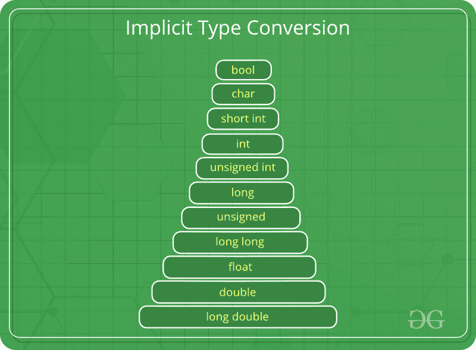
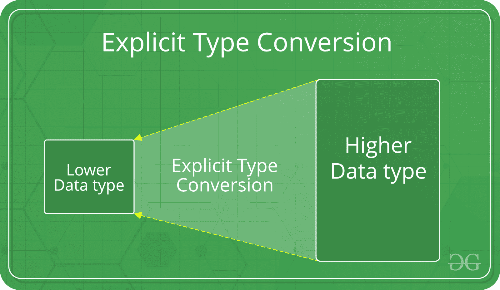

# C 中的类型转换

> 原文:[https://www.geeksforgeeks.org/type-conversion-c/](https://www.geeksforgeeks.org/type-conversion-c/)

类型转换基本上是从一种类型到另一种类型的转换。有两种类型的类型转换:

1.  **Implicit Type Conversion**

    

    也称为“自动类型转换”。

    *   由编译器自行完成，无需用户的任何外部触发。
    *   通常在表达式中存在多个数据类型时发生。在这种情况下，会进行类型转换(类型提升)以避免数据丢失。
    *   变量的所有数据类型都升级为数据类型最大的变量的数据类型。

        ```cpp
         bool -> char -> short int -> int -> 
               unsigned int -> long -> unsigned -> 
               long long -> float -> double -> long double 
        ```

    *   隐式转换可能会丢失信息，符号可能会丢失(当有符号隐式转换为无符号时)，并且可能会发生溢出(当 long long 隐式转换为 float 时)。

    **类型隐式转换示例:**

    ```cpp
    // An example of implicit conversion
    #include<stdio.h>
    int main()
    {
        int x = 10;    // integer x
        char y = 'a';  // character c

        // y implicitly converted to int. ASCII 
        // value of 'a' is 97
        x = x + y;

        // x is implicitly converted to float
        float z = x + 1.0;

        printf("x = %d, z = %f", x, z);
        return 0;
    }
    ```

    输出:

    ```cpp
    x = 107, z = 108.000000
    ```

2.  **Explicit Type Conversion**–

    

    这个过程也被称为类型转换，它是用户定义的。在这里，用户可以键入转换结果，使其成为特定的数据类型。

    C 语言中的语法:

    ```cpp
    (type) expression
    ```

    类型表示最终结果要转换成的数据类型。

    ```cpp
    // C program to demonstrate explicit type casting
    #include<stdio.h>

    int main()
    {
        double x = 1.2;

        // Explicit conversion from double to int
        int sum = (int)x + 1;

        printf("sum = %d", sum);

        return 0;
    }
    ```

    输出:

    ```cpp
    sum = 2
    ```

    类型转换的优势

    *   这样做是为了利用类型层次结构或类型表示的某些特性。
    *   它帮助我们计算包含不同数据类型变量的表达式。

**Related articles:**

*   [C](https://www.geeksforgeeks.org/catch-block-and-type-conversion-in-c/)中的挡块和型铸件
*   [整数促销](https://www.geeksforgeeks.org/integer-promotions-in-c/)

本文由 **Ankita Dutta** 供稿。如果你喜欢极客博客并想投稿，你也可以写一篇文章并把你的文章邮寄到 contribute@geeksforgeeks.org。看到你的文章出现在极客博客主页上，帮助其他极客。

如果您发现任何不正确的地方，或者您想分享更多关于上面讨论的主题的信息，请写评论