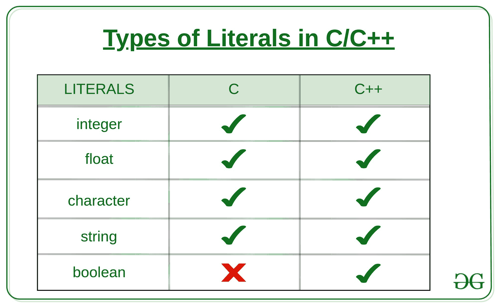

# C/c++ 中文字的类型，示例

> 原文:[https://www . geesforgeks . org/type-of-lithos-in-c-c-with-examples/](https://www.geeksforgeeks.org/types-of-literals-in-c-c-with-examples/)

分配给每个常量变量的值被称为**文字**。通常，术语、常数和文字可以互换使用。例如，“const int = 5，是常量表达式，值 5 称为常量整数。C 语言中有四种文字，C++ 中有五种文字。

[](https://media.geeksforgeeks.org/wp-content/uploads/20190823141825/Types-of-Literals-in-C_C-3.jpg)

C/C++ 的文字被相应地划分:

1.  **[整数文字](https://www.geeksforgeeks.org/integer-literal-in-c-cpp-prefixes-suffixes/) :** 用于表示和存储整数值。整数文字以两种类型表示，
    1.  **前缀:**整数文字的前缀表示要读取的基数。
        **例如:**

```cpp
0x10 = 16

Because 0x prefix represents a HexaDecimal base.
So 10 in HexaDecimal is 16 in Decimal.
Hence the value 16\. 

```

基本上有四种类型。

1.  **Decimal-literal(base 10):** A **non-zero decimal digit** followed by zero or more decimal digits(0, 1, 2, 3, 4, 5, 6, 7, 8, 9).

    **例如:**

    ```cpp
    56, 78

    ```

2.  **Octal-literal(base 8):** a **0** followed by zero or more octal digits(0, 1, 2, 3, 4, 5, 6, 7).

    **例如:**

    ```cpp
    045, 076, 06210

    ```

3.  **Hex-literal(base 16):** **0x** or **0X** followed by one or more hexadecimal digits(0, 1, 2, 3, 4, 5, 6, 7, 8, 9, a, A, b, B, c, C, d, D, e, E, f, F).

    **例如:**

    ```cpp
    0x23A, 0Xb4C, 0xFEA

    ```

4.  **Binary-literal(base 2):** **0b** or **0B** followed by one or more binary digits(0, 1).

    **例如:**

    ```cpp
    0b101, 0B111

    ```

*   **Suffixes:** The Prefix of the integer literal indicates the type in which it is to be read.

    **例如:**

    ```cpp
    12345678901234LL 
    indicates a long long integer value 12345678901234
    because of the suffix LL

    ```

    根据它们的数据类型，它们以多种方式表示。

    1.  **int:** 不需要后缀，因为整数常量默认分配为 int 数据类型。
    2.  **无符号 int:** 整数常量末尾的字符 U 或 U。
    3.  **long int:** 整数常量末尾的字符 L 或 L。
    4.  **无符号长 int:** 整数常量末尾的字符 ul 或 UL。
    5.  **long long int:** 整数常量末尾的字符 ll 或 LL。
    6.  **无符号 long long int:** 整数常量末尾的字符 ull 或 ULL。

    **例:**

    ## C

    ```cpp
    #include <stdio.h>

    int main()
    {

        // constant integer literal
        const int intVal = 10;

        printf("Integer Literal:%d \n",
               intVal);
        return 0;
    }
    ```