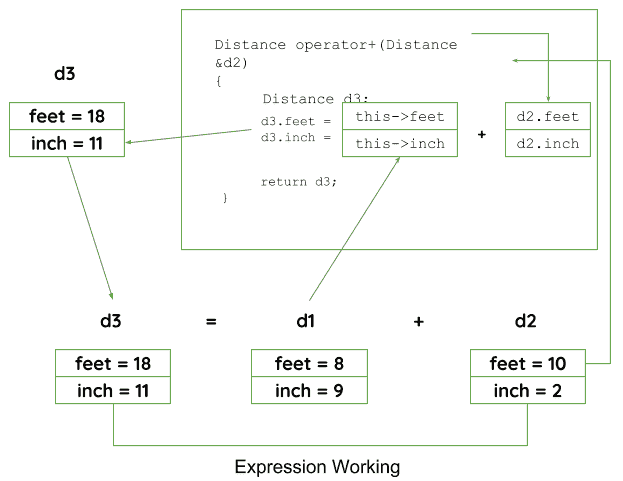

# c++ 中运算符重载的类型

> 原文:[https://www . geesforgeks . org/type-of-operator-overload-in-c/](https://www.geeksforgeeks.org/types-of-operator-overloading-in-c/)

**操作员超载:**

> C++ 提供了一个特殊的函数来改变其类中某些运算符的当前功能，这通常被称为运算符重载。运算符重载是一种方法，通过它我们可以改变某些特定运算符的功能来完成一些不同的任务。

这可以通过声明函数来完成，它的语法是，

```cpp
Return_Type classname :: operator op(Argument list)
{
    Function Body
}
```

在上面的语法中，Return_Type 是要返回给另一个对象的值类型，运算符 op 是一个函数，其中运算符是一个关键字，而 op 是要重载的运算符。
运算符函数必须是非静态(成员函数)或友元函数。
操作员超载可以使用**三种方法**完成，它们是

1.  重载一元运算符。
2.  重载二进制运算符。
3.  使用友元函数重载二进制运算符。

以下是定义操作员功能的一些标准/规则:

*   对于非静态函数，二元运算符应该只有一个参数，一元运算符不应该有参数。
*   在友元函数的情况下，二元运算符应该只有两个参数，一元运算符应该只有一个参数。
*   如果实现了运算符重载，所有类成员对象都应该是公共的。
*   不能超载的操作员是**。** **。*****:::****？:**
*   将该功能声明为好友功能**=****()****[]****->**时，不能使用运算符重载。

关于[操作员重载](https://www.geeksforgeeks.org/operator-overloading-c/)
的更多规则，请参考此处

1.  **重载一元运算符**:我们来考虑一下重载(-)一元运算符。在一元运算符函数中，不应传递任何参数。它只适用于一个类对象。它是对单个操作数进行操作的运算符的重载。
    **示例:**
    假设距离类采用两个成员对象，即英尺和英寸，创建一个函数，通过该函数，距离对象应该将英尺和英寸的值减 1(具有距离类型的单个操作数)。

## 卡片打印处理机（Card Print Processor 的缩写）

```cpp
// C++ program to show unary operator overloading
#include <iostream>

using namespace std;

class Distance {
public:

    // Member Object
    int feet, inch;

    // Constructor to initialize the object's value
    Distance(int f, int i)
    {
        this->feet = f;
        this->inch = i;
    }

    // Overloading(-) operator to perform decrement
    // operation of Distance object
    void operator-()
    {
        feet--;
        inch--;
        cout << "\nFeet & Inches(Decrement): " << feet << "'" << inch;
    }
};

// Driver Code
int main()
{
    // Declare and Initialize the constructor
    Distance d1(8, 9);

    // Use (-) unary operator by single operand
    -d1;
    return 0;
}
```

**Output:** 

```cpp
Feet & Inches(Decrement): 7'8
```

1.  在上面的程序中，它显示没有传递参数，也没有返回 return_type 值，因为一元运算符对单个操作数起作用。(-)运算符将功能更改为其成员函数。
    **注意:** d2 = -d1 不起作用，因为运算符-()不返回值。
2.  **重载二进制运算符**:在二进制运算符重载函数中，应该有一个参数需要传递。它是操作两个操作数的运算符的重载。
    我们以 Distance 类为例，但这次添加了两个距离对象。

## 卡片打印处理机（Card Print Processor 的缩写）

```cpp
// C++ program to show binary operator overloading
#include <iostream>

using namespace std;

class Distance {
public:
    // Member Object
    int feet, inch;
    // No Parameter Constructor
    Distance()
    {
        this->feet = 0;
        this->inch = 0;
    }

    // Constructor to initialize the object's value
    // Parameterized Constructor
    Distance(int f, int i)
    {
        this->feet = f;
        this->inch = i;
    }

    // Overloading (+) operator to perform addition of
    // two distance object
    Distance operator+(Distance& d2) // Call by reference
    {
        // Create an object to return
        Distance d3;

        // Perform addition of feet and inches
        d3.feet = this->feet + d2.feet;
        d3.inch = this->inch + d2.inch;

        // Return the resulting object
        return d3;
    }
};

// Driver Code
int main()
{
    // Declaring and Initializing first object
    Distance d1(8, 9);

    // Declaring and Initializing second object
    Distance d2(10, 2);

    // Declaring third object
    Distance d3;

    // Use overloaded operator
    d3 = d1 + d2;

    // Display the result
    cout << "\nTotal Feet & Inches: " << d3.feet << "'" << d3.inch;
    return 0;
}
```

**Output:** 

```cpp
Total Feet & Inches: 18'11
```

1.  在上面的程序中，
    *见第 26 行*，距离运算符+(距离& d2)，这里函数的返回类型是距离，它使用引用调用来传递参数。
    *见 49 号线*，D3 = D1+D2；这里，d1 调用其类对象的运算符函数，并将 d2 作为参数，通过该参数，运算符函数返回对象，结果将反映在 d3 对象中。
    二元运算符工作示意图:



1.  **使用 friend 函数重载二进制运算符**:在这种方法中，运算符重载函数必须在 Friend 关键字之前，并声明一个函数类范围。请记住，friend 运算符函数在二元运算符中接受两个参数，在一元运算符中改变一个参数。所有的工作和实现将与二进制运算符函数相同，除了这个函数将在类范围之外实现。
    我们用 friend 函数来做同样的例子。

## 卡片打印处理机（Card Print Processor 的缩写）

```cpp
// C++ program to show binary operator overloading
#include <iostream>

using namespace std;

class Distance {
public:

    // Member Object
    int feet, inch;

    // No Parameter Constructor
    Distance()
    {
        this->feet = 0;
        this->inch = 0;
    }

    // Constructor to initialize the object's value
    // Parameterized Constructor
    Distance(int f, int i)
    {
        this->feet = f;
        this->inch = i;
    }

    // Declaring friend function using friend keyword
    friend Distance operator+(Distance&, Distance&);
};

// Implementing friend function with two parameters
Distance operator+(Distance& d1, Distance& d2) // Call by reference
{
    // Create an object to return
    Distance d3;

    // Perform addition of feet and inches
    d3.feet = d1.feet + d2.feet;
    d3.inch = d1.inch + d2.inch;

    // Return the resulting object
    return d3;
}

// Driver Code
int main()
{
    // Declaring and Initializing first object
    Distance d1(8, 9);

    // Declaring and Initializing second object
    Distance d2(10, 2);

    // Declaring third object
    Distance d3;

    // Use overloaded operator
    d3 = d1 + d2;

    // Display the result
    cout << "\nTotal Feet & Inches: " << d3.feet << "'" << d3.inch;
    return 0;
}
```

**Output:** 

```cpp
Total Feet & Inches: 18'11
```

1.  在上面的程序中，运算符函数是通过将该函数声明为友元函数在类范围之外实现的。

通过这些方式，可以通过改变操作符的功能来重载操作符以执行某些任务。