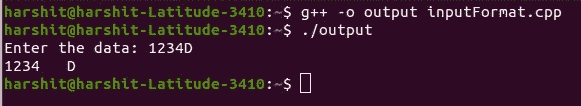
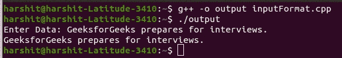
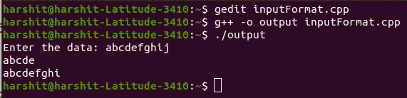

# c++中的无格式输入/输出操作

> 原文:[https://www . geesforgeks . org/unformated-input-output-operations-in-CPP/](https://www.geeksforgeeks.org/unformatted-input-output-operations-in-cpp/)

在本文中，我们将讨论在 [C++中的无格式](https://www.geeksforgeeks.org/c-plus-plus/)[输入/输出操作](https://www.geeksforgeeks.org/basic-input-output-c/)。由于运算符[**>>****<<**](https://www.geeksforgeeks.org/overloading-stream-insertion-operators-c/)重载识别所有基本的 C++类型，因此可以使用[对象](https://www.geeksforgeeks.org/c-classes-and-objects/)**【CIN】**和 **cout** 进行各种类型数据的输入和输出。操作员 **> >** 在 [**中超载，操作员 **< <在****](https://www.geeksforgeeks.org/c-stream-classes-structure/)****[中超载。](https://www.geeksforgeeks.org/operator-overloading-and-operator-in-a-linked-list-class/)****

从键盘读取数据的一般格式:

> 精灵:有：

*   这里， **var <sub>1</sub>** 、 **var <sub>2</sub>** 、……、 **var <sub>n</sub>** 是已经声明的变量名。
*   输入数据必须用空白字符分隔，用户输入的数据类型必须与程序中声明的变量的数据类型相似。
*   **操作符> >** 逐字符读取数据，并将其分配到指定位置。
*   当出现空格或出现与目标类型不匹配的字符类型时，变量读取终止。

**程序 1:**

## C++

```
// C++ program to illustrate the
// input and output of the data
// entered by user
#include <iostream>
using namespace std;

// Driver Code
int main()
{
    int data;
    char val;

    // Input the data
    cin >> data;
    cin >> val;

    // Print the data
    cout << data << "   " << val;

    return 0;
}
```

**输出:**



**说明:**在上述程序中， **123** 存储在整数的变量 **val** 中， **B** 传递给下一个 [**cin 对象**](https://www.geeksforgeeks.org/cin-in-c/) 并存储在字符的数据变量中。

### <u>放()和取()功能</u>:

[类**是**和**牡蛎**T5】具有预定义的功能](https://www.geeksforgeeks.org/c-stream-classes-structure/) [get()](https://www.geeksforgeeks.org/gets-is-risky-to-use/) 和 [put()](https://www.geeksforgeeks.org/puts-vs-printf-for-printing-a-string/) ，用于处理单个字符的输入和输出操作。功能 **get()** 有两种使用方式，如 **get(char*)** 和 **get(void)** 获取字符，包括空格、换行符和制表符。函数**获取(char*)** 将该值赋给一个变量，**获取(void)** 返回该字符的值。

**语法:**

> char 数据；
> 
> // get()返回字符值，赋给数据变量
> data = CIN . get()；
> 
> //显示存储在数据变量
> cout.put(数据)中的值；

**示例:**

> char c；
> 
> //直接赋值给 c
> CIN . get(c)；
> 
> //显示存储在 c 变量
> cout.put()中的值

**程序 2:**

## C++

```
// C++ program to illustrate the
// input and output of data using
// get() and puts()
#include <iostream>
using namespace std;

// Driver Code
int main()
{
    char data;
    int count = 0;

    cout << "Enter Data: ";

    // Get the data
    cin.get(data);

    while (data != '\n') {
        // Print the data
        cout.put(data);
        count++;

        // Get the data again
        cin.get(data);
    }

    return 0;
}
```

**输出:**

[](https://media.geeksforgeeks.org/wp-content/cdn-uploads/20210401113733/Program2InputOutput.jpg)

### [<u>getline()和 write()函数</u>](https://www.geeksforgeeks.org/getline-function-character-array/) :

在 [C++](https://www.geeksforgeeks.org/c-plus-plus/) 中，函数 [getline()](https://www.geeksforgeeks.org/getline-string-c/) 和 [write()](https://www.geeksforgeeks.org/fine-write-void-main-cc/) 提供了一种更有效的方式来处理面向行的输入和输出。 **getline()** 函数读取以[新行字符](https://www.geeksforgeeks.org/endl-vs-n-in-cpp/)结束的完整文本行。可以使用 **cin 对象**调用该功能。

**语法:**

> CIN . getline(variable _ to _ store _ line，size)；

阅读以 **'\n '(换行符)**结束。新字符被函数读取，但它不显示，而是被[空字符](https://www.geeksforgeeks.org/difference-between-null-pointer-null-character-0-and-0-in-c-with-examples/)替换。读取特定字符串后， **cin** 会自动在字符串末尾添加换行符。

**write()函数**一次显示整行，其语法与 getline()函数类似，只是在这里 **cout 对象**用于调用它。

**语法:**

> cout . write(variable _ to _ store _ line，size)；

要记住的重点是当出现**空字符**时， **write()函数**不会自动停止显示字符串。如果尺寸大于线的长度，则**写()功能**显示超出线的界限。

**程序 3:**

## C++

```
// C++ program to illustrate the
// input and output of file using
// getline() and write() function
#include <iostream>
#include <string>
using namespace std;

// Driver Code
int main()
{
    char line[100];

    // Get the input
    cin.getline(line, 10);

    // Print the data
    cout.write(line, 5);
    cout << endl;

    // Print the data
    cout.write(line, 20);

    cout << endl;

    return 0;
}
```

**输出:**

