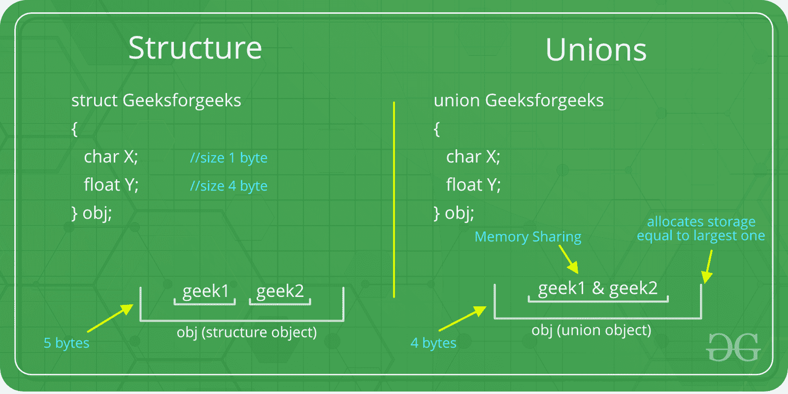

# 联合在 C

> 原文:[https://www.geeksforgeeks.org/union-c/](https://www.geeksforgeeks.org/union-c/)

像[结构](https://www.geeksforgeeks.org/structures-c/)一样，联合是用户定义的数据类型。在联合中，所有成员共享相同的内存位置。



例如，在下面的 C 程序中，x 和 y 共享同一个位置。如果我们改变 x，我们可以看到这些变化反映在 y 上。

```
#include <stdio.h>

// Declaration of union is same as structures
union test {
    int x, y;
};

int main()
{
    // A union variable t
    union test t;

    t.x = 2; // t.y also gets value 2
    printf("After making x = 2:\n x = %d, y = %d\n\n",
           t.x, t.y);

    t.y = 10; // t.x is also updated to 10
    printf("After making y = 10:\n x = %d, y = %d\n\n",
           t.x, t.y);
    return 0;
}
```

**Output:**

```
After making x = 2:
 x = 2, y = 2

After making y = 10:
 x = 10, y = 10

```