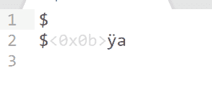

# 字符指针的异常行为

> 原文:[https://www . geeksforgeeks . org/带字符指针的异常行为/](https://www.geeksforgeeks.org/unusual-behaviour-with-character-pointers/)

在 [C++ ](https://www.geeksforgeeks.org/c-plus-plus/) 中， [cout](https://www.geeksforgeeks.org/basic-input-output-c/) 显示了不同于其他数据类型的指针/数组的字符指针/数组的不同打印行为。因此，本文将首先解释 **cout** 如何通过字符指针表现出不同的行为，然后讨论其背后的原因和工作机制。

**例 1:**

## C++

```cpp
// C++ program to illustrate difference
// between behaviour of integer pointer
// and character pointer
#include <iostream>
using namespace std;

// Driver Code
int main()
{
    // Integer array
    int a[] = { 1, 2, 3 };

    // Character array
    char ch[] = "abc";

    // Print the value of a and b
    cout << a << endl;

    cout << ch << endl;
    return 0;
}
```

**Output:**

```cpp
0x7ffc623e56c0
abc

```

**解释:**
从上面的代码中，很明显:

*   当使用整数指针指向一个数组时， **[cout](https://www.geeksforgeeks.org/basic-input-output-c/)** 打印该整数数组的基址。
*   但是当使用字符指针时， **cout** 打印完整的字符数组(直到遇到一个[空字符](https://www.geeksforgeeks.org/difference-between-null-pointer-null-character-0-and-0-in-c-with-examples/))，而不是打印字符数组的基址。

**例 2:**

## C++

```cpp
// C++ program to illustrate behaviour
// of character pointer pointing to
// character array
#include <iostream>
using namespace std;

// Driver Code
int main()
{
    // Character array b
    char b[] = "abc";

    // Pointer to character array
    char* c = &b[0];

    // Print the value of c
    cout << c << endl;
}
```

**Output:**

```cpp
abc

```

**解释:**
同样在这个例子中，字符类型指针 **c** 正在存储字符数组**b【】**的[基地址](https://www.geeksforgeeks.org/addressing-modes/)，因此当与 **cout** 一起使用时，它开始打印来自该基地址的每个字符，直到遇到空字符。

**例 3:**

## C++

```cpp
// C++ program to illustrate difference
// between behaviour of character and
// character pointer
#include <iostream>
using namespace std;

// Drive Code
int main()
{
    char c = '{content}apos;;
    char* p = &c;

    cout << c << endl;
    cout << p << endl;
}
```

**Output:**

```cpp
abc
a
a

```

**输出:**

[](https://media.geeksforgeeks.org/wp-content/cdn-uploads/20201021134737/Screenshot-83.png)

**解释:**
在上面的例子中， **c** 是一个简单的字符变量，它按照预期打印存储在其中的值。 **p** 与 **cout** 一起使用时作为字符指针，导致打印每个字符，直到遇到空字符。因此，在**“{ content }”之后会打印一些垃圾值；**。这仅仅意味着在存储器中，空字符被放置在**‘a’**字符之后(因为在这种情况下，在有用的数据完成之后，不像字符数组那样自动存储空字符)，因此它停止打印并给出所获得的输出。

### **<u>字符指针异常行为背后的原因</u> :**

其原因在于 [**运算符重载的概念。**](https://www.geeksforgeeks.org/operator-overloading-c/) [' < <'操作员过载](https://www.geeksforgeeks.org/overloading-stream-insertion-operators-c/)进行不同类型的输入。在 **const void*** 重载的情况下，它只打印地址。但是对于 **const char*** 重载，它开始打印每个字符，直到遇到空字符(将输入视为 C 风格字符串)。

**例 4:**

## C++

```cpp
// C++ program to illustrate
// printing of character array
#include <iostream>
using namespace std;

// Driver Code
int main()
{
    // Character array
    char c[] = "abc";

    // print value of c, c[0] and *c
    cout << c << endl;
    cout << c[0] << endl;
    cout << *c << endl;
}
```

**Output:**

```cpp
abc
a
a

```

**说明:**在上例中:

*   只有带有 cout 的' c '被视为 const char *并调用<
*   当使用 c[0]，即*(c + 0)时，它只是取消引用特定的内存位置，并且只打印存储在该位置的值。
*   类似地，对于与*(c + 0)相同的*c。

**注意:**如果输出被打字输入到不被视为 [C 型弦](https://www.geeksforgeeks.org/how-to-convert-c-style-strings-to-stdstring-and-vice-versa/)的东西中，异常行为可以被纠正。
**例 5:**

## C++

```cpp
// C++ program to illustrate behaviour
// of typecasted character pointer
#include <iostream>
using namespace std;

// Driver Code
int main()
{
    char c[] = { "abc" };
    char* b = c;
    cout << (void*)b;
}
```

**Output:**

```cpp
0x7ffe66f7f420

```

**说明:**
在上例中，字符数组的基址是在输出中得到的。

### **<u>利用带有字符指针的异常行为</u> :**

给定一个字符串，打印模式如下例所示:

## C++

```cpp
// C++ program to illustrate the
// utilization of unusual behaviour
// of character pointer
#include <iostream>
using namespace std;

// Function that prints the pattern
void printPattern(char* ch)
{
    // Base Condition
    if (*ch == '\0')
        return;

    // Recursion function call after
    // excluding the current character
    printPattern(ch + 1);

    // Print the whole string starting
    // from base address stored in 'ch'
    cout << ch << endl;
}

// Driver Code
int main()
{
    char ch[] = { "abcd" };

    // Function Call
    printPattern(ch);

    return 0;
}
```

**Output:**

```cpp
d
cd
bcd
abcd

```