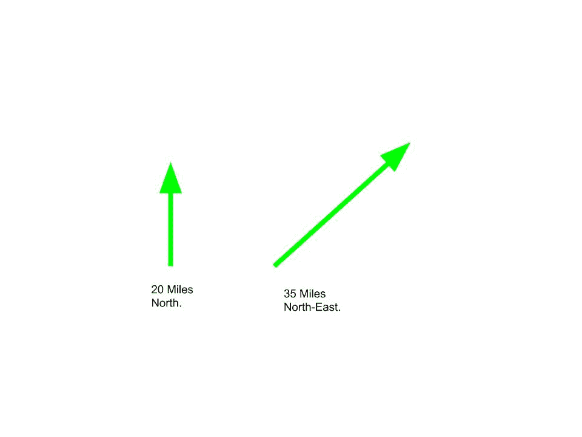

# 用类在 C++ 中实现向量

> 原文:[https://www . geeksforgeeks . org/使用类来实现向量数量 in-c/](https://www.geeksforgeeks.org/using-class-to-implement-vector-quantities-in-c/)

矢量是一个既有大小又有方向的量。在这里，大小只是量的大小，方向是量的方向。例如，考虑“向北走 20 英里”这句话。在上面的陈述中，20 是震级，北是方向。



**示例**:

```cpp
Input : Store and display vector with components 3, 4, 5.
Output : 3i + 4j + 5k

Input : Dot Product for V1 = (1, 3, 5), V2 = (2, 3, 0)
Output : 11

where i, j, k are unit vectors in x, y and z directions respectively.

```

一般来说，矢量表示为:

> **V = Xi + Yj + Zk**
> 
> 其中，X、Y 和 Z 分别是矢量 V 在方向 I、j 和 k 上的大小。

可以对向量执行的各种操作:

1.  **矢量相加:**矢量相加是将两个矢量对应的 X、Y、Z 大小相加，得到合成矢量。
    **例:**
    v1 = 1i+2j+3k
    v2 = 3i+2j+1k
    因此合成向量，v = v1 + v2 = 4i + 4j + 4k
2.  **Dot product of vectors:** Dot product of two vectors v1 and v2 is calculated as:

    ```cpp
    v = v1 . v2
      = magnitude(v1)*magnitude(v2)*Cos(θ)

    Where, θ is the angle between the vectors v1 and v2.

    ```

    **例:**
    v1 = 1i+2j+3k
    v2 = 3i+2j+1k
    因此，v = v1。v2 = 3 + 4 + 3 = 10

3.  **Cross product of vectors:** Cross product of vectors is done by using determinant for vectors a = axi + ayj + azk and b = bxi + byj + bzk

    c = a x b = I(ay * BZ–by * az)-j(ax * BZ–az * bx)+k(ax * by–bx * ay)

    **例:**
    v1 = 3i+4j+2k
    v2 = 6i+3j+9k
    因此，v = v1 X v2 = 30i–15j–15k

下面是上述操作在 C++ 中使用类的实现:

```cpp
#include <cmath>
#include <iostream>
using namespace std;

class Vector {
private:
    int x, y, z;
    // Components of the Vector

public:
    Vector(int x, int y, int z)
    {
        // Constructor
        this->x = x;
        this->y = y;
        this->z = z;
    }
    Vector operator+(Vector v); // ADD 2 Vectors
    Vector operator-(Vector v); // Subtraction
    int operator^(Vector v); // Dot Product
    Vector operator*(Vector v); // Cross Product
    float magnitude()
    {
        return sqrt(pow(x, 2) + pow(y, 2) + pow(z, 2));
    }
    friend ostream& operator<<(ostream& out, const Vector& v);
    // To output the Vector
};

// Addition of vectors
Vector Vector::operator+(Vector v)
{
    int x1, y1, z1;
    x1 = x + v.x;
    y1 = y + v.y;
    z1 = z + v.z;
    return Vector(x1, y1, z1);
}

// Subtraction of vectors
Vector Vector::operator-(Vector v)
{
    int x1, y1, z1;
    x1 = x - v.x;
    y1 = y - v.y;
    z1 = z - v.z;
    return Vector(x1, y1, z1);
}

// Dot product of vectors
int Vector::operator^(Vector v)
{
    int x1, y1, z1;
    x1 = x * v.x;
    y1 = y * v.y;
    z1 = z * v.z;
    return (x1 + y1 + z1);
}

// Cross product of vectors
Vector Vector::operator*(Vector v)
{
    int x1, y1, z1;
    x1 = y * v.z - z * v.y;
    y1 = z * v.x - x * v.z;
    z1 = x * v.y - y * v.x;
    return Vector(x1, y1, z1);
}

// Display Vector
ostream& operator<<(ostream& out, const Vector& v)
{
    out << v.x << "i ";
    if (v.y >= 0)
        out << "+ ";
    out << v.y << "j ";
    if (v.z >= 0)
        out << "+ ";
    out << v.z << "k" << endl;
    return out;
}

// Driver program
int main()
{
    // Let us Take the vector quantites :
    // V1 = 3i + 4j + 2k
    // V2 = 6i + 3j + 9k
    Vector V1(3, 4, 2), V2(6, 3, 9);

    cout << "V1 = " << V1;
    cout << "V2 = " << V2;

    cout << "V1 + V2 = " << (V1 + V2);
    cout << "Dot Product is : " << (V1 ^ V2);
    cout << "Cross Product is : " << (V1 * V2);

    return 0;
}
```

**Output:**

```cpp
V1 = 3i + 4j + 2k
V2 = 6i + 3j + 9k
V1 + V2 = 9i + 7j + 11k
Dot Product is : 48Cross Product is : 30i -15j -15k

```