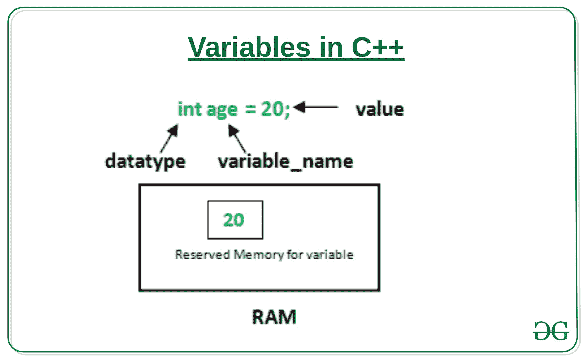
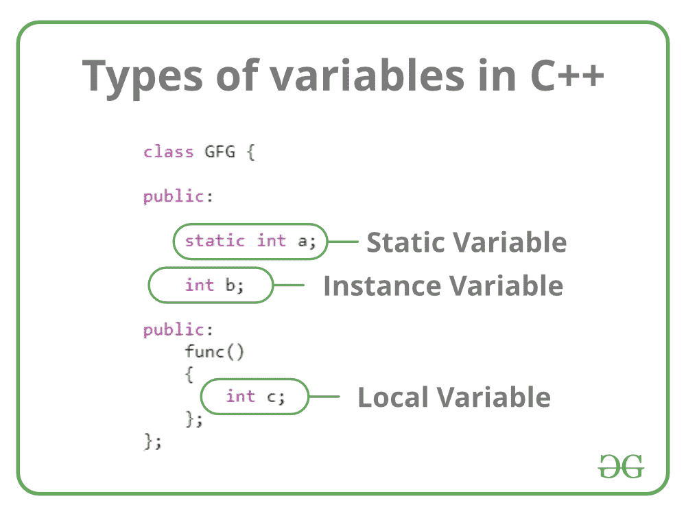

# c++ 中的变量

> 原文:[https://www.geeksforgeeks.org/variables-in-c/](https://www.geeksforgeeks.org/variables-in-c/)

变量是给一个内存位置起的名字。它是程序中的基本存储单元。

*   存储在变量中的值可以在程序执行过程中更改。
*   变量只是给一个内存位置起的名字，所有对变量的操作都会影响这个内存位置。
*   在 C++ 中，所有的变量都必须在使用前声明。

**如何声明变量？**

典型的变量声明形式为:

```cpp
// Declaring a single variable
type variable_name;

// Declaring multiple variables:
type variable1_name, variable2_name, variable3_name;
```

变量名可以由字母(大写和小写)、数字和下划线“_”字符组成。但是，名称不能以数字开头。



在上图中，

> [**数据类型**](https://www.geeksforgeeks.org/c-data-types/) :可以存储在该变量中的数据类型。
> **变量 _ 名称**:变量的名称。
> **值**:是变量中存储的初始值。

**示例** :

```cpp
// Declaring float variable
float simpleInterest; 

// Declaring integer variable
int time, speed; 

// Declaring character variable
char var; 
```

**变量声明和定义的区别**

**变量声明**是指变量在首次使用前首先声明或引入的部分。一个**变量定义**是变量被分配一个存储位置和值的部分。大多数时候，变量声明和定义是一起完成的。
为了更好的说明，请看下面的 C++ 程序:

## 卡片打印处理机（Card Print Processor 的缩写）

```cpp
#include <iostream>
using namespace std;

int main()
{
    // declaration and definition
    // of variable 'a123'
    char a123 = 'a';

    // This is also both declaration and definition
    // as 'b' is allocated memory and
    // assigned some garbage value.
    float b;

    // multiple declarations and definitions
    int _c, _d45, e;

    // Let us print a variable
    cout << a123 << endl;

    return 0;
}
```

**Output:** 

```cpp
a
```

**变量类型**

基于 C++ 中[变量的范围](https://www.geeksforgeeks.org/scope-of-variables-in-c/)有三种类型的变量:

*   局部变量
*   实例变量
*   静态变量



现在让我们详细了解每一个变量。

1.  **局部变量**:在块、方法或构造函数中定义的变量称为局部变量。
    *   这些变量是在进入程序块或函数在退出程序块后被调用和销毁时，或函数返回调用时创建的。
    *   这些变量的作用域只存在于声明该变量的块中。也就是说，我们只能在该块内访问这些变量。
    *   局部变量的初始化是强制性的。
2.  **实例变量**:实例变量是非静态变量，在任何方法、构造函数或块之外的类中声明。
    *   由于实例变量是在类中声明的，因此这些变量是在类的对象创建时创建的，而在对象销毁时销毁。
    *   与局部变量不同，我们可以对实例变量使用访问说明符。如果我们没有指定任何访问说明符，那么将使用默认的访问说明符。
    *   实例变量的初始化不是强制性的。
    *   实例变量只能通过创建对象来访问。
3.  **静态变量**:静态变量也称为类变量。
    *   这些变量被类似地声明为实例变量，区别在于静态变量是在任何方法构造函数或块之外的类中使用 [static 关键字](https://www.geeksforgeeks.org/static-keyword-cpp/)声明的。
    *   与实例变量不同，不管我们创建多少对象，每个类只能有一个静态变量的副本。
    *   静态变量在程序执行开始时创建，在执行结束时自动销毁。
    *   静态变量的初始化不是强制性的。它的默认值是 0
    *   如果我们访问像实例变量这样的静态变量(通过一个对象)，编译器将显示警告消息，并且不会停止程序。编译器会自动将对象名替换为类名。
    *   如果我们在没有类名的情况下访问静态变量，编译器会自动追加类名。

**实例变量 Vs 静态变量**

*   每个对象都有自己的实例变量副本，而不管我们创建多少个对象，每个类只能有一个静态变量的 T2 副本。
*   使用一个对象在实例变量中所做的更改将不会反映在其他对象中，因为每个对象都有自己的实例变量副本。在静态的情况下，变化**将反映在其他对象中**，因为静态变量是一个类的所有对象所共有的。
*   我们可以通过对象引用访问实例变量**，通过类名直接访问**静态变量。****
*   静态变量和实例变量的语法:

    ```cpp
    class Example
    {
        static int a; // static variable
        int b;        // instance variable
    }
    ```