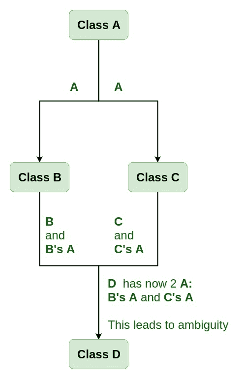

# c++中的虚拟基类

> 原文:[https://www.geeksforgeeks.org/virtual-base-class-in-c/](https://www.geeksforgeeks.org/virtual-base-class-in-c/)

虚拟基类在虚拟继承中使用的方式是，当使用多个继承时，防止给定类的多个“实例”出现在继承层次结构中。

**需要虚拟基础类:**
考虑一下我们有一个类 **A** 的情况。这个类是 **A** 被另外两个类 **B** 和 **C** 继承。这两个类都继承到一个新类 **D** 中，如下图所示。



从图中我们可以看到类 **A** 的数据成员/函数被两次继承到类 **D** 中。一至类**乙**和二至类**丙**。当类 **A** 的任何数据/函数成员被类 **D** 的对象访问时，会产生关于哪个数据/函数成员将被调用的模糊性？一个通过 **B** 继承，另一个通过 **C** 继承。这会混淆编译器并显示错误。

**示例:**展示 C++中虚拟基类的需求

```
#include <iostream>
using namespace std;

class A {
public:
    void show()
    {
        cout << "Hello form A \n";
    }
};

class B : public A {
};

class C : public A {
};

class D : public B, public C {
};

int main()
{
    D object;
    object.show();
}
```

**编译错误:**

```
prog.cpp: In function 'int main()':
prog.cpp:29:9: error: request for member 'show' is ambiguous
  object.show();
         ^
prog.cpp:8:8: note: candidates are: void A::show()
   void show()
        ^
prog.cpp:8:8: note:                 void A::show()

```

**如何解决这个问题？**
为了解决类 **A** 在类 **B** 和类 **C** 中都被继承时的这种歧义，通过放置关键字 **virtual** 将其声明为**虚拟基类**如下:

**虚拟基类语法:**

```
Syntax 1:
class B : virtual public A 
{
};

Syntax 2:
class C : public virtual A
{
};

```

**注:** **虚**可写在**公**之前或之后。现在只有一个数据/函数成员的副本会被复制到类 **C** 和类 **B** ，类 **A** 成为虚拟基类。
虚拟基类提供了一种方法来节省空间，并避免使用多个继承的类层次结构中的歧义。当基类被指定为虚拟基类时，它可以多次充当间接基类，而不会复制其数据成员。使用虚拟基的所有基类共享其数据成员的单个副本。

**例 1**

```
#include <iostream>
using namespace std;

class A {
public:
    int a;
    A() // constructor
    {
        a = 10;
    }
};

class B : public virtual A {
};

class C : public virtual A {
};

class D : public B, public C {
};

int main()
{
    D object; // object creation of class d
    cout << "a = " << object.a << endl;

    return 0;
}
```

**Output:**

```
a = 10

```

**说明:**类 **A** 只有一个数据成员 **a** ，为**公共**。这个类在 **B 类**和 **C 类**中无形中被继承。现在类 **B** 和类 **C** 成为虚拟基类，不做数据成员 **a** 的重复。

**例 2:**

```
#include <iostream>
using namespace std;

class A {
public:
    void show()
    {
        cout << "Hello from A \n";
    }
};

class B : public virtual A {
};

class C : public virtual A {
};

class D : public B, public C {
};

int main()
{
    D object;
    object.show();
}
```

**Output:**

```
Hello from A

```