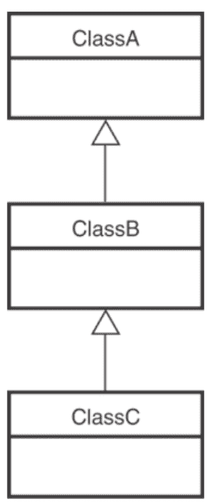

# c++中的虚函数和运行时多态|集合 1(简介)

> 原文:[https://www . geesforgeks . org/virtual-functions-and-runtime-多态-in-c-set-1-introduction/](https://www.geeksforgeeks.org/virtual-functions-and-runtime-polymorphism-in-c-set-1-introduction/)

### 本文介绍了多态和虚函数的概念，以及它们在继承中的应用。

### 我们将讨论以下内容

*   定义
*   没有虚函数
*   使用虚拟函数

### 定义:

1.  一个**虚函数**是一个*成员*函数，它在*基*类中使用关键字 virtual 声明，并由*派生的*类重新定义(Overriden)。
2.  术语**多态性**意味着采取多种形式的能力。如果存在通过*继承*相互关联的类的层次结构，就会出现这种情况。



类层次

> **注意**:在 C++中，这意味着如果我们调用一个成员函数，那么它可能会导致一个不同的函数被执行，这取决于调用它的对象类型。

考虑以下简单程序作为[运行时多态性](https://www.geeksforgeeks.org/polymorphism-in-c/)的例子。该程序需要注意的主要问题是，派生类的函数是使用基类指针调用的。
的想法是[虚函数](https://www.geeksforgeeks.org/virtual-function-cpp/)是根据指向或引用的对象实例的类型调用的，而不是根据指针或引用的类型调用的。
换句话说，虚函数在运行时被延迟解析。
现在，我们将看一个使用这两个概念的例子来阐明您的理解。

## C++

```cpp
#include <iostream>
using namespace std;

// Base class
class Shape
{
public:
    Shape(int l, int w)
    {
        length = l;
        width = w;
    } // parameterized constructor
    int get_Area()
    {
        cout << "This is call to parent class area" << endl;
          return 1;
    }

protected:
    int length, width;
};

// Derived class
class Square : public Shape
{
public:
    Square(int l = 0, int w = 0)
        : Shape(l, w)
    {
    } // declaring and initializing derived class
      // constructor
    int get_Area()
    {
        cout << "Square area: " << length * width << endl;
        return (length * width);
    }
};
// Derived class
class Rectangle : public Shape
{
public:
    Rectangle(int l = 0, int w = 0)
        : Shape(l, w)
    {
    } // declaring and initializing derived class
      // constructor
    int get_Area()
    {
        cout << "Rectangle area: " << length * width
             << endl;
        return (length * width);
    }
};

int main(void)
{
    Shape* s;
    Square sq(5, 5); // making object of child class Square
    Rectangle rec(
        4, 5); // making object of child class Rectangle

    s = &sq;
    s->get_Area();
    s = &rec;
    s->get_Area();

    return 0;
}
```

**Output**

```cpp
This is call to parent class area
This is call to parent class area
```

**在上述功能中:**

*   我们将每个子类**矩形**和**正方形**对象的地址存储在 **s** 中
*   然后我们在上面调用 **get_Area()** 函数，
*   理想情况下，它应该调用子类各自的 **get_Area()** 函数，但是
*   而是调用基类中定义的 **get_Area()** 。
*   这是由于静态链接造成的，这意味着对 **get_Area()** 的调用只被基类中的编译器设置了一次。

**有什么用？**
虚函数允许我们创建一个基类指针列表，并调用任何派生类的方法，甚至不知道派生类对象的种类。
**例如:**考虑一个组织的员工管理软件。
让代码有一个简单的基类 *Employee* ，该类包含类似*raissesarly()*、 *transfer()* 、 *promote()* 等虚拟函数。不同类型的员工，如*经理*、*工程师*等。可能在基类*雇员*中有自己的虚拟函数实现。
在我们完整的软件中，我们只需要到处传递员工列表，调用适当的函数，甚至不知道员工的类型。例如，我们可以通过遍历员工列表轻松提高所有员工的工资。每种类型的雇员可能在它的类中都有自己的逻辑，但是我们不需要担心它们，因为如果对于特定的雇员类型存在*raisesarary()*，那么只会调用那个函数。

## 卡片打印处理机（Card Print Processor 的缩写）

```cpp
class Employee {
public:
    virtual void raiseSalary()
    {
        /* common raise salary code */
    }

    virtual void promote() { /* common promote code */ }
};

class Manager : public Employee {
    virtual void raiseSalary()
    {
        /* Manager specific raise salary code, may contain
          increment of manager specific incentives*/
    }

    virtual void promote()
    {
        /* Manager specific promote */
    }
};

// Similarly, there may be other types of employees

// We need a very simple function
// to increment the salary of all employees
// Note that emp[] is an array of pointers
// and actual pointed objects can
// be any type of employees.
// This function should ideally
// be in a class like Organization,
// we have made it global to keep things simple
void globalRaiseSalary(Employee* emp[], int n)
{
    for (int i = 0; i < n; i++)

        // Polymorphic Call: Calls raiseSalary()
        // according to the actual object, not
        // according to the type of pointer
        emp[i]->raiseSalary();
}
```

像*globalraisselarry()*一样，在不知道对象实例类型的情况下，可以对员工列表执行许多其他操作。
虚函数非常有用，以至于像 [Java 这样的后期语言默认情况下将所有方法保持为虚拟的](https://www.geeksforgeeks.org/g-fact-43/)。
**编译器如何执行运行时解析？**
编译器维护两件事来达到这个目的:

1.  [***vtable:***](http://en.wikipedia.org/wiki/Virtual_method_table) 每类维护的函数指针表。

2.  [***vptr:***](http://en.wikipedia.org/wiki/Virtual_method_table#Implementation) 一个指向 vtable 的指针，按对象实例维护(参见[这个](http://geeksquiz.com/c-virtual-functions-question-12/)的例子)。

[](https://media.geeksforgeeks.org/wp-content/uploads/VirtualFunction.png)

编译器在两个地方添加额外的代码来维护和使用 *vptr* 。
**1)** 每个建造师都有代码。这段代码设置正在创建的对象的 vptr。该代码设置 *vptr* 指向该类的 *vtable* 。
**2)** 具有多态函数调用的代码(如上述代码中的 *bp- > show()* )。无论在哪里进行多态调用，编译器都会插入代码，首先使用基类指针或引用来查找 *vptr* (在上面的示例中，由于被指向或引用的对象是派生类型，因此会访问派生类的 vptr)。一旦取出 *vptr* ，就可以访问派生类的 *vtable* 。使用 *vtable* ，访问并调用派生类函数 *show()* 的地址。
**这是在 C++中实现运行时多态性的标准方式吗？**
c++标准并没有明确规定运行时多态性必须如何实现，但是编译器通常在相同的基本模型上使用微小的变化。
[虚拟功能测验](https://www.geeksforgeeks.org/c-plus-plus-gq/virtual-functions-gq/)。
**参考文献:**
[http://en.wikipedia.org/wiki/Virtual_method_table](http://en.wikipedia.org/wiki/Virtual_method_table)
[http://en.wikipedia.org/wiki/Virtual_function](http://en.wikipedia.org/wiki/Virtual_function)
[http://www . drbio . Cornell . edu/pl47/programming/TICPP-2nd-ed-Vol-one-html/frames . html](http://www.drbio.cornell.edu/pl47/programming/TICPP-2nd-ed-Vol-one-html/Frames.html)
如发现任何不正确的地方，请写评论，或者想分享更多关于以上讨论话题的信息