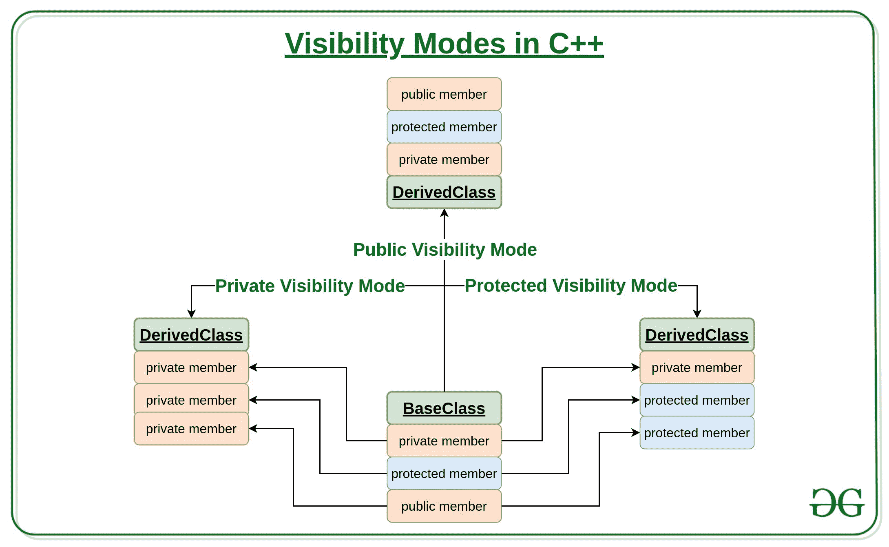

# c++中的可见模式，示例

> 原文:[https://www . geesforgeks . org/visibility-modes-in-c-with-examples/](https://www.geeksforgeeks.org/visibility-modes-in-c-with-examples/)

当一个**基类**借助[继承](https://www.geeksforgeeks.org/inheritance-in-c/)由一个**派生类**派生时，派生类对基类的可访问性由可见性模式控制。派生类不继承对私有数据成员的访问。但是，它确实继承了一个完整的父对象，该对象包含该类声明的任何私有成员。

```
// C++ implementation to show
// Visibility modes

#include <bits/stdc++.h>
using namespace std;

// Base class
// Class A will be inherited
class A {
public:
    int x;

protected:
    int y;

private:
    int z;
};

// Derived class
// Class B will inherit Class A
class B : public A {
};

// main function
int main()
{
    B b;

    // x is public
    // so its value will be printed
    cout << b.x << endl;

    // y is protected
    // so it will give visibility error
    cout << b.y << endl;

    // z is not accessible from B
    // so it will give visibility error
    cout << b.z << endl;
};
```

**编译错误:**

```
prog.cpp: In function 'int main()':
prog.cpp:14:6: error: 'int A::y' is protected
  int y;
      ^
prog.cpp:34:12: error: within this context
  cout << b.y << endl;
            ^
prog.cpp:17:6: error: 'int A::z' is private
  int z;
      ^
prog.cpp:37:12: error: within this context
  cout << b.z << endl;
            ^

```

<u>**可见性在这个节目中意味着什么？**T3】</u>

*   由于 A 中的会员‘x’是 **[公众号](https://www.geeksforgeeks.org/access-modifiers-in-c/)** ，其知名度将对所有人开放。这意味着任何类都可以访问和使用这个 x。这就是“b.x”中没有错误的原因。
*   A 中的成员‘y’是 **[受保护的](https://www.geeksforgeeks.org/access-modifiers-in-c/)** ，其可见性将只对派生类可见。这意味着任何派生类都可以访问和使用这个 y。
*   A 中的成员‘z’为 **[列兵](https://www.geeksforgeeks.org/access-modifiers-in-c/)** ，其知名度不会向其他任何阶层开放。这意味着任何派生类都不能访问和使用这个 z。

<u>**能见度模式类型:**</u>

[](https://media.geeksforgeeks.org/wp-content/uploads/20200304134750/Visibility-Modes-in-C.jpg)

有三种类型的可见性模式:

1.  **Public Visibility mode:** If we derive a subclass from a public base class. Then the public member of the base class will become public in the derived class and protected members of the base class will become protected in the derived class.

    ```
    // C++ implementation to show
    // Public Visibility mode

    #include <bits/stdc++.h>
    using namespace std;

    // Base class
    // Class A will be inherited
    class A {
    public:
        int x;

    protected:
        int y;

    private:
        int z;
    };

    // Derived class
    // Class B will inherit Class A
    // using Public Visibility mode
    class B : public A {
    };

    // main function
    int main()
    {
        B b;

        // x is public and it will remain public
        // so its value will be printed
        cout << b.x << endl;

        // y is protected and it will remain protected
        // so it will give visibility error
        cout << b.y << endl;

        // z is not accessible from B as
        // z is private and it will remain private
        // so it will give visibility error
        cout << b.z << endl;
    };
    ```

    **编译错误:**

    ```
    prog.cpp: In function 'int main()':
    prog.cpp:14:9: error: 'int A::y' is protected
         int y;
             ^
    prog.cpp:37:15: error: within this context
         cout << b.y << endl;
                   ^
    prog.cpp:17:9: error: 'int A::z' is private
         int z;
             ^
    prog.cpp:42:15: error: within this context
         cout << b.z << endl;
                   ^

    ```

2.  **Protected Visibility mode:** If we derive a subclass from a Protected base class. Then both public member and protected members of the base class will become protected in the derived class.

    ```
    // C++ implementation to show
    // Protected Visibility mode

    #include <bits/stdc++.h>
    using namespace std;

    // Base class
    // Class A will be inherited
    class A {
    public:
        int x;

    protected:
        int y;

    private:
        int z;
    };

    // Derived class
    // Class B will inherit Class A
    // using Protected Visibility mode
    class B : protected A {
    };

    // main function
    int main()
    {
        B b;

        // x is public and it will become protected
        // so it will give visibility error
        cout << b.x << endl;

        // y is protected and it will remain protected
        // so it will give visibility error
        cout << b.y << endl;

        // z is not accessible from B as
        // z is private and it will remain private
        // so it will give visibility error
        cout << b.z << endl;
    };
    ```

    **编译错误:**

    ```
    prog.cpp: In function 'int main()':
    prog.cpp:11:9: error: 'int A::x' is inaccessible
         int x;
             ^
    prog.cpp:33:15: error: within this context
         cout << b.x << endl;
                   ^
    prog.cpp:14:9: error: 'int A::y' is protected
         int y;
             ^
    prog.cpp:37:15: error: within this context
         cout << b.y << endl;
                   ^
    prog.cpp:17:9: error: 'int A::z' is private
         int z;
             ^
    prog.cpp:42:15: error: within this context
         cout << b.z << endl;
                   ^

    ```

3.  **Private Visibility mode:** If we derive a subclass from a Private base class. Then both public member and protected members of the base class will become Private in the derived class.

    ```
    // C++ implementation to show
    // Private Visibility mode

    #include <bits/stdc++.h>
    using namespace std;

    // Base class
    // Class A will be inherited
    class A {
    public:
        int x;

    protected:
        int y;

    private:
        int z;
    };

    // Derived class
    // Class B will inherit Class A
    // using Private Visibility mode
    class B : private A {
    };

    // main function
    int main()
    {
        B b;

        // x is public and it will become private
        // so it will give visibility error
        cout << b.x << endl;

        // y is protected and it will become private
        // so it will give visibility error
        cout << b.y << endl;

        // z is not accessible from B as
        // z is private and it will remain private
        // so it will give visibility error
        cout << b.z << endl;
    };
    ```

    **编译错误:**

    ```
    prog.cpp: In function 'int main()':
    prog.cpp:11:9: error: 'int A::x' is inaccessible
         int x;
             ^
    prog.cpp:33:15: error: within this context
         cout << b.x << endl;
                   ^
    prog.cpp:14:9: error: 'int A::y' is protected
         int y;
             ^
    prog.cpp:37:15: error: within this context
         cout << b.y << endl;
                   ^
    prog.cpp:17:9: error: 'int A::z' is private
         int z;
             ^
    prog.cpp:42:15: error: within this context
         cout << b.z << endl;
                   ^

    ```

<u>**继承后如何改变可见性模式？**T3】</u>

在特定可见性模式的帮助下继承基类后，成员将自动改变其可见性，如上所述。但是为了改变继承后的可见性，我们需要手动操作。

**语法:**

```
<visibility_mode>:
    using base::<member>;

```

**例如:**

```
// inorder to change the visibility of x to public
<public>:
    using base::<x>;

```

**示例:**考虑包含公共成员“a”、受保护成员“b”和“c”、私有成员“d”和“e”的基类。下面的程序解释了如何将“b”的可见性从受保护更改为公开。

```
// C++ implementation to show how to
// change the Visibility modes

#include <bits/stdc++.h>
using namespace std;

// Base class
// Class A will be inherited
class BaseClass {

    // Public members
public:
    int a;

    // Protected members
protected:
    int b;
    int c;

    // Private members
private:
    int d;
    int e;
};

// BaseClass will be inherited as private
// to change all the members to private first
class DerivedClass : private BaseClass {

    // Now change the visibility of b
    // from private to public
public:
    using BaseClass::b;
};

// main function
int main()
{
    DerivedClass derivedClass;

    // d must be private and
    // hence generate visibility error
    cout << derivedClass.d << endl;

    // b must be now pubic and hence should
    // not generate visibility error
    cout << derivedClass.b << endl;

    return 0;
};
```

**编译错误:**

```
prog.cpp: In function 'int main()':
prog.cpp:22:9: error: 'int BaseClass::d' is private
     int d;
         ^
prog.cpp:47:26: error: within this context
     cout << derivedClass.d << endl;
                          ^

```