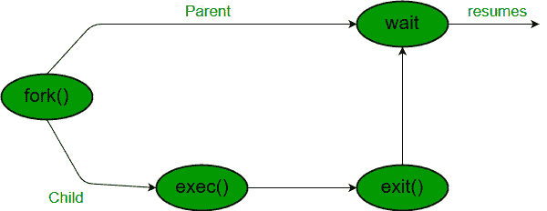

# 在 C 中等待系统调用

> 原文:[https://www.geeksforgeeks.org/wait-system-call-c/](https://www.geeksforgeeks.org/wait-system-call-c/)

**先决条件:** [分叉系统调用](https://www.geeksforgeeks.org/fork-system-call/)
等待()调用会阻塞调用进程，直到其子进程之一退出或收到信号。子进程终止后，父 ***在等待系统调用指令后继续*** 执行。
子进程可能因以下任一情况而终止:

*   它调用 exit()；
*   它从 main 返回(一个 int)
*   它接收一个信号(来自操作系统或另一个进程)，其默认操作是终止。



**c 语言语法:**

```
#include
#include

// take one argument status and returns 
// a process ID of dead children.
pid_t wait(int *stat_loc);   
```

如果任何进程有多个子进程，那么在调用 wait()之后，如果没有子进程终止，父进程必须处于 wait 状态。
如果只有一个子进程被终止，那么返回一个 wait()返回终止子进程的进程标识。
如果多个子进程被终止，那么等待()任意获取 ***子进程*** ，并返回该子进程的进程标识。
当 wait()返回时，它们还通过指针定义**退出状态**(它告诉我们，一个进程为什么终止)，如果状态不是**空**。
如果任何进程没有子进程，那么 wait()立即返回“-1”。
***注意:“由于环境问题，这些代码不会在简单的 IDE 中运行，因此使用终端来运行这些代码”***
**示例:**

## 卡片打印处理机（Card Print Processor 的缩写）

```
// C program to demonstrate working of wait()
#include<stdio.h>
#include<stdlib.h>
#include<sys/wait.h>
#include<unistd.h>

int main()
{
    pid_t cpid;
    if (fork()== 0)
        exit(0);           /* terminate child */
    else
        cpid = wait(NULL); /* reaping parent */
    printf("Parent pid = %d\n", getpid());
    printf("Child pid = %d\n", cpid);

    return 0;
}
```

输出:

```
Parent pid = 12345678 
Child pid = 89546848 
```

## C

```
// C program to demonstrate working of wait()
#include<stdio.h>
#include<sys/wait.h>
#include<unistd.h>

int main()
{
    if (fork()== 0)
        printf("HC: hello from child\n");
    else
    {
        printf("HP: hello from parent\n");
        wait(NULL);
        printf("CT: child has terminated\n");
    }

    printf("Bye\n");
    return 0;
}
```

**输出:**取决于环境

```
HC: hello from child
Bye
HP: hello from parent
CT: child has terminated
     (or)
HP: hello from parent
HC: hello from child
HC: Bye
CT: child has terminated    // this sentence does 
                            // not print before HC 
                            // because of wait.
Bye
```

**孩子状态信息:**
等待上报的孩子状态信息不仅仅是孩子的退出状态，还包括

*   正常/异常终止
*   终止原因
*   退出状态

要查找状态信息，我们使用
**【WIF】**…。宏
1。**WIFEXTED(状态)**:儿童正常退出
**WEXISTATE(状态)**:儿童退出
2 时返回代码。**WIPHILED(状态)**:儿童因未捕捉到信号而退出
**WTERMSIG(状态)**:给出终止信号的编号
3。**WIFTSTOPED(状态)**:儿童停止
**WSTOPSIG(状态)**:给出停止信号的编号

```
/*if we want to prints information about a signal */
void psignal(unsigned sig, const char *s);
```

**示例:**
检查以下程序的输出。

## C

```
// C program to demonstrate working of status
// from wait.
#include<stdio.h>
#include<stdlib.h>
#include<sys/wait.h>
#include<unistd.h>

void waitexample()
{
    int stat;

    // This status 1 is reported by WEXITSTATUS
    if (fork() == 0)
        exit(1);
    else
        wait(&stat);
    if (WIFEXITED(stat))
        printf("Exit status: %d\n", WEXITSTATUS(stat));
    else if (WIFSIGNALED(stat))
        psignal(WTERMSIG(stat), "Exit signal");
}

// Driver code
int main()
{
    waitexample();
    return 0;
}
```

**输出:**

```
Exit status: 1              
```

我们知道如果有多个子进程被终止，那么 wait()会任意收获任何子进程，但是如果我们想要收获任何特定的子进程，我们使用 ***waitpid()*** 函数。

> **c 语言语法:**
> pid_t waitpid (child_pid，&状态，选项)；

**选项参数**

*   如果为 0，则表示父级不必等待终止子级的选项。
*   如果 **WNOHANG** 表示父不等待，如果子不终止，只需检查并返回 waitpid()。(不阻止父进程)
*   如果 child_pid 为 **-1** 则表示任意 ***任意子*** ，这里 waitpid()工作与 wait()工作相同。

**waitpid()的返回值**

*   子对象的 pid，如果子对象已经退出
*   0，如果使用 WNOHANG 并且子级还没有退出。

## C

```
// C program to demonstrate waitpid()
#include<stdio.h>
#include<stdlib.h>
#include<sys/wait.h>
#include<unistd.h>

void waitexample()
{
    int i, stat;
    pid_t pid[5];
    for (i=0; i<5; i++)
    {
        if ((pid[i] = fork()) == 0)
        {
            sleep(1);
            exit(100 + i);
        }
    }

    // Using waitpid() and printing exit status
    // of children.
    for (i=0; i<5; i++)
    {
        pid_t cpid = waitpid(pid[i], &stat, 0);
        if (WIFEXITED(stat))
            printf("Child %d terminated with status: %d\n",
                   cpid, WEXITSTATUS(stat));
    }
}

// Driver code
int main()
{
    waitexample();
    return 0;
}
```

**输出:**

```
Child 50 terminated with status: 100
Child 51 terminated with status: 101
Child 52 terminated with status: 102
Child 53 terminated with status: 103
Child 54 terminated with status: 104
```

在这里，儿童信息依赖于系统，但为了打印所有儿童信息。
本文由**卡丹·帕特尔**供稿。如果你喜欢 GeeksforGeeks 并想投稿，你也可以使用[contribute.geeksforgeeks.org](http://contribute.geeksforgeeks.org)写一篇文章或者把你的文章邮寄到 contribute@geeksforgeeks.org。看到你的文章出现在极客博客主页上，帮助其他极客。
如果发现有不正确的地方，或者想分享更多关于上述话题的信息，请写评论。