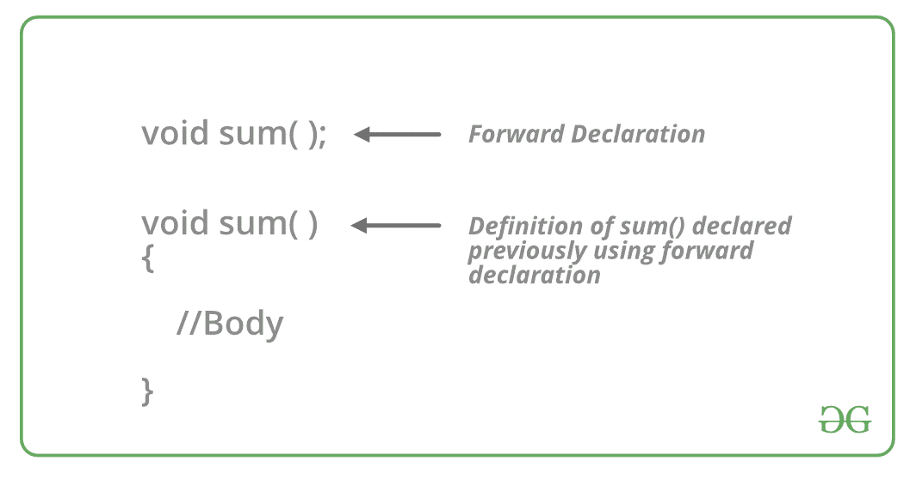

# 什么是 C++中的 Forward 声明

> 原文:[https://www . geesforgeks . org/什么是转发声明-in-c/](https://www.geeksforgeeks.org/what-are-forward-declarations-in-c/)

<u>是指标识符、变量、函数、类等的语法或签名的预先声明。在它被使用之前(在程序的后面完成)。
[](https://media.geeksforgeeks.org/wp-content/cdn-uploads/20191128195739/CPP-Forward-declarations.png) 
**例:**</u>

```
// Forward Declaration of the sum()
void sum(int, int);

// Usage of the sum
void sum(int a, int b)
{
    // Body
} 
```

<u>在 C++中，Forward 声明通常用于类。在这种情况下，类在使用前是预定义的，因此它可以被在此之前定义的其他类调用和使用。</u>

<u>**示例:**</u>

```
// Forward Declaration class A
class A;

// Definition of class A
class A{
    // Body
}; 
```

<u>**<u>需要远期申报:</u>**</u>

<u>让我们用一个例子来理解正向申报**的必要性。**</u>

<u>**例 1:**</u>

```
.
// C++ program to show
// the need for Forward Declaration

#include <iostream>
    using namespace std;

class B {

public:
    int x;

    void getdata(int n)
    {
        x = n;
    }
    friend int sum(A, B);
};

class A {
public:
    int y;

    void getdata(int m)
    {
        y = m;
    }
    friend int sum(A, B);
};

int sum(A m, B n)
{
    int result;
    result = m.y + n.x;
    return result;
}

int main()
{
    B b;
    A a;
    a.getdata(5);
    b.getdata(4);
    cout << "The sum is : " << sum(a, b);
    return 0;
}
```

<u>**输出:**</u>

```
Compile Errors :
prog.cpp:14:18: error: 'A' has not been declared
   friend int sum(A, B);
                  ^ 
```

<u>**解释:**这里编译器抛出这个错误是因为，在 B 类中，A 类的对象正在被使用，直到那一行都没有声明。因此编译器找不到类 A。那么如果类 A 写在类 B 之前呢？让我们在下一个例子中找到答案。</u>

<u>**例 2:**</u>

```
.
// C++ program to show
// the need for Forward Declaration

#include <iostream>
    using namespace std;

class A {
public:
    int y;

    void getdata(int m)
    {
        y = m;
    }
    friend int sum(A, B);
};

class B {

public:
    int x;

    void getdata(int n)
    {
        x = n;
    }
    friend int sum(A, B);
};

int sum(A m, B n)
{
    int result;
    result = m.y + n.x;
    return result;
}

int main()
{
    B b;
    A a;
    a.getdata(5);
    b.getdata(4);
    cout << "The sum is : " << sum(a, b);
    return 0;
}
```

<u>**输出:**</u>

```
Compile Errors :
prog.cpp:16:23: error: 'B' has not been declared
     friend int sum(A, B);
                       ^ 
```

<u>**解释:**这里编译器抛出这个错误是因为，在 A 类中，B 类的对象正在被使用，在那一行之前没有声明。因此编译器找不到 b 类</u>

<u>**现在很明显，无论类是按什么顺序编写的，上面的任何代码都不会起作用。因此这个问题需要一个新的解决方案- **前进宣言**T4。**</u>

<u>让我们将 forward 声明添加到上面的示例中，并再次检查输出。</u>

<u>**例 3:**</u>

```
#include <iostream>
using namespace std;

// Forward declaration
class A;
class B;

class B {
    int x;

public:
    void getdata(int n)
    {
        x = n;
    }
    friend int sum(A, B);
};

class A {
    int y;

public:
    void getdata(int m)
    {
        y = m;
    }
    friend int sum(A, B);
};
int sum(A m, B n)
{
    int result;
    result = m.y + n.x;
    return result;
}

int main()
{
    B b;
    A a;
    a.getdata(5);
    b.getdata(4);
    cout << "The sum is : " << sum(a, b);
    return 0;
}
```

<u>**Output:**

```
The sum is : 9

```</u> 

<u>程序现在运行没有任何错误。一个**正向声明**在实际定义实体之前告诉编译器一个实体的存在。正向声明也可以用于 C++中的其他实体，如函数、变量和用户定义的类型。</u>