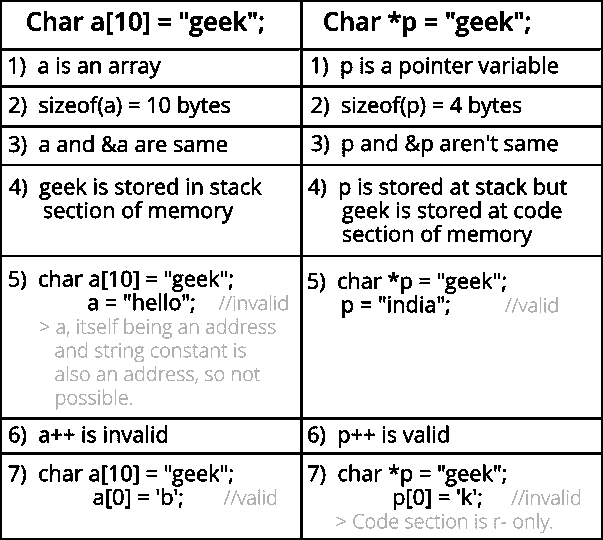

# C 中的 char s[]和 char *s 有什么区别？

> 原文:[https://www . geeksforgeeks . org/char-s-和 char-s-in-c/](https://www.geeksforgeeks.org/whats-difference-between-char-s-and-char-s-in-c/) 的区别是什么

考虑下面两个 c 中的语句，两者有什么区别？

```cpp
   char s[] = "geeksquiz";
   char *s  = "geeksquiz";
```

**以下是主要区别:**



语句' **char s[] = "geeksquiz"** '创建了一个字符数组，它就像任何其他数组一样，我们可以执行所有的数组操作。这个数组唯一特别的地方是，虽然我们已经用 9 个元素初始化了它，但是它的大小是 10(编译器会自动添加' \0 ')

## C

```cpp
#include <stdio.h>
int main()
{
    char s[] = "geeksquiz";
    printf("%lu", sizeof(s));
    s[0] = 'j';
    printf("\n%s", s);
    return 0;
}
```

输出:

```cpp
10
jeeksquiz
```

语句“ **char *s = "geeksquiz"** ”创建了一个字符串文字。大多数编译器将字符串存储在内存的只读部分。C 和 C++ 标准称字符串文字具有静态存储持续时间，任何修改它们的尝试都会产生未定义的行为。
**s** 只是一个指针，像其他任何指针一样存储字符串文字的地址。

## C

```cpp
#include <stdio.h>
int main()
{
    char *s = "geeksquiz";
    printf("%lu", sizeof(s));

    // Uncommenting below line would cause undefined behaviour
    // (Caused segmentation fault on gcc)
    //  s[0] = 'j'; 
    return 0;
}
```

输出:

```cpp
8
```

运行上述程序可能还会生成一条警告“警告:不推荐使用从字符串常量到“char*”的转换”。出现此警告是因为 s 不是常量指针，而是存储只读位置的地址。这个警告可以通过指向 const 的指针来避免。

## C

```cpp
#include <stdio.h>
int main()
{
    const char *s = "geeksquiz";
    printf("%lu", sizeof(s));
    return 0;
}
```

本文由 Abhay Rathi 供稿。如果发现有不正确的地方，请写评论，或者想分享更多关于以上讨论话题的信息