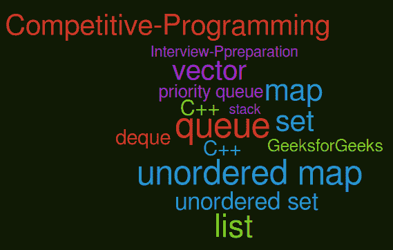

# 哪些 C++ 库对竞争性编程有用？

> 原文:[https://www . geesforgeks . org/哪些 c 库对竞争性编程有用/](https://www.geeksforgeeks.org/which-c-libraries-are-useful-for-competitive-programming/)

[C++ ](https://www.geeksforgeeks.org/c-programming-language/) 是竞争编程中最推荐的语言之一(原因请参考我们[之前的文章](https://www.geeksforgeeks.org/how-to-be-a-good-programmer-in-college/)

[C++ STL](https://www.geeksforgeeks.org/the-c-standard-template-library-stl/) 包含许多容器，这些容器对于不同的目的是有用的。在本文中，我们将从[竞技编程](https://www.geeksforgeeks.org/how-to-begin-with-competitive-programming/)和面试准备的角度来关注最重要的容器。

[**向量**](https://www.geeksforgeeks.org/vector-in-cpp-stl/):(#包括<向量>)动态大小数组，允许插入和删除，而不考虑数组的大小。它还具有普通数组的优点，如随机访问和缓存友好性。C++ vector 支持许多附加操作，如 [erase()、](https://www.geeksforgeeks.org/vector-erase-and-clear-in-cpp/) [push_front()、](https://www.geeksforgeeks.org/list-push_front-function-in-c-stl/) [insert()、](https://www.geeksforgeeks.org/vector-insert-function-in-c-stl/)等。

[**队列**](https://www.geeksforgeeks.org/queue-cpp-stl/) : (#include <队列>)适用于我们希望项目按先进先出顺序排列的情况。示例问题是，[生成具有给定数字](https://www.geeksforgeeks.org/interesting-method-generate-binary-numbers-1-n/)、[流中第一个不重复字符的数字](https://www.geeksforgeeks.org/find-first-non-repeating-character-stream-characters/)、[树的层级顺序遍历](https://www.geeksforgeeks.org/level-order-tree-traversal/)及其变体、图的[BFS](https://www.geeksforgeeks.org/breadth-first-search-or-bfs-for-a-graph/)及其变体。更多练习请参考[队列练习题](https://practice.geeksforgeeks.org/explore/?category%5B%5D=Queue&page=1)。

[**栈**](https://www.geeksforgeeks.org/stack-in-cpp-stl/) : (#include <栈>)用于我们希望有后进先出订单的情况。示例问题有[平衡括号](https://www.geeksforgeeks.org/check-for-balanced-parentheses-in-an-expression/)、[库存跨度问题](https://www.geeksforgeeks.org/the-stock-span-problem/)、[下一个较大的元素](https://www.geeksforgeeks.org/next-greater-element/)和[直方图中最大的区域](https://www.geeksforgeeks.org/largest-rectangle-under-histogram/)。更多练习请参考[叠练题](https://practice.geeksforgeeks.org/explore/?category%5B%5D=Stack&page=1)。

[**设置**](https://www.geeksforgeeks.org/set-in-cpp-stl/) 和 [**地图**](https://www.geeksforgeeks.org/map-associative-containers-the-c-standard-template-library-stl/):(#包含<设置>和#包含<地图>)这两个都实现了[自平衡二叉查找树](https://www.geeksforgeeks.org/self-balancing-binary-search-trees-comparisons/) ( [红黑树【特别是 T11】)。在我们希望使用中等(优于数组，劣于散列)搜索、插入和删除查询时间来维护已排序项目的情况下，这非常有用。示例问题有，](https://www.geeksforgeeks.org/red-black-tree-set-1-introduction-2/)[最接近左侧的更大或相同的值](https://www.geeksforgeeks.org/closest-greater-or-same-value-on-left-side-for-every-element-in-array/)，[为 arra 中的每个元素找到最接近的值](https://www.geeksforgeeks.org/find-closest-value-for-every-element-in-array/) y 等。当我们希望只存储键时，我们使用 set 当我们希望存储键值对时，我们使用 map。

[**【无序 _ 集合】**](https://www.geeksforgeeks.org/unorderd_set-stl-uses/) 和 [**无序 _ 映射**](https://www.geeksforgeeks.org/unordered_map-in-stl-and-its-applications/):(#包含<无序 _ 集合>和#包含<无序 _ 映射>)这两个都实现了带链接的哈希。当我们希望快速搜索、插入和删除(所有三个操作都是 O(1))时很有用。这是业内最常用的数据结构之一，也是学术界最低估的。常见的问题有很多，c [计算不同的元素](https://www.geeksforgeeks.org/count-distinct-elements-in-an-array/)、[数组项的频率](https://www.geeksforgeeks.org/counting-frequencies-of-array-elements/)、[两个未排序数组的和为 0 的子数组](https://www.geeksforgeeks.org/find-if-there-is-a-subarray-with-0-sum/)和[的并集和交集](https://www.geeksforgeeks.org/find-union-and-intersection-of-two-unsorted-arrays/)。更多练习请参考[哈希练习问题](https://practice.geeksforgeeks.org/explore/?category%5B%5D=Hash&page=1)。

[**优先级 _ 队列**](https://www.geeksforgeeks.org/priority-queue-in-cpp-stl/):(#包含<优先级 _ 队列>)默认实现[最大堆](https://www.geeksforgeeks.org/binary-heap/)。我们也可以[创建一个最小堆](https://www.geeksforgeeks.org/implement-min-heap-using-stl/)。每当我们希望有效地找到最小或最大元素时，就使用它。用于实现 [Prim 算法、](https://www.geeksforgeeks.org/prims-minimum-spanning-tree-mst-greedy-algo-5/)T10】Dijkstra 最短路径、 [Huffman 编码](https://www.geeksforgeeks.org/huffman-coding-greedy-algo-3/)、 [K 个最大元素](https://www.geeksforgeeks.org/k-largestor-smallest-elements-in-an-array/)、[最大购买玩具](https://www.geeksforgeeks.org/maximise-the-number-of-toys-that-can-be-purchased-with-amount-k/)、[合并 K 个排序数组](https://www.geeksforgeeks.org/merge-k-sorted-arrays-set-2-different-sized-arrays/)、[一个流的中位数](https://www.geeksforgeeks.org/median-of-stream-of-integers-running-integers/)。更多练习请参考[堆练习题](https://practice.geeksforgeeks.org/explore/?category%5B%5D=Heap&page=1)。

[**德清**](https://www.geeksforgeeks.org/deque-cpp-stl/) **:** (#include <德清>出列支持 O(1)时间内两端插入删除。因为它是使用数组实现的，所以它也允许随机访问。我们可以使用出列来实现队列和堆栈。德格上的示例问题是，[访问所有汽油泵](https://www.geeksforgeeks.org/find-a-tour-that-visits-all-stations/)和所有 k 尺寸子阵列的[最大值。](https://www.geeksforgeeks.org/sliding-window-maximum-maximum-of-all-subarrays-of-size-k/)

在本文的下一部分，我们将讨论更重要的 C++ 库。