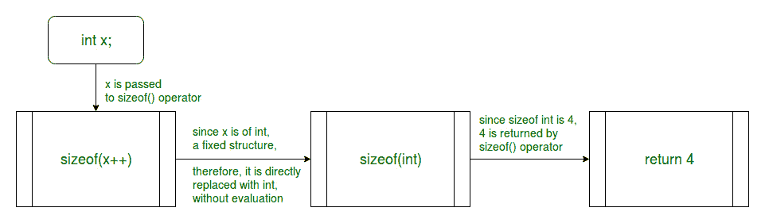
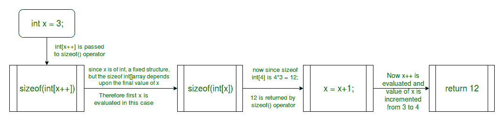
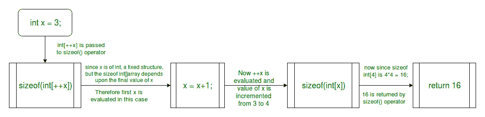

# 为什么 sizeof(x++)在 C 中不递增 x？

> 原文:[https://www . geesforgeks . org/why-sizeofx-not-increment-x-in-c/](https://www.geeksforgeeks.org/why-does-sizeofx-not-increment-x-in-c/)

根据 [C99 标准](http://www.open-std.org/JTC1/sc22/wg14/www/docs/n1256.pdf)，sizeof()运算符只考虑操作数的类型，它可以是表达式或类型的名称(即 int、double、float 等)，而不是在计算表达式时获得的值。因此，sizeof()运算符中的操作数不会被计算。只有当操作数的类型是可变长度数组时，才会计算它，因为在这种情况下，只有在计算表达式后才能确定大小。

### 案例 1:

**当 sizeof()方法被传递时，一个固定大小的结构:**

在这种情况下，sizeof()运算符不计算参数。仅检查参数的类型并返回其大小。

下图显示了 sizeof()运算符在此场景中的工作流程:



**例 1:**

与期望值 4 相比，增量后 x 的输出值仍然是 3。这是因为 sizeof 运算符不需要计算表达式来获得大小，因为操作数的数据类型不会改变，因此大小保持不变。

```
#include <stdio.h>

int main()
{
    int x = 3;
    printf("%d\n", sizeof(x++));
    printf("x = %d", x);

    return 0;
}
```

**输出:**

```
4
x = 3

```

### 案例 2:

**当 sizeof()方法被传递一个可变大小的结构时:**

在这种情况下，sizeof()运算符计算参数以查看大小是否有任何变化。如果找到，则首先修改大小，然后返回最终大小。

下面的示例说明了这个场景中的 sizeof()运算符:

**例 2:**



在本例中，sizeof 运算符需要计算表达式，以便计算数组的大小，如图所示。因此，在这种情况下，我们得到了增量后的 x 值。

```
#include <stdio.h>

int main()
{
    int x = 3;
    printf("%d\n", sizeof(int[x++]));
    printf("x = %d", x);

    return 0;
}
```

**输出:**

```
12
x = 4

```

**例 3:**



同样在这个例子中，sizeof 运算符需要计算表达式，以便计算数组的大小，如图所示。在这个例子中，使用了后递增运算符，因此第一行的输出是 16。在第二行中，x 的值在递增后打印。

```
#include <stdio.h>

int main()
{
    int x = 3;
    printf("%d\n", sizeof(int[++x]));
    printf("x = %d", x);

    return 0;
}
```

**输出:**

```
16
x = 4

```