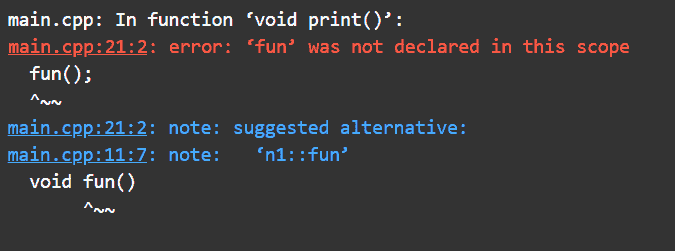

# 为什么在 C++ 程序中写“使用命名空间 std”很重要？

> 原文:[https://www . geesforgeks . org/why-it-is-important-write-use-namespace-STD-in-CPP-program/](https://www.geeksforgeeks.org/why-it-is-important-to-write-using-namespace-std-in-cpp-program/)

在本文中，我们将讨论 [C++ 程序](https://www.geeksforgeeks.org/c-plus-plus/)中**使用 [**命名空间**](https://www.geeksforgeeks.org/namespace-in-c/)**【STD】**的用法。**

**<u>需要的</u>** [**<u>命名空间</u>**](https://www.geeksforgeeks.org/namespace-in-c/) **:**

*   由于多个[变量](https://www.geeksforgeeks.org/variables-and-keywords-in-c/)、[函数](https://www.geeksforgeeks.org/functions-in-c/)、[类](https://www.geeksforgeeks.org/c-classes-and-objects/)等不能同名。在同一范围内。
*   所以为了克服这种情况，引入了命名空间。

**程序 1:**

下面是一个 C++ 程序，演示了函数和变量同名的名称空间的使用:

## C++

```cpp
// C++ program to illustrate the use
// of namespace with same name of
// function and variables
#include <iostream>
using namespace std;

// Namespace n1
namespace n1 {
int x = 2;

// Function to display the message
// for namespace n1
void fun()
{
    cout << "This is fun() of n1"
         << endl;
}
}

// Namespace n2
namespace n2 {

int x = 5;

// Function to display the message
// for namespace n2
void fun()
{
    cout << "This is fun() of n2"
         << endl;
}
}

// Driver Code
int main()
{
    // The methods and variables called
    // using scope resolution(::)
    cout << n1::x << endl;

    // Function call
    n1::fun();

    cout << n2::x << endl;

    // Function ca;;
    n2::fun();

    return 0;
}
```

**Output:** 

```cpp
2
This is fun() of n1
5
This is fun() of n2
```

**说明:**

*   在上面的示例程序中， **n1** 和 **n2** 都有一个同名的变量和函数 **x** 和 **fun()** 。
*   命名空间用于减少或限制任何变量或函数的范围。
*   与上面的代码一样，变量 x 和方法 fun()仅限于名称空间 **n1** 和 **n2** 。因此，他们的范围不在 **n1** 或 **n2** 之外。
*   每次在不需要定义的变量或函数中使用范围解析运算符**(:)**，可以使用指令用“**求解。**
*   使用指令的**意味着将命名空间中编写的整个代码包含在结束范围中。**

**程序 2:**

下面是演示“使用”[指令](https://www.geeksforgeeks.org/cc-preprocessors/)用法的 C++ 程序:

## C++

```cpp
// C++ program to demonstrate the use
// of "using" directive
#include <iostream>
using namespace std;

// Namespace n1
namespace n1 {
int x = 2;
void fun()
{
    cout << "This is fun() of n1"
         << endl;
}
}

// Namespace is included
using namespace n1;

// Driver Code
int main()
{
    cout << x << endl;

    // Function Call
    fun();

    return 0;
}
```

**Output:** 

```cpp
2
This is fun() of n1
```

**说明:**

*   在上面的程序中，写了“使用[命名空间](https://www.geeksforgeeks.org/namespace-in-c/) **n1** 之后，就不需要使用范围解析来利用 **n1** 的成员了。
*   它可以被解释为“使用”在命名空间中编写的代码的副本到它已经被编写的范围。

如果“使用名称空间 **n1** ”被写在 **main()** 中，并试图在不同的函数中使用成员( **fun()** 和 **x** )，它会给出一个[编译时错误](https://www.geeksforgeeks.org/difference-between-compile-time-errors-and-runtime-errors/)。

**程序 3:**

下面是 C++ 程序，演示了 [main()函数](https://www.geeksforgeeks.org/executing-main-in-c-behind-the-scene/)中“使用命名空间”的用法:

## C++

```cpp
// C++ program illustrating the use
// of "using namespace" inside main()

#include <iostream>
using namespace std;

// Namespace n1
namespace n1 {
int x = 2;
void fun()
{
    cout << "This is fun() of n1"
         << endl;
}
}

// Function calling function
void print()
{
    // Gives error, used without ::
    fun();
}

// Driver Code
int main()
{
    // Namespace inside main
    using namespace n1;

    cout << x << endl;

    // Function Call
    fun();

    return 0;
}
```

**输出:**

[](https://media.geeksforgeeks.org/wp-content/uploads/20210220200144/Picture1.png)

**说明:**

*   众所周知，“std”(标准的缩写)是一个名字空间，其成员在程序中使用。
*   所以“std”命名空间的成员有 [cout](https://www.geeksforgeeks.org/difference-between-cout-and-stdcout-in-c/) 、 [cin](https://www.geeksforgeeks.org/cincout-vs-scanfprintf/) 、 [endl](https://www.geeksforgeeks.org/endl-vs-n-in-cpp/) 等。
*   该名称空间存在于 [iostream.h](https://www.geeksforgeeks.org/c-stream-classes-structure/) [头文件](https://www.geeksforgeeks.org/header-files-in-c-cpp-and-its-uses/)中。
*   下面是 C++ 中的代码片段，显示了 iostream.h 中编写的内容:

## C++

```cpp
// Code written in the iostream.h file

namespace std {
ostream cout;
i0stream cin;
// and some more code
}
```

**说明:**

*   现在当**cout<T3【极客暴发户】；**写好后，编译器在我们的程序中搜索 cout，cout 保存在 std 命名空间中，所以给编译器的指令是，如果编译器在当前范围内没有找到任何东西，就尝试在 std 命名空间中找到。
*   不必写 namespaced，只需在每次使用 std 的成员时使用作用域解析(::)。例如 **std::cout** 、 **std::cin** 、 **std::endl** 等。

**程序 4:**

下面是演示 std 使用的 C++ 程序:

## C++

```cpp
// C++ program to illustrate
// the use of std
#include <iostream>

// Driver Code
int main()
{
    int x = 10;
    std::cout << " The value of x is "
              << x << std::endl;
    return 0;
}
```

**Output:** 

```cpp
The value of x is 10
```

**说明:**无论写“使用命名空间 std”还是使用作用域解析，程序的输出都是一样的。